# Tasks with Kinesis

## 1. Build a real time data streaming system with Amazon Kinesis Data Streams

Architecture Diagram

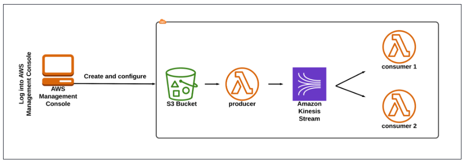

### Creating a Kinesis data stream

In this task , we will create a Kinesis data stream by providing the name, capacity and other configuration.

- Navigate to Kinesis by clicking on the Services menu, under the Analytics section.
- Under Get Started, select Kinesis Data Streams and click on Create data stream button.
- Under Data stream name, enter the name my-data-stream.
- Under Capacity mode : select Provisioned.
- Under Provisioned shards, enter 1.
- Click on Create data stream button.
- Once the data stream is created, click to open it.
- Click on the Configuration tab.
- Scroll down to Encryption and click on Edit.
- Check `Enable server-side encryption` and use the default encryption key type, i.e Use `AWS managed CMK`.
- Click on Save changes.
- You have used AWS KMS to encrypt your data.

### Creating an S3 Bucket

- Navigate to S3 by clicking on the Services menu, under the Storage section.
- Click on Create bucket button.
- In the General Configuration
- - Bucket name : Enter yourname.
- Region: Select yours (i.e same region as the Kinesis data stream).
- In the Bucket Versioning, Check the option Enable.
- In the Default encryption:
- - Server-side encryption: Select Enable
- - Encryption key type: Leave the key type as Amazon S3-managed key (SSE-S3).
- Click on Create bucket button.

### Creating producer Lambda function

Let us create 3 lambda functions. One function for the producer and the other two for consumers.

- Navigate to Lambda by clicking on the Services menu, under the Compute section.
- Click on the Create function button.
- - Choose Author from scratch
- - Function name: Enter producer
- - Runtime: Select Node.js 14.x
- - Under the Permissions section, click on Change default execution role and then choose use an existing role (need create).
- - Click on Create function button.
- Configuration Page: On this page, we need to configure our lambda function.
- If you scroll down a little bit, you can see the Code source section. Here we need to write a NodeJs function which 
reads the file in S3 and sends the data to kinesis data stream.
- Remove the existing code in AWS lambda index.js. Copy the below code and paste it into your lambda index.js file.
------------------------------------------------------------------------------------------------------------------------------
    const AWS = require('aws-sdk');         
    AWS.config.update({             
        region: 'us-east-1'                     
    })                      
    const s3 = new AWS.S3();                    
    const kinesis = new AWS.Kinesis();                      
    exports.handler = async (event) => {                
        console.log(JSON.stringify(event));                 
        const bucketName = event.Records[0].s3.bucket.name;             
        const keyName = event.Records[0].s3.object.key;             
        const params = {        
            Bucket: bucketName,             
            Key: keyName                
    }   
    await s3.getObject(params).promise().then(async (data) => {     
        const dataString = data.Body.toString();                
        const payload = {   
            data: dataString    
        }
            await sendToKinesis(payload, keyName);              
        }, error => {       
        console.error(error);                   
        })              
    };                  
    async function sendToKinesis(payload, partitionKey) {                   
        const params = {        
            Data: JSON.stringify(payload),              
            PartitionKey: partitionKey,
            StreamName: 'your-data-stream'      
        }           
        await kinesis.putRecord(params).promise().then(response => {        
            console.log(response);      
        }, error => {       
            console.error(error);               
        })                  
    }
------------------------------------------------------------------------------------------------------------------------------

- You need to change the StreamName in the index.js file based on your Kinesis data stream name under the function sendToKinesis.
- Save the function by clicking on the Deploy button.

### Creating an event notification

- Navigate to S3 by clicking on the Services menu, under the Storage section.
- Click on the created S3 bucket and navigate to the Properties tab.
- Scroll down to Event notifications and click on Create event notification.
- Under Create event notification:
- - Event name : Enter upload-event
- - Leave the prefix as it is.
- - Suffix : Enter .txt
- Under Event types, select All object create events.
- Under Destination, select Lambda function.
- Under Specify Lambda function, select Choose from your Lambda functions and choose the producer from the list and click on Save changes button.
- That means whenever an object is created, producer lambda function is triggered.

### Creating consumer Lambda functions

Let us create lambda functions for consumers.

Consumer -1

- Click on the Create function button.
- - Choose Author from scratch
- - Function name: Enter consumer1
- - Runtime: Select Node.js 14.x
- - Under the Permissions section, click on Change default execution role and then choose Use an existing role.
- - Click on Create function button.
- Configuration Page: On this page, we need to configure our lambda function.
- If you scroll down a little bit, you can see the Code source section. Here we need to write a NodeJs function which 
reads the file in the data stream and processes the data, here we are logging out the data.
- Remove the existing code in AWS lambda index.js. Copy the below code and paste it into your lambda index.js file. 
Save the function by clicking on the Deploy button.

---------------------------------------------------------------------------------------
    exports.handler = async (event) => {
    console.log(JSON.stringify(event));
    for (const record of event.Records) {
    const data = JSON.parse(Buffer.from(record.kinesis.data, 'base64'));
    console.log('consumer #1', data);
    }
    };
---------------------------------------------------------------------------------------

- On the same page, go to `Configuration` tab and click on `Triggers`
- Under Triggers,  Kinesis trigger will be in a Disabled state, select the trigger and click on Edit button.
- Check the Activate trigger and click on the Save button
- Now you can see the Kinesis: your-data-stream (Enabled).
- In case the trigger is not present already , click on Add Trigger button.
- - Select a source dropdown: Select Kinesis
- - Kinesis stream : Select your-data-stream
- - Check the Activate trigger checkbox.
- - Click on Add button.

Consumer - 2

- Click on the Create function button.
- - Choose Author from scratch
- - Function name: Enter consumer2
- - Runtime: Select Node.js 14.x
- - Under the Permissions section, click on Change default execution role and then choose use an existing role.
- - Click on Create function button.
- Configuration Page: On this page, we need to configure our lambda function.
- Remove the existing code in AWS lambda index.js. Copy the below code and paste it into your lambda index.js file.

---------------------------------------------------------------------------------------
    exports.handler = async (event) => {
    console.log(JSON.stringify(event));
    for (const record of event.Records) {
    const data = JSON.parse(Buffer.from(record.kinesis.data, 'base64'));
    console.log('consumer #2', data);
    }
    };
---------------------------------------------------------------------------------------

- Save the function by clicking on the Deploy button.
- On the same page, go to Configuration tab and click on Triggers
- Under Triggers,  Kinesis trigger will be in Disabled state select the trigger and click on Edit button.
- Check the Activate trigger and click on save button
- Now you can see the Kinesis: your-data-stream (Enabled).
- In case the trigger is not present already , click on Add Trigger button.
- - Select a source dropdown: Select Kinesis
- - Kinesis stream : Select your-data-stream
- - Check the Activate trigger checkbox.
- - Click on Add button.

### Creating and uploading a test file to S3 bucket

- Open any text editor on your computer.
- Copy and paste the following data and save the file in txt, in my case test.txt

---------------------------------------------------------------------------------------
    Hello
    This is our task...
    Bye bye!!!
---------------------------------------------------------------------------------------

- Navigate to S3 by clicking on the Services menu, under the Storage section.
- Click on the bucket we created earlier.
- Under the Objects tab, click on Upload.
- In the Files and folders, click Add files.
- Navigate and select the test.txt file created earlier in the task.
- Once you select the file, click on Upload button.
- Now, click Close to close the Upload: status page.

### Testing the configuration

- Now, we have uploaded the file to the S3 bucket. Since we have configured the event notification, the producer lambda 
function should get triggered.
- Let us test the configuration by checking the logs of lambda functions.
- Navigate to CloudWatch by clicking on the Services menu, under the Management & Governance section.
- On the left panel, click on Logs and select Log groups.
- Here you can see all 3 functions logs (two consumer and one producer)

Producer

- In the filter log groups, search for the producer.
- Click and open the log group.
- In the Log streams, you will find the latest event, in our case we’ll have only 1 log event.
- Click and open the log stream. This means our lambda function is triggered successfully.
- Click and expand the event. We can see the event that triggers the lambda function from our S3 bucket.

- 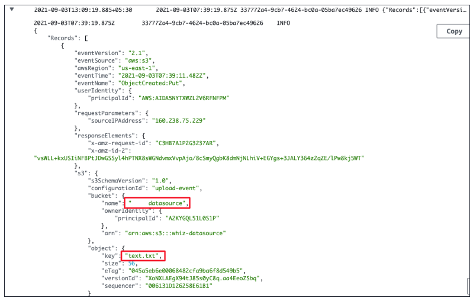

- Then the lambda function sends the data to Kinesis and returns a successful message.
- In the producer lambda function, we can see that the S3 is configured as a trigger for the producer lambda function.

Consumer 1

- Now return to the log groups main menu.
- In the filter log groups, search for the consumer1.
- Click and open the log group.
- In the Log streams, you will find the latest event, in our case we’ll have only 1 log event.
- Click and open the log stream. This means the lambda function got executed.
- We can see the event object from the Kinesis.
- We can see from the event that the data is encrypted and encoded.
- Our lambda function has extracted the data and read it out.

Consumer 2

- Now return to the log groups main menu.
- In the filter log groups, search for the consumer2.
- Click and open the log group.
- In the Log streams, you will find the latest event, in our case we’ll have only 1 log event.
- Click and open the log stream. This means the lambda function got executed.
- We can see the event object from the Kinesis.
- We can see from the event that the data is encrypted and encoded.
- Our lambda function has extracted the data and read it out.

### Delete AWS Resources

- Deleting Kinesis Data Streams

## 2. Build a real time data streaming system with Amazon Kinesis Data Stream and Kinesis Agent

Architecture Diagram

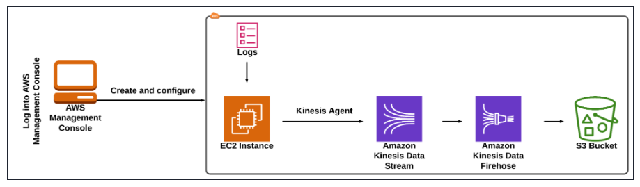

### Launching an EC2 Instance

- Navigate to EC2 by clicking on the Services menu at the top, then click on EC2 in the Compute section.
- Navigate to Instances on the left panel and click on Launch Instance button.
- Enter Name as Demo_Instance
- Select Amazon Linux from the Quick Start.
- - Choose an Amazon Machine Image (AMI): Choose Amazon Linux 2 AMI(HVM) from the drop-down.
- Choose an Instance Type: Select t2.micro
- For Key pair : Choose Create a new key pair
- - Key Pair name :  Enter  MyKey
- - Key pair type : Choose RSA
- - Private key file format: Choose .pem
- - Click on Create key pair button.
- In Network Settings Click on Edit Button:
- - Auto-assign public IP: Select Enable
- - Select Create new Security group
- - Security group name : Enter kinesis_demo_SG
- - Description : Enter Security Group to allow traffic to EC2
- - Add SSH and HTTP rules
- Under Advanced Details create and select role.
- Keep Rest thing Default and Click on Launch Instance Button.
- Select View all Instances to View Instance you Created
- Launch Status: Your instances are now launching, Navigate to Instances page from left menu and wait the status of the 
EC2 Instance changes to running and health check status changes to 2/2 checks passed
- Select the Instance and copy the Public IPv4 address from the Details section. Note down the Public IPv4 Address of your EC2 instance.

### SSH into EC2 Instance

### Host a sample website

In this task, we will host a sample website by navigating to the HTML folder present in the var directory and then we 
will fetch the sample site using the wget command.

- Switch to the root user : `sudo -s`
- Run all the updates using the yum command: `yum update -y`
- Install the LAMP server: `sudo amazon-linux-extras install -y lamp-mariadb10.2-php7.2 php7.2`
- Install the HTTPD : `sudo yum install -y httpd mariadb-server`
- Start the HTTPD server: `sudo systemctl start httpd`
- Enable the HTTPD Server: `sudo systemctl enable httpd`
- Navigate to the HTML folder path: `cd /var/www/html`
- Let us download a sample website template. Here I am downloading a zip file from the site using wget.
- - sudo wget https://www.free-css.com/assets/files/free-css-templates/download/page270/marvel.zip
- You can check if it is downloaded in the HTML path using ls command.
- Unzip the downloaded html template. Use the zip file name to unzip. (In our lab you can find unzip files, download the 
same from the site or create zip file from exists)
- Following command : `sudo unzip marvel.zip`
- Use the command ls to list all the files and folders present in the present working directory.
- You will be able to see a zip file and a folder. When we unzipped the marvel.zip, we got the folder, 2115_marvel.

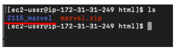

- Copy the folder name to a text editor.
- To verify if the sample website is hosted, paste http://IP_Address/folder_name in the browser and press [Enter]
- For example : http://34.233.120.188/2115_marvel/
- You can see that the website is hosted successfully.
- The website logs will be in the path `“/var/log/httpd/access_log”`. For each click and use of the website, the related 
logs will be collected and stored here.
- You can check the logs using the following commands : 
- - `sudo su`
- - `cd /var/log/httpd/`
- - `tail -10 access_log`

### Set file permissions to httpd

Now let's see how to store these continuous logs. Before proceeding, change the permission of the httpd folder, so that 
the file will be in readable, writable, and executable mode by ec2-user.

- Add the httpd group to your EC2 instance with the command : `groupadd httpd`
- Add ec2-user user to the httpd group with the command : `usermod -a -G httpd ec2-user`
- To refresh your permissions and include the new httpd group, log out completely with the command : `exit` (if you are in the sudo, you have to exit twice)
- SSH into EC2 Instance.
- Verify that the httpd group exists with the groups with the command : `groups`

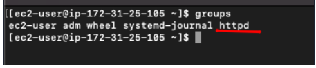

- Change the group ownership of the /var/log/httpd directory and its contents to the httpd group
- - `sudo chown -R root:httpd /var/log/httpd`
- Change the directory permissions of /var/log/httpd and its subdirectories to add group write permissions and set the 
group ID on subdirectories created in the future
- - `sudo chmod 2775 /var/log/httpd`
- - `find /var/log/httpd -type d -exec sudo chmod 2775 {} +`

### Creating Kinesis Data Stream

Let us create a Kinesis data stream. The logs created in the EC2 sample website will be pushed to Kinesis data stream.

- Navigate to Kinesis by clicking on the Services menu, under the Analytics section.
- Under Get Started, select Kinesis Data Streams and click on Create data stream.
- Under Data stream name, enter the Data stream name as my-data-stream
- Click on Create data stream button.
- Once the data stream is created, click to open it.
- Click on the Configuration tab.
- Scroll down to Encryption and click on Edit button.
- Check Enable server-side encryption and use the default encryption key type, i.e Use AWS managed CMK.
- Click on Save changes button.
- You have used AWS KMS to encrypt your data.

### Creating a S3 Bucket

In this task, we will create an S3 bucket where we will store the data from the firehose.

- Navigate to S3 by clicking on the Services menu, under the Storage section.
- Click on Create bucket button.
- In the General Configuration:
- - Bucket name: Enter my-demo-logs
- In the Default encryption:
- - Encryption key type: Leave the key type as Amazon S3 key (SSE-S3).
- - Bucket key: Select Enable
- Click on Create bucket button.

### Creating Kinesis Data Firehose

Once the streaming service gets the data from the logs, then we need to push the data somewhere. It is not possible to 
post the data from the Kinesis Data Streams. So we will use Kinesis Data Firehose.

- Navigate to Kinesis by clicking on the Services menu, under the Analytics section.
- Under Get Started, select Kinesis Data Firehose and click on Create delivery stream.
- Under Choose Source and Destination,
- - Source: Choose Amazon Kinesis Data Streams
- - Destination: Choose Amazon S3
- Under the Source settings:
- - Click on Browse button.
- - From the pop-up, select the Data Stream we have created earlier
- - Click on Choose button.
- Under Delivery stream name, Enter Delivery stream name as my-delivery-stream
- Leave the Transform and convert records as default.
- Under the Destination settings:
- - Click on Browse button.
- - From the pop-up, select the S3 Bucket we have created earlier, in my case, my-demo-logs
- - Click on Choose button.
- Expand the Buffer hints, compression and encryption section. Under the Buffer interval, make it to 60 seconds.
- Expand the Advanced settings:
- - Under Permissions, let it be as default, i.e Create or update IAM role.
- Click on Create delivery stream button.

### Creating and configuring Kinesis Agent

Let us configure a Kinesis agent which will collect data and send it to Kinesis Data Streams.

- SSH into the EC2 instance.
- Let us install the latest version of Kinesis agent on the instance.
- - `sudo yum install –y https://s3.amazonaws.com/streaming-data-agent/aws-kinesis-agent-latest.amzn2.noarch.rpm`
- - Type “y” if asked in the installation process.
- After installing the Kinesis agent, let us update the json file available in the path `/etc/aws-kinesis/agent.json`.
- Edit the agent.json: `sudo nano /etc/aws-kinesis/agent.json`
- - Remove all the content and paste the below JSON content.
- - Note 1: Make sure you copy the “awsAccessKeyId” , "awsSecretAccessKey" and paste it the JSON code wherever required.
- - Note 2: Make sure the “filePattern” consists of the log file path which is default in this case and “kinesisStream” 
consists of the created Kinesis Data Stream name.
- - Press “ctrl + x” to save. Press “y” to save the modified changes and press Enter (Follow the commands to save the file carefully).

-------------------------------------------------------------------------------------------------
    {
        "cloudwatch.emitMetrics": true,
        "kinesis.endpoint": "",
        "firehose.endpoint": "",
        "awsAccessKeyId": "A*****************",
        "awsSecretAccessKey": "B******************",
        "flows": [
            {
            "filePattern": "/var/log/httpd/access_log",
            "kinesisStream": "data-stream",
            "partitionKeyOption": "RANDOM"
            }
        ]
    }
-------------------------------------------------------------------------------------------------

- The name of the kinesis stream ( “kinesisStream” ) to which the agent sends data. Change the kinesisStream name 
according to the name you created.
- Whenever you change the configuration file (agent.json), you must stop and start the agent, using the commands.
- - `sudo service aws-kinesis-agent stop`
- - `sudo service aws-kinesis-agent start`
- Once the agent is started for the first time, a log file will be created. Check the log file using the commands:
- - `cd /var/log/aws-kinesis-agent/`
- - `ls -ltr`

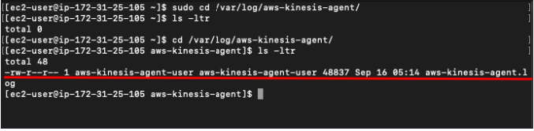

- You can check if the service is started properly by going through the log.
- - `head -10 aws-kinesis-agent.log`
- We can see that the agent is successfully started.

### Testing the real-time streaming of data

Let us test by hosting the above sample website on multiple browsers or do some click activity on the website. The 
related logs will be collected on the listed S3 bucket.

- To test the data streaming, paste your IP_Address/folder_name in the multiple browsers and press enter.
- - Example : http://34.233.120.188/2115_marvel/
- Note: The folder_name is the unzipped folder of the sample website which we have noted earlier in the previous task.
- Once you have followed the above step, click on the website links present to create more logs.
- Note: We are clicking the links in the sample website website to generate logs which will be streamed to the created S3 Bucket.
- Navigate to S3 by clicking on the Services menu, under the Storage section.
- Note: Wait for 3-5 minutes, if you are not able to see the logs.
- You will see a hierarchy of folders with year > month > date > hour.
- Click on the date or hour to see the logs created.
- Click on the log and select Open and save the file.
- Open the log file in any text editor in the local and check the logs.
- Note: The more the clicks in the page, the more the logs are generated. In this demo webpage, we have only 1 page. 
So try to open the webpage in many browsers and click on the links to generate the logs.

### Checking the CloudWatch metrics of Kinesis Data Stream and Firehose

Let us the check the CloudWatch metrics of Kinesis Data Stream which records the data and Kinesis Delivery stream which reads the data from Data Stream.

- Navigate to Kinesis by clicking on the Services menu, under the Analytics section.
- Click on the created data stream and navigate to the Monitoring tab. You will be able to see the graph according to the logs generated.

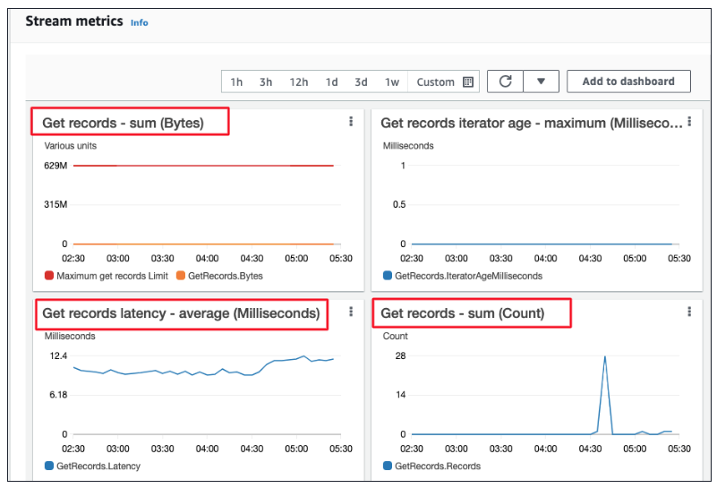

- On the left navigation panel, click on the Data Firehose.
- Click on the created delivery stream and navigate to the Monitoring tab. You will be able to see the graph.

### Delete AWS Resources

- Terminating EC2 Instance 
- Deleting Kinesis Data Streams
- Deleting Kinesis Delivery Streams

## 3. Task with AWS EMR

Task Details:

- Build EMR cluster with 1 master node and 1 core node
- Submit work to cluster
- YARN to manage cluster

### EMR Configuration - Cluster

- Services -> EMR -> Clusters and Click on Create cluster

- General Configuration :
- - Cluster Name: My Cluster (Logging: check)
- - Launch mode: Cluster
- Software configuration :
- - Release: emr-5.32.0
- - Application: Core Hadoop: Hadoop 2.10.1, Hive 2.3.7, Hue 4.8.0, Mahout 0.13.0, Pig 0.17.0, and Tez 0.9.2
- Hardware configuration : 
- - Instance type: m5.xlarge
- - Number of instances: 2
- - Cluster scaling: uncheck
- Security and access :
- - EC2 key pair: select an existing key pair or go to Services -> EC2 -> Key Pairs console to create a new one
- Click on Create cluster
- Click on Cluster on the navigation panel

### EMR Steps

- Wait until the cluster’s Status change from Starting to Waiting cluster ready. You may need refresh the page.
- Security Group Configuration : Services -> EC2 -> Security Groups
- - We need to add our IP address and SSH to the white list to the security of EMR Master node.
- Create SG :
- - Type: SSH
- - Protocol: TCP
- - Port range: 22
- - Source: Anywhere or My IP
- - Click on Save rules

### Connect to EMR Master Node through SSH

- Go back to EMR console
- - Click on `Connect to the Master Node Using SSH`
- Shell on your local machine:
- - `chmod 0400 yourEMR.pem`
- - `ssh -i yourEMR.pem hadoop@ec2-3-236-249-246.compute-1.amazonaws.com`
- Show all nodes through YARN command.
- - Shell on EMR Master node : `yarn node -list -showDetails -all`
- - It shows we have one node (the core node)
- To see the cluster details: 
- - Shell on EMR Master node : `yarn cluster -lnl`
- To see the yarn command : `yarn`

### EMR Configuration - Steps

- Services -> EMR -> Clusters and Click on Create cluster
- Steps - Add Step
- Click on your cluster then click on Steps tab
- We can see the 1st step (kickstart step) is Completed.
- Click on Add step
- - Step type: Pig program
- - Custom JAR
- - Streaming program
- - Hive program
- - Pig program
- - 
- Name: My Pig program
- Script S3 location: create and input your pig program path (must be the script!)
- Download the sample do-reports2.pig program then upload it to your S3 bucket.
- Input S3 Location: create and input your pig Input directory
- Download the sample pig input then upload it to your S3 bucket. (1-6 access logs)
- Output S3 Location: create and input your pig Output directory

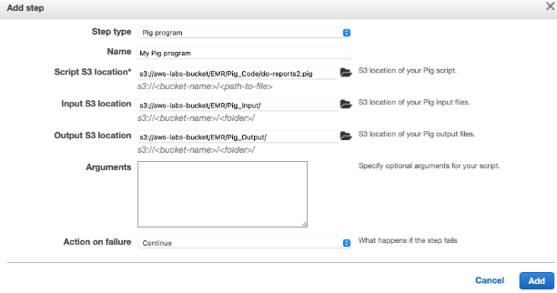

- Click on Add

- Pig Program Review
- This pig program will import logs and break into tuples

------------------------------------------------------------------------------------------
    import logs and break into tuples
    
    raw_logs =
        -- load the weblogs into a sequence of one element tuples
        LOAD '$INPUT' USING TextLoader AS (line:chararray);
    
    logs_base =
        -- for each weblog string convert the weblong string into a
        -- structure with named fields
        FOREACH
            raw_logs
        GENERATE
        FLATTEN (
            REGEX_EXTRACT_ALL(
                line,
                '^(\\S+) (\\S+) (\\S+) \\[([\\w:/]+\\s[+\\-]\\d{4})\\] "(.+?)" (\\S+) (\\S+) "([^"]*)" "([^"]*)"'
            )
        )
        AS (
            remoteAddr: chararray, remoteLogname: chararray, user: chararray, time: chararray,
            request: chararray, status: int, bytes_string: chararray, referrer: chararray,
            browser: chararray
            )
        ;
    
    logs =
        -- convert from string values to typed values such as date_time and integers
        FOREACH
            logs_base
        GENERATE
            *,
            ToDate(time, 'dd/MMM/yyyy:HH:mm:ss Z', 'UTC') as dtime,
            (int)REPLACE(bytes_string, '-', '0')          as bytes
        ;
    
    
    --
    -- determine total number of requests and bytes served by UTC hour of day
    -- aggregating as a typical day across the total time of the logs
    --
    
    by_hour_count =
        -- group logs by their hour of day, counting the number of logs in that hour
        -- and the sum of the bytes of rows for that hour
        FOREACH
            (GROUP logs BY GetHour(dtime))
        GENERATE
            $0,
            COUNT($1) AS num_requests,
            SUM($1.bytes) AS num_bytes
        ;
    
    STORE by_hour_count INTO '$OUTPUT/total_requests_bytes_per_hour';
    
    
    
    --
    -- top 50 X.X.X.* blocks
    --
    by_ip_count =
        -- group weblog entries by the ip address from the remote address field
        -- and count the number of entries for each address blok as well as
        -- the sum of the bytes
            FOREACH
                (GROUP logs BY (chararray)REGEX_EXTRACT(remoteAddr, '(\\d+\\.\\d+\\.\\d+)', 1))
            --     (GROUP logs BY block)
            GENERATE  $0,
                COUNT($1) AS num_requests,
                SUM($1.bytes) AS num_bytes
        ;
    
    
    
    by_ip_count_sorted =  ORDER by_ip_count BY num_requests DESC;
    
    by_ip_count_limited =
        -- order ip by the number of requests they make
        LIMIT by_ip_count_sorted 50;
    
    STORE by_ip_count_limited into '$OUTPUT/top_50_ips';
    
    
    --
    -- top 50 external referrers
    --
    by_referrer_count =
        -- group by the referrer URL and count the number of requests
        FOREACH
            (GROUP logs BY (chararray)REGEX_EXTRACT(referrer, '(http:\\/\\/[a-z0-9\\.-]+)', 1))
        GENERATE
            FLATTEN($0),
            COUNT($1) AS num_requests
        ;
    
    by_referrer_count_filtered =
        -- exclude matches for example.org
        FILTER by_referrer_count BY NOT $0 matches '.*example\\.org';
    
    by_referrer_count_sorted =
        -- take the top 50 results
        ORDER by_referrer_count_filtered BY $1 DESC;
    
    by_referrer_count_limited =
        -- take the top 50 results
        LIMIT by_referrer_count_sorted 50;
    
    STORE by_referrer_count_limited INTO '$OUTPUT/top_50_external_referrers';
    
    
    --
    -- top search terms coming from bing or google
    --
        google_and_bing_urls =
            -- find referrer fields that match either bing or google
            FILTER
                (FOREACH logs GENERATE referrer)
            BY
                referrer matches '.*bing.*'
            OR
                referrer matches '.*google.*'
            ;
    
    search_terms =
        -- extract from each referrer url the search phrases
        FOREACH
            google_and_bing_urls
        GENERATE
            FLATTEN(REGEX_EXTRACT_ALL(referrer, '.*[&\\?]q=([^&]+).*')) as (term:chararray)
        ;
    
    search_terms_filtered =
        -- reject urls that contained no search terms
        FILTER search_terms BY NOT $0 IS NULL;
    
    search_terms_count =
        -- for each search phrase count the number of weblogs entries that contained it
        FOREACH
            (GROUP search_terms_filtered BY $0)
        GENERATE
            $0,
            COUNT($1) AS num
        ;
    
    search_terms_count_sorted =
        -- order the results
        ORDER search_terms_count BY num DESC;
    
    search_terms_count_limited =
        -- take the top 50 results
        LIMIT search_terms_count_sorted 50;
    
    STORE search_terms_count_limited INTO '$OUTPUT/top_50_search_terms_from_bing_google';
------------------------------------------------------------------------------------------

- Run step
- After you add a new EMR step, you can see the Status is Pending, which means it is running now.
- Wait until the Status change to completed. You may need refresh the page.

### Validation Test

- Original Pig Input files (Generally speaking, they are http request log.)

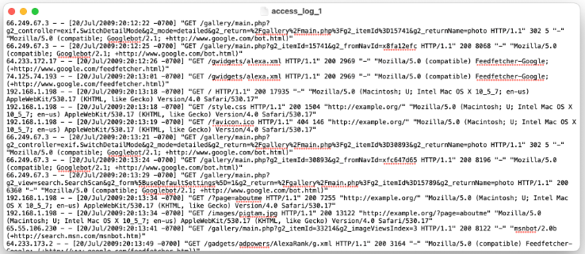

- S3 - Go to your S3 bucket.

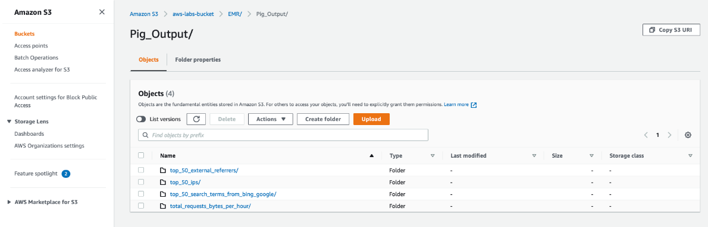

- top_50_external_referrers/

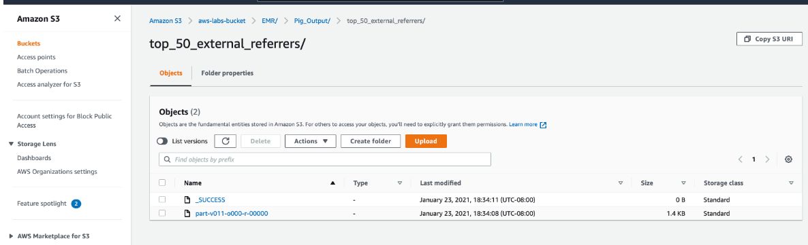

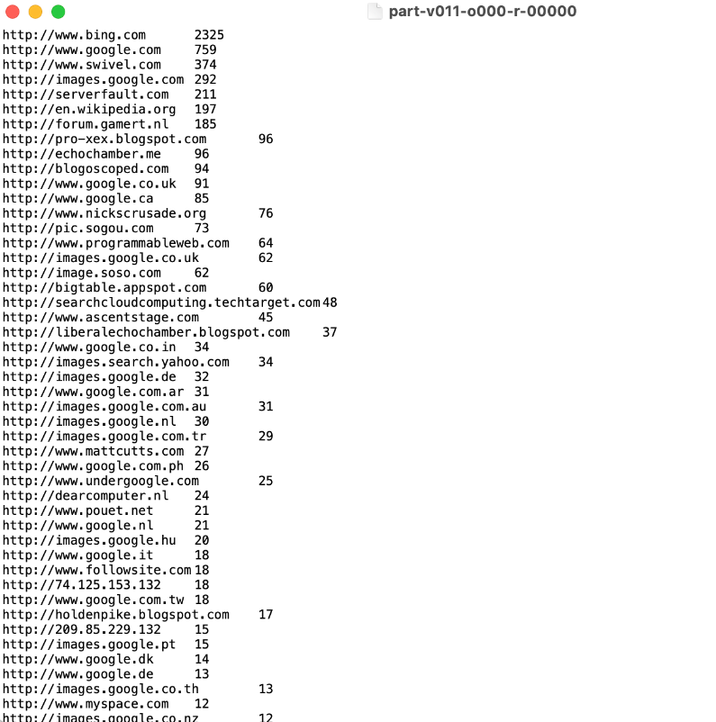

- View the log

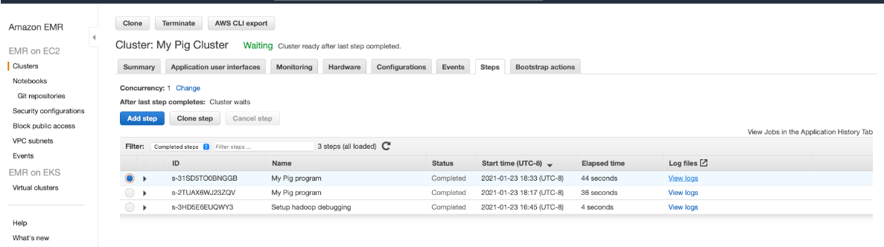

- Monitoring

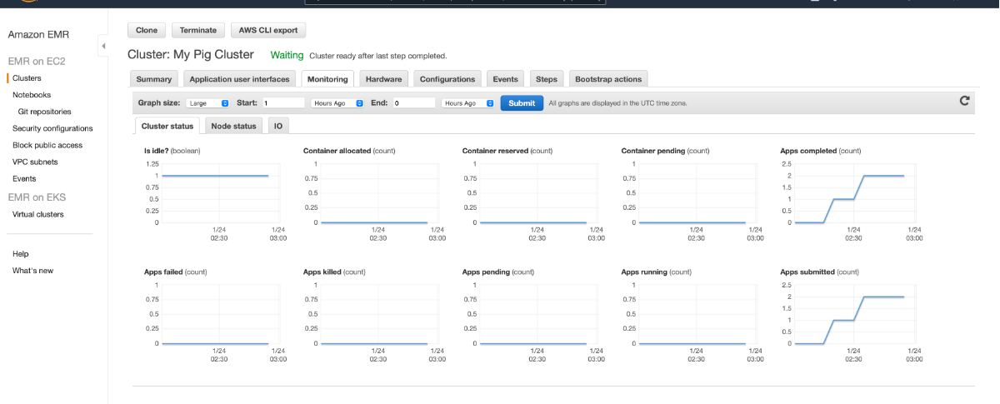

- Warning : Terminate the EMR Cluster to avoid bankrupt.
- Delete the EMR related security groups.
- - You CANNOT delete them together. You MUST delete the slave sg fist then then delete master sg since slave sg refers master sg