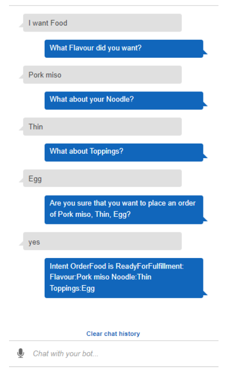

# Task with Machine Learning 

## 1. Getting started with Amazon Rekognition using AWS Lambda

Architecture Diagram

### Create a S3 Bucket and upload images

- In the left menu, choose Buckets, click on Create bucket button and fill the bucket details.
- - Bucket Name: yours.rekognition.23
- - Region: Select yours
- - Object Ownership: Choose ACLs disabled (recommended) option
- - Bucket settings for Block Public Access: Uncheck the option, Block all public access and select the check box 
option of Acknowledgment.
- - Leave other settings as default.
- - Click on the Create bucket button.
- Click on your bucket name.
- You can upload any image from your local storage or download this example image (`rose_flower_54_11.jpeg`)
- Upload a file to S3 bucket

### Create a Lambda function

- Click on the Create function button.
- - Choose Author from Scratch button.
- - Function name: Enter my_rekognition_Lambda
- - Runtime: Select Python 3.8
- - Permissions: Click on the Change default execution role and choose Use an existing role.
- - Existing role: Select  yours_policy_role_<RANDOM_NUMBER> from the dropdown list. (Need to create)
- - Click on Create function button.
- Under Code tab, go to Code source and double click on lambda_function.py, Replace the existing code with the below.

----------------------------------------------------------------------------------------
    import json
    import boto3
    def lambda_handler(event, context):

        bucket_name = "yours.rekognition.23"
        image_obj_name = "rose_flower_54_11.jpeg"
    
        try:
            rkClient = boto3.client("rekognition", region_name="us-east-1")
            try:
                rkResponse = rkClient.detect_labels(
                    Image={
                        'S3Object': {
                            'Bucket': bucket_name,
                            'Name': image_obj_name
                        }
                    },
                )
                print(rkResponse['Labels'])
                return rkResponse['Labels']
            except Exception as e:
                print("Get labels failed because ", e)
        except Exception as e:
            print("Client connection to Rekognition failed because ", e)
----------------------------------------------------------------------------------------

`Note: Please replace the bucket name and object name with yours.`

`Note: If you have created the bucket with a different name or uploaded an object that is different from the lab the output/result may differ.`

- Save the function by clicking on Deploy button.

### Test the Lambda function

`Note: Make sure the bucket name object name on lines 6 and 7 is correct with your S3 data.`

- Click on Test button, Event name: Enter LambdaTest and click on the Save button.
- Again click on the Test button.
- Now in the lambda Execution result Rekognition will return the labels based on the image.
- It gives you data in the format of JSON, with a label name and how confident it is about the detection of the label 
from the image.

So, This is how we use Amazon Rekognition service for detecting labels in an image.

### Delete AWS Resources

- Delete all resources 

## 2. Building a Food Ordering Chatbot Website

Architecture Diagram

### Create a Lambda Function and Integrate it with Lex

- Go to Lambda by searching for the service on the top left hand corner like below and click on the lambda service.
- Click on Create function (Select `Author from Scratch`, Function name: `CanteenBot`, Runtime: `Node.js.14.x`)
- Leave all other options as default and Click on Create Function button.
- Copy the below code and replace the existing code in `index.js` file.

----------------------------------------------------------------------------------------
    function close(sessionAttributes, fulfillmentState, message, responseCard) {
        return {
            sessionAttributes,
            dialogAction: {
                type: "Close",
                fulfillmentState,
                message,
                responseCard,
            },
        };
    }

    function OrderFood(intentRequest, callback) {
        const outputSessionAttributes = intentRequest.sessionAttributes;
        const source = intentRequest.invocationSource;
        console.log(intentRequest);

        if (source === "FulfillmentCodeHook") {
            const slots = intentRequest.currentIntent.slots;

            console.log(slots);
        
            const Toppings = slots.Toppings;
            const Noodle = slots.Noodle;
            const Flavour = slots.Flavour;

    callback(
      close(outputSessionAttributes, "Fulfilled", {
        contentType: "PlainText",
        content: `Great! Your ${Toppings} ${Flavour} ${Noodle} will be available for pickup soon. Thanks for using CanteenBot!`,
      })
    );
    return;
    }
    }
    
    // --------------- Intents -----------------------
    function dispatch(intentRequest, callback) {
        console.log(`intent=${intentRequest.currentIntent.name}`);
        
        const name = intentRequest.currentIntent.name;
        
        console.log(name);

        if (name.startsWith("OrderFood")) {
            return OrderFood(intentRequest, callback);
        }

        throw new Error(`Intent with name ${name} not supported`);
    }

    // --------------- Main handler -----------------------
    exports.handler = (event, context, callback) => {
        console.log(JSON.stringify(event));

        try {
            dispatch(event, (response) => callback(null, response));
        } catch (err) {
            callback(err);
        }
    };
----------------------------------------------------------------------------------------

- Click Deploy in the right-hand corner above the code console to save the code.

### Creating a Chatbot using Amazon Lex

- Navigate to the Services menu at the top, search for Lex and select it. You’ll be redirected to the Amazon Lex Dashboard.
- Click on the Get Started button.
- On the left side Select Return to V1 Console and Click on Create.
- Select Custom Bot and fill in the page with the below information :

----------------------------------------------------------------------------------------
    Bot Name: Enter FoodOrdering
    Language: Select English(US)
    Output voice: Select None this is only a text-based application
    Session timeout: 5 min
    Sentiment analysis: No
    IAM role: Leave as is
    COPPA: yes
----------------------------------------------------------------------------------------
- Click on Create button.

### Create Intent and Slot types and Testing Bot

- Start creating the chatbot by clicking `Create Intent` and also clicking `Create Intent` in the popup window.
- Give a unique name for the new intent: Enter `OrderFood`
- Under sample utterances, enter the following : (`I would like to place an order`, `I want food`)
- Click on the plus sign next to slot types on the left hand side and click on Create slot type.
- Name the slot type as `FlavourType` and add the values `Chicken miso` and `Pork miso`. Click Add slot to intent button.
- Click on create slot type again and this time have the slot type name of `NoodleType` with values of `Thin` and `Thick`. 
Click Add slot to intent.
- Create the last slot type which is `Toppings` and add the values `Egg`, `chicken` and `Garlic oil`. Click Add slot to intent.
- Within the slots section, change the name and prompt for the corresponding slots. 
- - Name: Flavour      Prompt: What Flavour you want?
- - Name: Noodle       Prompt: What about your Noodle?
- - Name: Toppings     Prompt: What about Toppings?
- Click on Confirmation Prompt:
- - In Confirm Section Type : Are you sure that you want to place an order of {Flavour}, {Noodle}, {Toppings}?
- - In Cancel Section Type : No worries! Your order will not be placed.

- Click Build button on the top right corner of the page
- Test the bot by clicking the right hand side Test Chatbot toolbar to expand the chatbot window.

- Select your intent. Within the Fulfillment section of the page , select AWS Lambda Function and within the drop down 
choose CanteenBot. A popup should appear like the image below. Select OK to use the Lambda function. Version should be set to Latest by default.

- Click Build and Test the Bot.

### Add Button to the chatbot responses

- Go to the slot under Flavour slot select the settings icon on the far right.
- A popup should appear as below and you can scroll down to fill in the values corresponding to the buttons and click Save.
- - Image URL : https://static.toiimg.com/thumb/54458787.cms?width=1200&height=900

- Build the Chatbot and Test it. 

### Publish the Chatbot

- Once you have finished making your chatbot. You can publish it by clicking on the publish button on the top right.
- Create an alias : Enter `PublishCanteenBot`
- Leave other options as default and click on the Publish button in the popup window.

### Create an Amazon Cognito role for website Integration

- From the AWS Console, type Cognito and select the service.
- Click on Manage `Identity Pools` and then click on Create new Identity pool button.
- - Identity Pool name: Enter `MyTest`
- - Check Enable access to Unauthenticated Identities checkbox
- Click on the Create Pool button.
- Expand the View Details section, note down the role name for authenticated and unauthenticated identities.
- Click Allow on the bottom right.
- On the new page, note down the Identity Pool ID, you will need this in the next section.
- On the services dropdown on the top, expand and search for IAM.
- On the IAM page, click on Roles on the left hand side.
- Search for Cognito unauth role
- Click on Add permissions and then click on Attach Policies to attach new policies for this role.
- Search for the `AmazonLexRunBotsOnly` and select the box on the left hand side.
- Search for `AmazonRekognitionReadOnly` policy, select the box on the left hand side.
- Once all the policies are selected, click Attach Policy at the bottom.

### Create a website using HTML, CSS and Javascript with Rekognition HTML File

- Download the entire code
- Open `main.html` file. This is a basic HTML file with the use of a Bootstrap framework to easily structure 
the webpage into 3 columns.
- Copy the `main1.html` code within the body section inside the main.html file. Copy the code between the 
`
` tag.

- JavaScript files are the components in the code that allows functionality and logic to occur.
- Open `video.js` file This code will initiate the camera window so you can capture images from your laptop camera.
- Double click on your main.html file and you should see the screen below and when the browser asks for camera permissions, click Allow.

- CSS is a file format that is used to style the web page with colors and formatting.
- Open `style.css` file This sets the background to a particular color
- Add the `main2.html` to the head section within the `main.html` file. This ensures that your HTML file can have a 
reference to the style you defined within your css document.
- Your head section within your main.html file should look like the code snippet below.

- Refresh your webpage and your background color will have changed into the image below.

- We also want to identify the items found in the image. Copy and paste the main3.html code within the body section of 
the main.html file after the `
` tag.

- Now we want to send the image bytes over to the Rekognition API to identify the objects in the image. To undertake 
this Copy and paste the video1.js code to the bottom of the video.js file.

`NOTE : Replace the identity pool id with the identity pool id you copied down in the previous section.`

- After adding all those components, save the file and refresh your web page. When you click capture, the Rekognition 
API would be used to identify the objects and you should see a list of objects on the left hand side like the below image. Additionally, a spinning icon should come up when capturing images.

- We can add some custom functionality such as Google searching any objects identified. Add the video2.js code snippet 
inside video.js after pageList.appendChild(element).
- Your code should look like this for video.js.   

- Refresh your page and test out the image recognition website by taking a picture and see the google search occur for 
the item in the image.
- Let's add some extra styles in the webpage. Add the below style1.css inside your style.css file. This adds the borders 
and background colours for the video window.

### Integrate Lex into a basic website 

In this task we are going to add chatbot into the live website

- Open your main.html and paste the main4.html code in the `

` tags. 
- - This code includes a button on the bottom right corner and will open a form when the button is clicked.
- Paste the style2.js code inside the style.css so the form and buttons are styled correctly.
- The web page should look like the below now. The orange button on the right hand side should be seen now but you 
can't interact with it at this point in time.

Link the Lex chatbot functionality with the website

- To link the Lex chatbot functionality with the website open chatbot.js.
- Replace the botName and botAlias in the code
- Add the main5.html code snippet underneath `` within the main.html file.
- You should now be able to expand the chatbot window and interact with your Amazon Lex Chatbot.

### Hosting the website on S3 using Cloudfront

- On the S3 page click on Create Bucket and fill the bucket details:
- - Bucket name: Give a unique name which is available
- - Region: Select yours
- - Object Ownership : Enabled
- - Uncheck Block Public Access settings for this bucket and Acknowledge it.?
- - Leave other settings as default
- Click on the Create Bucket button.
- Click on your Bucket and then click on the Upload button.
- Click on Add files. Browse your main.html, style.css, chatbot.js and video.js files into the bucket
- Scroll Down and expand Permission tab and select Grant public-read access and Acknowledge it
- Click on Upload.
- Go to the services bar on the top left and type Amazon CloudFront to go to the Amazon CloudFront service console.
- Click Create Distribution on the top left within the service panel.
- In Create DIstribution console:
- - Origin Domain: Select S3 bucket you created
- - S3 Bucket access: Select Yes
- - Origin access identity: Select Create new OAI
- - Bucket policy: Select Yes
- - Viewer protocol policy:Select Redirect HTTP to HTTPS
- - Default root object: main.html
- Click Create Distribution on the bottom right to create your distribution wait untill it get deployed it may take some time
- Click Distributions on the left hand side and go to your distribution Domain Name. Copy and Paste that name to your 
web browser to see your website.
- 

### Cleanup AWS Resources

- Deleting Lex Chatbot
- Deleting Lambda Function
- Deleting Cognito
- Deleting S3 Bucket
- Deleting Cloudfront
