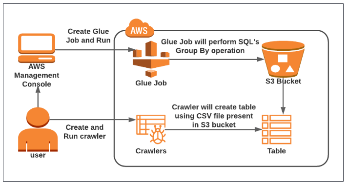

# Task with DMS, Glue and S3

## 1. Migration of Database using DMS

Architecture Diagram

### Launch New Ubuntu EC2 Instance

In this task, we are going to create a new Ubuntu EC2 instance that will serve as the source database for the migration 
to Amazon RDS instance.

- Click on Instances from the left sidebar and then click on Launch instances 
- Name : Enter `SourceEC2Instance`
- For Amazon Machine Image (AMI): Select Ubuntu in quickstart and in the drop box.
- For Instance Type: select t2.micro
- For Key pair: Select Create a new key pair Button
- - Key pair name: MyKey
- - Key pair type: RSA
- - Private key file format: .pem.
- In Network Settings, Click on Edit:
- - Auto-assign public IP: Enable
- - Select Create a new security group
- - Security group name : Enter Migration-SG
- - Description : Enter Migration-SG
- To Choose SSH
- - Choose Type : SSH
- - Source : Anywhere
- For MYSQL/Aurora
- - Click on Add security group rule
- - Source : Anywhere
- - Choose Type : MYSQL/Aurora
- Keep rest thing Default and Click on Launch Instance Button.
- Note down the IPv4 Public IP address - Example: 54.221.120.52

### SSH into the EC2 Instance via console

### Install and Configure MySQL Server

In this section, we are going to install and configure MySQL server on the Ubuntu EC2 instance that was launched in the 
previous task. MySQL is a popular open-source relational database management system, and it needs to be installed on the 
EC2 instance to serve as the source database for the migration process.

- Once connected to the server, switch to root user:  
- - `sudo su`
- To update all the packages:
- - `apt-get update -y`
- Install MySQL:
- - `apt-get install mysql-server -y`
- Login to the MySQL:
- - `mysql -u root -p`
- Enter Password: by default, the password is empty. Press Enter to proceed further.
- Enter 
- - `exit;`
- Now, we have to set the password, for the root user. Please keep a note of this password as we will use this in 
upcoming steps. To set the default password,  please run the below-provided commands one by one:
- - We must first stop the MySQL service using the command : `/etc/init.d/mysql stop`
- - Create a directory using the command : `mkdir /var/run/mysqld`
- - Change the ownership of the directory using : `chown mysql /var/run/mysqld`
- - Now start MySQL using : `mysqld_safe --skip-grant-tables&`
- - 
- - You will be seeing something similar to the above picture, then Press [Enter].
- - Connect to MySQL with root user using : `mysql -u root`
- - Enter : `UPDATE mysql.user SET authentication_string=null WHERE User='root';`
- - Enter : `FLUSH PRIVILEGES;`
- - Enter : `ALTER USER 'root'@'localhost' IDENTIFIED WITH mysql_native_password BY 'source123';`
- - Enter : `FLUSH PRIVILEGES;`
- - Enter : `exit;`
- - Now we must stop all services before starting again by using : `sudo killall -u mysql`
- - 
- - You will see something similar to the above picture, hit [Enter] if you do not come out of the process message.
- - Start the service using : `/etc/init.d/mysql start`
- - Log in to MySQL again using : `mysql -p -u root` , Password: source123
- Now you can only log in using the password you have set and nothing else.
- After successful login, you will be able to see the welcome message and mysql> prompt waiting for your command:
- - 
- To exit out of MySQL, run the following command: `exit;`
- Make sure you do not give any extra spaces while executing these commands.

### Update the MySQL configuration file

In this task, we will open mysqld.cnf file and check the below details to configure them. If any rule is missing, 
then we have to manually add those in the MySQL config file. To edit that file, follow the below steps in Source Instance.

- To edit the MySQL config file, use the below provided command:
- - `nano /etc/mysql/mysql.conf.d/mysqld.cnf`
- Check the below details already in the MySQL configuration file.
- - bind-address = 0.0.0.0
- - server-id = 1
- - log_bin=mysql-bin
- - binlog_format=row
- If any rule is not available, then enter the missed ones manually and save the file.
- - 
- To save the file: Press CTRL+X and confirm by pressing ‘y’ and hit enter.
- Restart the MySQL server using the below command: 
- - `/etc/init.d/mysql restart`
- Source Database is configured.

### Create an Amazon RDS Database

In this task, we are going to create a new Amazon RDS database that will serve as the source database for the migration 
to Amazon RDS instance

- Click on Databases from the left navigation menu and then click Create database
- Specify DB details:
- Instance specifications
- - Database creation method : Standard create
- - Engine options : Select MySQL
- - Version : Default
- - Template : Select Free tier
- - DB instance identifier : Enter mydbinstance
- - Master username. : Enter awsrdsuser
- - Master password and Confirm password: Enter mylabs123
- - `Note:` This is the username/password combo used to log onto your database. Please make note of them somewhere safe.
- - DB instance class : Select `Burstable classes db.t2.micro — 1 vCPUs, 1 GiB RAM`
- - NOTE : Select Include previous generation classes If t2.micro is not visible
- - Storage type : Select `General Purpose SSD (gp2)`
- - Allocated storage : Select 20 (default)
- - Enable storage autoscaling : Uncheck
- - Virtual Private Cloud(VPC) : Select Default VPC
- - Subnet group : Select Default
- - Public Access : Select No
- - VPC Security groups : Select Choose existing
- - Existing VPC security group name : Remove the default security group and select Migration-SG from the dropdown list
- Scroll down to Additional Configuration options
- - Initial database name: Enter myrdsdatabase
- - DB parameter group: Select default
- - Option group: Select default
- - Enable automated backups: uncheck
- - Enable auto minor version upgrade: uncheck
- - Maintenance window: Select No preference
- - Enable deletion protection: uncheck
- Leave other parameters as default. Scroll to the bottom of the page, Click Create database.
- It will take around 5 minutes for the database to become available. Once the status changes from creating to available, the database is ready.
- Open mydbinstance and note down the Endpoint of RDS under Connectivity and security
- - `Example: mydbinstance.c81x4bxxayay.us-east-1.rds.amazonaws.com`

### Create a Replication instance in DMS

In this section, we are going to create a replication instance in the AWS Database Migration Service (DMS). The replication 
instance will be used to replicate data from an EC2 MySQL database to an Amazon RDS database.

- Click on Services and then choose Database Migration Service under the Migration & Transfer.
- Click on Replication instances from the left navigation menu and then click Create replication instance
- In the Replication instance configuration section:
- - Name : Enter myreplicationinstance
- - Description : Enter To replicate EC2-Mysql to AWS RDS
- - Instance class : Select dms.t3.micro
- - Engine version : Default
- - Allocated storage (GB) : Enter 10 GB
- - High Availability : Select Dev or test workload (Single-AZ)
- - VPC : default VPC
- - Publicly accessible : Check
- In Advanced security and network configuration section:
- - Replication subnet group : Default
- - Availability zone : Default
- - VPC security group(s) : Enter Migration-SG
- - KMS master key : Default
- Leave other settings as default.
- Click on the  Create button to create the replication instance.
- `NOTE : Ignore the error and click on Create button again`
- It will take 5 minutes for a replication instance to be created. Once status changes to available, click on the 
instance and scroll down. You will find the details section of the replication instance.
- Select myreplicationinstance from Details section, copy the private & public IP address and note it down on the notepad.

### Configure Replication Instance details in Source EC2 Instance

- SSH back into the Source EC2 instance. For more details, go through SSH into Source Database EC2 instance from Mac 
or Windows systems.
- Switch to root user: `sudo su`
- Login to the MySQL: `mysql -u root -p` , enter password: source123
- Command Syntax to create a new user in a MySQL Database
- - `CREATE USER 'root'@<<Private IP of Replication Instance>> IDENTIFIED BY 'your-root-password';`
- - Example : `CREATE USER 'root'@172.31.29.148 IDENTIFIED BY 'source123';`
- We need to grant root access to the replication instance to connect with the MySQL server on Source EC2. To give access, 
follow the below steps:
- - `GRANT ALL ON *.* TO root@'<<Private IP of Replication Instance>>' IDENTIFIED BY 'your-root-password';`
- - Example: `GRANT ALL ON *.* TO root@172.31.29.148;`
- And repeat the same step now with the Public IP address of the replication instance.
- - `CREATE USER 'root'@3.224.227.68 IDENTIFIED BY 'source123';`
- - `GRANT ALL ON *.* TO root@3.224.227.68;`
- Save the changes by using the following command: `FLUSH PRIVILEGES;`
- Enter exit to Exit MySQL and to restart the MySQL server, run the below command.
- - `/etc/init.d/mysql restart`
- The Replication instance has access to Source Instance MySQL Database.

### Create Endpoints in DMS

We have to create the Source and Target endpoints for EC2 and RDS Instances. These endpoints will help to connect the 
replication instance with both source and target machines.

Source Endpoint:

- To create an Endpoint, Click on the Endpoints (Left panel) in the DMS service console page and click on Create endpoint
- Follow the below steps to complete Endpoint type:
- - Select endpoint as Source endpoint
- - Select RDS DB instance: Uncheck (This is for Source, i.e. MySQL on EC2)
- Endpoint configuration:
- - Endpoint identifier : Enter sourcemysqlendpoint
- - Descriptive Amazon Resource Name (ARN): sourcemysqlendpoint
- - Source engine : Select MySQL
- - Access to endpoint database: Choose Provide access information manually
- - Server name : 54.221.120.52 - Public IP address of Source EC2 Instance (Enter your IP)
- - Port : Enter 3306
- - Username : Enter root
- - Password : Enter source123
- - Secure Socket Layer (SSL) mode: None
- Leave other configurations as default.
- Test endpoint connection:
- - VPC : Default
- - Replication instance : Enter myreplicationinstance (Which was created earlier)
- - Click on Run test to test the connection. If all are working fine, you will be able to see the status as “successful”
- Click on Create Endpoint.

### Target Endpoint:

- To create an Endpoint, Click on the Endpoints(Left panel) in the DMS service console page and click on the Create endpoint button
- Follow the below steps to complete Endpoint type:
- - Select endpoint as Target endpoint
- - Select RDS DB instance: check (This is for Target i.eRDS Instance)
- - Select RDS Database: mydbinstance
- Endpoint configuration:
- - Endpoint identifier : Enter mydbinstance
- - Descriptive Amazon Resource Name (ARN): Enter awsrdsendpoint
- - Target engine : Enter MySQL
- - Access to endpoint database: Choose Provide access information manually
- - Server name : Enter `mydbinstance.c81x4bxxayay.us-east-1.rds.amazonaws.com ? DNS Endpoint of RDS database`
- - Port : Enter 3306
- - Secure Socket Layer (SSL) mode: None
- - User name : Enter awsrdsuser
- - Password : Enter yourlabs123
- Leave other settings as default.
- Test endpoint connection:
- - VPC : Default
- - Replication instance : Enter myreplicationinstance (Which we created earlier)
- - Click on Run test to test the connection.
- Click on the Create endpoint  button.

### Create a simple custom Database on Source EC2:

In this task, we will create a simple database and create a table inside which will be migrated using DMS.

- SSH back to Source EC2 Instance.
- Connect to Source MySQL Client
- - `mysql -u root -p`, Enter Password : source123
- Create a Database : `CREATE DATABASE SchoolDB;`
- - View the database created : `show databases;`
- Switch the database SchoolDB : `use SchoolDB;`
- Create a sample Table of students:

-------------------------------------------------------------------------------------
    CREATE TABLE students (
        subject_id INT AUTO_INCREMENT,
        subject_name VARCHAR(255) NOT NULL,
        teacher VARCHAR(255),
        start_date DATE,
        lesson TEXT,
        PRIMARY KEY (subject_id)
    );
-------------------------------------------------------------------------------------

- See the student table : `show tables;`
- Insert data into the table

-------------------------------------------------------------------------------------
    INSERT INTO students(subject_name, teacher) VALUES ('English', 'John Taylor');
    
    INSERT INTO students(subject_name, teacher) VALUES ('Science', 'Mary Smith');
    
    INSERT INTO students(subject_name, teacher) VALUES ('Maths', 'Ted Miller');
    
    INSERT INTO students(subject_name, teacher) VALUES ('Arts', 'Suzan Carpenter');
-------------------------------------------------------------------------------------

- Check the items added in the Table : `select * from students;`
- - 
- After database migration, this new custom table can be used as proof of database migration.

### Checking AWS RDS Database before Migration

In this task, we will check the databases and tables that exist on the AWS RDS Instance. So that after migration, you 
will be able to find the new changes. We can use the existing Source EC2 Instance to connect to AWS RDS.

- SSH into the Source EC2 instance.
- Switch to root user: `sudo su`
- Now, connect to the Amazon RDS Instance by running the below command:
- - Syntax : `mysql -h <RDS Instnace Endpoint> -u <User Name> -p`
- - `Example: mysql -h mydbinstance.c81x4bxxayay.us-east-1.rds.amazonaws.com -u awsrdsuser -p`
- - Enter Password: mylabs123
- After successful login, run the below command : `Show database;`
- 
- A database by name SchoolDB does not exist now. After migration, SchoolDB database will be available here.

### Create a Database Migration Task

An AWS Database Migration Service task is where all the migration process happens. We will specify the tables and 
schemas to use for the migration and any special processing, such as logging requirements, control table data, and error handling.

- Click on Database migration tasks from the left navigation menu and then click Create task
- Create a database migration task:
- Task configuration:
- - Task identifier : Database-Migration-Task
- - Replication instance : Select myreplicationinstance
- - Source database endpoint : Enter sourcemysqlendpoint
- - Target database endpoint : Enter mydbinstance
- - Migration type : Migrate existing data and replicate ongoing changes
- Task settings:
- - Editing mode: Wizard
- - Target table preparation mode: Do nothing
- - LOB column settings: Limited LOB mode
- - Maximum LOB size (KB): 32 KB
- - Validation: Uncheck Turn on
- - Task logs: Uncheck Turn on cloudwatch logs
- - Leave Advance tasks settings as default.
- Table mappings:
- - Editing mode : Wizard
- - Selection rules : Click on Add new Selection rule button
- - Schema : Select Enter a Schema
- - Source name : Enter %SchoolDB (Database name)
- - Source table name : Enter %students (Table name)
- - Action : Include
- Leave other settings as default.
- Click on Create task.
- Now the migration of Database will occur. Usually it will take around 1 minute.

### Status of AWS Database Migration Tasks:

- Navigate to Database migration tasks in left panel of DMS page.
- If you followed all the previous steps correctly, it will show the migration task status as `Load complete, replication ongoing`
- Now the Migration of database to Amazon RDS is completed.
- To check the migration status and details, we need to connect to the destination MySQL database which is in AWS RDS Instance.
- SSH back into Source EC2 Instance.
- Connect to AWS RDS instance.
- - `mysql -h mydbinstance.c81x4bxxayay.us-east-1.rds.amazonaws.com -u awsrdsuser -p`
- - Enter Password: mylabs123
- Once inside MySQL Client, check the databases available: `show databases;`
- 
- Run command: `use SchoolDB;`
- 
- Run command: `show tables;`
- 
- Run command: `select * from students;`
- 
- Now we can see the SchoolDB which was available in Source EC2 Ubuntu Server migrated to Amazon RDS Instance Database.

## 2. Perform ETL operation in Glue with S3

Architecture Diagram

### Copy S3 Bucket's Sample data URI

- Navigate to S3 by clicking on the Services menu at the top, then click on S3 in the Storage section.
- Create and click on the bucket name your have created.
- Put 2 files in bucket (glue_code.py, sample_data.csv)
- Click on the sample_data.csv, to check the properties of this file
- Click on either of the copy buttons to copy the path (URI) of the sample_data.csv file.
- Save this URI in a notepad, we'll need this during the creation of the Glue crawler.
- And, save the S3 bucket name, we need this one, when working with glue script.

### Download the glue code

- Download the glue_code.py

### Create a Glue crawler

- Navigate to AWS Glue by clicking on the Services menu in the top, then click on AWS Glue in the Analytics section.
- Click on Crawlers under the Data catalog section.
- To create a Crawler, click on the Create Crawler button.
- Section 1 : Set Crawler properties
- - Crawler name: Enter MyCrawler
- - Click on the Next button.
- Section 2: Choose Data Sources and classifiers
- - Select : Not yet
- - Data Sources: Select Add a data source
- Section 3: Add a data store
- - Choose a data store: Select S3
- - Location of S3 data : Select In your account
- - S3 path: paste the copied S3 URI i.e. s3://yourbacket/sample_data.csv
- - Subsequent crawler runs : Select Crawl all sub-folders
- - Click on Add an S3 data source button.
- - Click on Next button.
- Section 4: Configure security settings
- - IAM role : Select Create new IAM role
- - IAM role: AWSGlueServiceRole
- - Click on the Create button.
- - Click on the Next button.
- Section 5: Set output and scheduling
- - Click on the Add database button.This will navigate you to the new tab.
- - Database name: enter demo
- - Keep other options as default.
- - Click on the Create database button.
- - Go back to the previous tab.
- - Click on the Refresh icon and Choose the database created.
- - Under Crawler Schedule, Set Frequency as On demand
- - Click on the Next button.
- - Under Review and Create, Click on Create button.
- A crawler is now created.

### Run the crawler, to create a table

- Select the crawler and click on the Run crawler button.
- The crawler has completed, one table is now created.

### Create a Glue Job

- Click on ETL jobs under the Data Integration and ETL section in the left navigation panel.
- Select the `Spark script editor`.
- - Under Options, Select Upload and edit an existing script. In the Choose file, upload the python file downloaded before.
- - Click on Create button.
- Few modifications in the glue script :
- - On line 15, make sure your database name is correct, i.e. demo
- - On line 16, make sure your glue table name is correct i.e. sample_data_csv
- - On line 18, replace the s3 bucket name with the bucket name present in yor account
- `Note: The output will not be sent to the S3 bucket if you miss replacing the bucket name on line 18.`
- Navigate to the Job Details tab
- Section 1: Configure the job properties
- - Name: enter MyJob
- - IAM role: select AWSGlueServiceRole (you have created it)
- - Type: Select Spark
- - Glue version: select Glue 4.0 - Supports spark 3.3, Scala 2, Python 3
- - Worker type: Select G 1X
- - Check the Automatically scale the number of workers box
- - Maximum number of workers: Enter 5
- - Max concurrency: Enter 1
- - Job timeout (minutes): Enter 10
- - Scroll Down and Under Advanced properties, Script file name: MyJob.py
- - Script path where the script is stored: select the s3 bucket 
- - Leave other options as default
- - Click on the Save button on the top right.
- Click on Run button.
- - Navigate to Runs tab , Job is currently in Running state.
- - The glue job will be shown as succeeded with-in 10 minutes.
- Check the output of Glue Job

### Check the output of Glue Job

- Navigate to S3 by clicking on the Services menu at the top, then click on S3 in the Storage section.
- Open the S3 Bucket
- Here, you will see your files
- Download the output file, named as `run-1610354854518-part-r-00000` (your file name will be another), and save this file as CSV.
- - Select the file
- - Click on the Actions button.
- - Choose the option of Download as.
- - Add .csv at the end of the file and open with excel.
- - You will see data

### Delete AWS Resource

- Deleting Glue Job
- Deleting Glue Crawler
