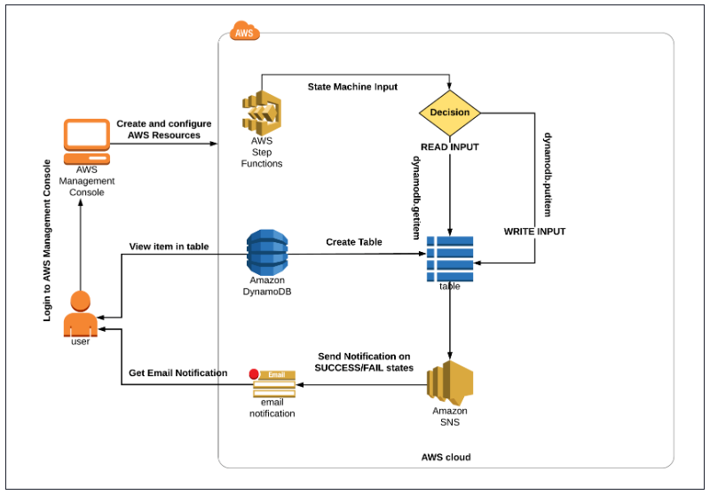

# Task with EBS

## 1. Automating EBS Snapshot Creation Using CloudWatch and SNS

Architecture Diagram

### Creating an EC2 Instance

- Click on Instances from the left sidebar and then click on the Launch instance button. 
- Name : Enter myserver
- For Amazon Machine Image (AMI): Search for Amazon Linux 2 AMI in the search box and click on the select button.
- For Instance Type: select t2.micro
- For Key pair: Select Proceed without a key pair 
- In Network Settings Click on Edit:
- - Auto-assign public IP: Enable
- - Select Create new Security group
- - Security group name: Enter mySG
- - For SSH
- - Choose Type: SSH
- - Source: Custom (Allow specific IP address) or Anywhere (From ALL IP addresses accessible).
- Click on Launch Instances.
- Copy the Instance ID for further use.

### Create an IAM Role

- Select IAM under Security, Identity, & Compliance. On the left menu, click on Roles. Click on the Create Role button.
- - Select type of trusted entity: Select AWS Service
- - Select Lambda from the AWS Services list.
- Filter Policies:  Now you can see a list of policies. Search for your policy by name `mysnapshotpolicy` and select it
- Select your policy and click on the Next.
- Role Name:
- - Role name: Enter `Snapshot_Role`
- - Click on the `Create role` button.

### Create a Lambda Function

- Click on the Create Function button.
- Choose `Author from scratch`.
- Function name: Enter `MylabsEBS`
- Runtime: Select Python 3.9
- Architecture : Select x86_64(default)
- Role: In the permissions section, click on Change default execution role and then click Use an existing role.
- Existing role: Select `Snapshot_Role`
- Click on the Create function button.
- Copy the code, and paste it into the Lambda function code block:

---------------------------------------------------------------------------------------------
    import json
    import boto3
    import time
    from botocore.exceptions import ClientError
    def lambda_handler(event, context):

        try:
            # EC2 Client
            client = boto3.client('ec2', region_name='us-east-1')
            # Get Volume ID of EBS attached to EC2 Instnace
            response = client.describe_volumes()
            if len(response['Volumes']) > 0:
              for k in response['Volumes']:
                  print("EBS Volume ID : ",k['VolumeId'], " of EC2 Instance : ", k['Attachments'][0]['InstanceId'])
                  try:
                      # Create a Snapshot of Volume
                      responsesnapsnot = client.create_snapshot(VolumeId= k['VolumeId'])
                      print("Snapshot Created with ID : ", responsesnapsnot['SnapshotId'])
                  except Exception as e:
                      print("some error :", e)
            return {
                    'statusCode': 200,
                    'body': json.dumps("sucess")
                    }
        except ClientError as e:
                print("Detailed error: ",e)
                return {
                        'statusCode': 500,
                        'body': json.dumps("error")
                   
                        }
        except Exception as e:
                print("Detailed error: ",e)
                return {
                        'statusCode': 500,
                        'body': json.dumps("error")
                   
                        }

---------------------------------------------------------------------------------------------
 
- Once the code is pasted, click on the Deploy button to save the code.
- Copy the ARN of the Lambda function and save it in Notepad, we'll need it later while creating a subscription.

### Create an SNS Topic

- Navigate to Services at the top and choose Simple Notification Service
- Click Topics on the left side panel. Now click on Create Topic.
- Select `Standard` as Type.
- Enter the topic name: Enter `Mylabnote` 
- Under `Delivery status logging`, select AWS Lambda and then click on `Create new service role` under IAM roles.
- Click on Create new roles, now you will be redirected to another tab for IAM.
- Now you will be redirected back to the SNS page. Click on Create Topic.

Note: If you are getting the error displayed (`Couldnt create topic`), ignore the error and click on the Create Topic button again.

- Create a subscription by clicking on the Create Subscription button.
- Choose `Topic ARN`  then choose AWS Lambda as the protocol. In Endpoint Copy and paste the ARN of your Lambda function 
and click on the Create Subscription button
- Create another Subscription and set the protocol to Email and under Endpoint provide a valid email address. You will 
receive a confirmation email to the address you provided. (Please check your Spam folder of your email)
- Once you confirm your email address, navigate to Topics on the left panel and click on mylabnote. Now you can see a dashboard

### Create a rule in CloudWatch

- Click on Rules under Events in the left side panel.
- You will be asked whether you want to use the newer service EventBridge or the old service CloudWatch Events.
- Click on Go to Amazon Eventbridge. 
- On the Amazon EventBridge page, click on Create Rule.
- Enter the rule name as Mysnap
- Rule Type: `Rule with an event pattern` and then click on the Next button
- Event source: `AWS events or EventBridge partner events`
- In Event Pattern:
- - Event source: AWS service and choose EC2 in Service Name
- - Choose Event Type as `EC2 Instance State-change Notification`.
- - Select `Specific State(s): Stopped, Pending`.
- - Select Specific Instance and Paste the Instance ID you copied in Task `Creating an EC2 Instance`
- Click on Next
- Select the Target type as AWS Service and choose SNS Topic in the drop-down list.
- Select the Topic you created(Mylabnote), scroll down, and click on `Skip to Review and Create`.
- Review everything and click on Create Rule.
- Now navigate to Services and click on EC2 under Compute.
- Select the EC2 instance, click on the Instance state, and click on the Stop instance. Click on the Stop button on the pop-up window
- You will receive an email confirmation and a snapshot will be created automatically.
- To check the snapshot, click on Snapshots under Elastic Block Store in the left side panel. Please wait for some time 
for the snapshot to get created completely and the status will change to completed.

### Delete AWS Resources

## 2. Creating a Serverless Workflow with AWS Step Functions

Architecture Diagram

### Create a DynamoDB Table

- In this task, our objective is to generate a DynamoDB table by inputting the necessary configurations.
- Click on Services and select DynamoDB under the Database section
- Click on the Create table button. 
- - Table Name: Enter `mydynamodbtable`
- - Partition key: Enter ID and select String
- - Leave everything as default.
- - Click on Create table button.
- Your table will be created within 2-3 minutes.

### Create a SNS Topic

- Click on Topics in the left navigation panel. Click on Create topic button.
- - Type : Select Standard
- - Name : Enter Step_function_SNS
- - Display Name : Enter Step_function_SNS
- - Leave other options as default and click on Create topic button.
- - Copy the ARN and save it for later. (Place it in any text editor)

### Create a SNS Subscription

- Under Subscriptions, Click on the Create subscription button.
- - Topic ARN : Select the ARN of Topic you created
- - Protocol : Select Email
- - Endpoint : Enter your <Mail>
- Leave everything as default and click on Create subscription button.
- You will receive an email confirming your subscription to your email.
- Click on cConfirm subscription link.
- Your email address is now subscribed to the SNS Topic `Step_function_SNS`

### Create a State Machine in Step Function

- Navigate to the Services menu at the top, then click on Step Functions
- Click on the State machines from the left navigation panel.
- Click on Create state machine button.
- Click on `here` link to write your own workflow.
- Click on Leave button. Select Write your workflow in code. Select Type as Standard.
- Definition :
- - Open/download State_machine_Definition for the state machine.
- - Copy the whole code and replace the existing state machine json code

Note : If you create the dynamoDB table with a different name please update the table name in the following areas.

- - Search for `ReadDataFromTable` and update the table name.
- - Search for `WriteDataToTable` and update the table name.
- - Now replace the entire value of `TopicArn` key with the `SNS Topic ARN` that you have copied and placed in the text edit.
    (Update both places)
- State Machine Definition Explanation:
- - The State machine either writes or reads data to the dynamoDB table.
- - Based on the input we provide, it determines whether to Read or Write Data.
- - If the operation is successful, you will get a success message to your mail id which you have provided in the SNS topic.
- - If the operation Fails or any exception or task operation fails, you will get a Failed message as Email notification.
- Now on the right side the flow diagram will be as follows:

Note : if this image is not displayed, please click on the refresh button, to reload the diagram.

- Now click on the Next button.
- Specify details:
- - Name : Enter MyStateMachine
- - Permissions - Execution role : Select Create new role
- - INFO : AWS will automatically detect all the services used in state machine definition and creates an IAM role with 
all the required permission.
- - Leave everything as default.
- Click on the `Create state machine` button.

### Test the Step function

#### Test 1 - Write data to DynamoDB table

- Click on the Start execution button.
- New execution:
- - Enter an execution name: Enter `SampleTest1`
- - Input: Copy and paste the following code:

---------------------------------------------------------------------------------------------
    {
        "TableOperation": "Write",
        "ID": "12345",
        "Name": "Alex"
    }
---------------------------------------------------------------------------------------------

- Click on the Start execution button.
- In the Graph inspector diagram, you can view the state machine control flow. The colour of Tasks will become green 
(success) as shown in the image below.

- Now Navigate to your DynamoDB Table, click on the table name `mydynamodbtable` and then click on `Explore table items`.
- You will be able to see the value got inserted to the table.
- Now check your Mail and you will be able to see success message.

#### Test 2 - Read data from DynamoDB table

- Now again go back to your state machine and Click on the New execution button.
- New execution :
- - Enter an execution name : Enter SampleTest2
- - Input : Copy and paste the following:

---------------------------------------------------------------------------------------------
    {
        "TableOperation": "Read",
        "ID": "12345"
    }
---------------------------------------------------------------------------------------------

- Click on the Start execution button.
- In the Graph inspector diagram, you can view the state machine control flow.

- Now Check your Mail and you will be able to see a success message.

#### Test 3 - Fail the condition

- Now again go back to your state machine and Click on the New execution button.
- New execution:
- - Enter an execution name : Enter SampleTest3
- - Input : Copy and paste the following code:

---------------------------------------------------------------------------------------------
    {
        "TableOperation": "Update",
        "ID": "123454",
        "Name": "John"
    }
---------------------------------------------------------------------------------------------

- Click on the Start execution button.
- In the Graph inspector diagram, you can view the state machine control flow.

Note : you will only get a failure SNS notification, if the API call to dynamoDB fails, or the table name in the definition is wrong.

### Delete AWS Resources

