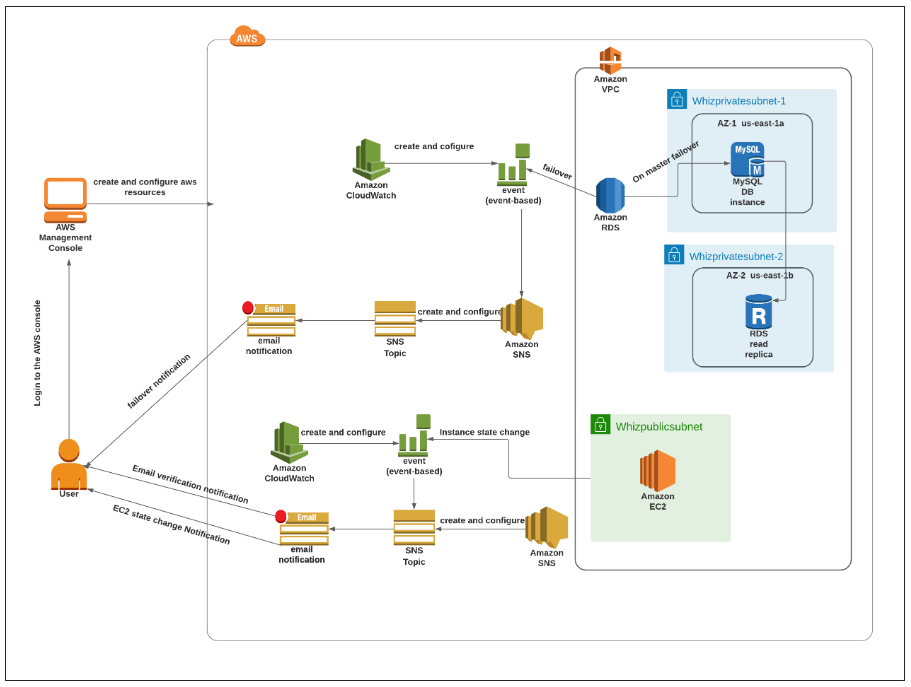
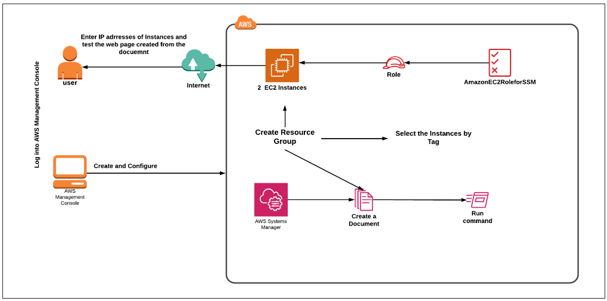
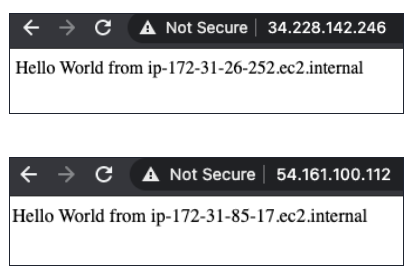
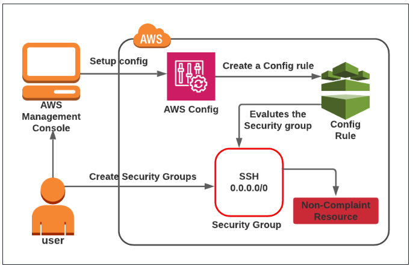

# Task with SQS and SNS

## 1. Building a Resilient AWS Architecture to withstand hardware failovers and get notified using SNS from scratch

Architecture Diagram

### Create a VPC

You are creating a virtual private cloud for our instances.

- Navigate and click on `Create vpc`
- - Name tag: Enter  MyVPC (or any name of your wish)
- - IPv4 CIDR block: Enter 10.0.0.0/16
- - IPv6 CIDR block: Select No IPv6 CIDR Block
- - Tenancy: Leave it as  Default
- - Now click on Create VPC button.

### Create and configure Internet Gateway

- Click on `Internet Gateways` from the left menu and click on `Create internet gateway`.
- - Name tag : Enter MyInternetGateway
- - Click on Create internet gateway.
- Select the Internet gateway you created from the list and click on `Actions` and Click on `Attach to VPC button`.
- Select MyVPC which you created from the list and click on Attach Internet gateway button.

### Create public and private subnets

- In the left panel click on Subnets and click on Create Subnet button.
- - VPC ID: Select MyVPC from the list you created earlier.
- - Subnet Name: Enter PublicSubnet-1
- - Availability Zone: Select us-east-1a (you need select yours)
- - IPv4 CIDR block: Enter 10.0.1.0/24
- - Click on Create Subnet button.
- We are going to create the two private subnets that we use for our RDS instance.
- - VPC ID: Select MyVPC
- - Subnet Name: Enter PrivateSubnet-1
- - Availability Zone: Select us-east-1a (you need select yours)
- - IPv4 CIDR block: Enter 10.0.2.0/24
- 
- - VPC ID : Select MyVPC from the list you created earlier.
- - Subnet Name: Enter PrivateSubnet-2
- - Availability Zone: Select us-east-1b (you need select yours)
- - IPv4 CIDR block: Enter 10.0.3.0/24
- - Click on Create Subnet button

### Create a Public and Private Route Table

We are creating a public and private route table and associating the private subnets with the private route table.

- Go to `Route Tables` from the left menu and click on Create route table.
- - Name Tag: Enter PublicRouteTable
- - VPC: Select MyVPC from the list.
- - Click on Create route table
- Now, add a route to allow Internet traffic to the VPC.
- - Select PublicRouteTable.
- - Go to the Routes tab, click on the Edit routes button and on the next page, click on Add route.
- - Specify the following values: 
----------------------------------------------------------------------------------------------------------------------
    Destination: Enter 0.0.0.0/0
    Target: Select Internet Gateway from the dropdown menu to select MyInternetGateway.
----------------------------------------------------------------------------------------------------------------------
- - Click on Save changes button.
- Now associate the subnets to the route tables.
- - Go to subnet associations
- - Click on Edit Subnet association.
- - Select PublicSubnet-1 from the list.
- - Click on Save associations button.
- Go to Route Tables from the left menu and click on Create Route table.
- - Name Tag: Enter PrivateRouteTable
- - VPC: Select MyVPC
- - Click on Create route table.
- Now associate the subnets to the route tables.
- - Click on the Edit Subnet association tab.
- - Select PrivateSubnet-1, PrivateSubnet-2 from the list.
- - Click on Save Associations.

### Create a security group for EC2 and RDS

- In this section, you are creating a security group for both EC2 and RDS.
- Navigate to EC2 by clicking on the Services menu in the top, then click on EC2 under the Compute section. Firstly we 
are creating a security group for EC2.
- Under security groups, click on Create security group.
- - Security group name:  Enter EC2-SG
- - Description: Enter Security group for EC2
- - VPC: Select MyVPC
- Click on edit inbound rules,  Click on Add rule
- - Choose Type: SSH
- - Source: Select Custom (0.0.0.0) or Anywhere-IPv4
- Now click on the Create security group button.
- We are now creating a security group for RDS.
- - Security group name:  Enter RDSMulti-AZ
- - Description: Enter Security group for RDS
- - VPC: Select MyVPC
- Click on Edit inbound rules button, and Click on Add rule button.
- - Choose Type: MySQL/Aurora
- - Source: Select the security group of EC2 that was created earlier EC2-SG
- Click on Create security group button.

### Create a subnet group for RDS

- We are creating a subnet group for Multi-AZ deployment in RDS.
- Navigate to RDS by clicking on the Services menu in the top, then click on RDS under the Databases section.
- On the left panel select the Subnet groups . This is mainly used for launching your database in a private subnet.
- Click on Create DB subnet group. Under subnet group details
- - Name:  Enter RDSMultiAZ-SBG
- - Description: Enter Subnet group for RDS Multi-AZ
- - VPC: Select MyVPC
- Under Add subnets section
- - Availability Zones: select us-east-1a,us-east-1b
- - Subnets: Select both IPv4 addresses of the private subnets we have created.
- - Click on the Create button.

### Launching an EC2 instance

- In this instance, you are launching an EC2 mainly for hardware simulation tests.
- Navigate to Instances from the left side menu and click on Launch Instance button.
- Choose an Amazon Machine Image (AMI): Search for Amazon Linux 2 AMI in the search box and click on the select button.
- Under the Name and Tags section :
- - Name : MyEC2
- Select Quick Start tab and Amazon Linux under it
- Amazon Machine Image (AMI) : select Amazon Linux 2 AMI
- Under the Instance Type section : 
- - Instance Type : Select t2.micro
- Under the Key Pair (login) section :
- - Click on Create new key pair hyperlink
- - Key pair name: EC2_Public_Key
- - Key pair type: RSA
- - Private key file format: .pem or .ppk
- - Click on Create key pair and select the created key pair.
- Under the Network Settings section :
- - Click on Edit button.
- - Remove the existing default VPC and add VPC with name MyVPC
- - Subnet: Choose the created subnet  PublicSubnet-1
- - Auto-assign public IP: select Enable
- - Firewall (security groups) : Select an existing security group
- - Common security groups : Select Security group with name EC2_SG
- Click on Advanced Details :
- - IAM Role: create role
- Keep everything else as default and click on the Launch instance button.
- Launch Status: Your instance is now launching, Navigate to Instances page from the left menu and wait until the status 
of the EC2 Instance changes to running.

### Create a RDS database instance

- Navigate to RDS dashboard
- Click on the Create Database button and you are navigated to the page where you will provide all the required details 
to create a MySQL database.
- On the page, click on the option `Standard create` a method for our lab requirement.
- In the Engine options, select MySQL engine type.
- Edition: Leave it as default
- Under Templates, select Dev/Test option.
- Under Availability and durability: Select Multi-AZ DB instance
- Under Settings, provide the following details :
- - DB instance identifier: Enter database-1
- - Master username: Enter mylabadmin
- - Master password: Enter mylabs123
- - Confirm password: Enter mylabs123

`Note : Make sure the master and confirm passwords should be the same and also note the username and password.`

- Under DB instance class, select Burstable classes (including t classes) and select db.t3.micro
- Storage: 
- - Storage Type : Select General Purpose SSD (gp2)
- - Allocated storage: 20 GiB.
- - Enable storage autoscaling: Uncheck the option
- Under connectivity
- - VPC: choose MyVPC
- - Public access: Select No
- - VPC Subnet Group: Select RDSMultiAZ-SG.
- Under VPC Security group: Remove the Default SG and Select RDSMulti-AZ
- Leave all the other options default and click on Create Database.
- It will take 15-20 minutes to create the database and the status will turn to Available.
- Now, the database is successfully created.

### Configuring Cloudwatch metrics and adding a subscription

- In this section, you are creating an alarm and adding a subscription for EC2 recovery.
- Navigate to CloudWatch by clicking on the Services menu at the top
- Click on All alarms under Alarms in the left panel and then click on Create alarm button.
- Click on Select Metric to choose the metric that will trigger our alarm
- Copy the instance id of the EC2 instance(MyEC2) created.
- Now paste the instance id in the search bar.
- We can see this `EC2 > Per-Instance Metrics`, click on it.
- Select the `StatusCheckFailed_System` metric and click Select metric button.
- Now, add the following conditions to it:
- - Statistics: select  Average
- - Period: select 1 minute
- In alarm conditions :
- - Threshold type: select `static`
- - Whenever `statusCheckfailed` system is: Select `Greater/Equal`
- - Than(Define threshold value) :Enter 1
- - Click Next.
- Now we are going to create  notification and recovery actions for the EC2 instance failover
- Now navigate to `Notification` section
- - Alarm state trigger: Select `In alarm`
- - In SNS topic: Select Create new topic
- - Topic name: Enter `EC2FailAlarm`
- - Email endpoints that will receive the notification : Enter `your email address`
- Now click on the Create topic button.
- For recovery of EC2, we will create EC2 action, to do so, scroll down and click on Add EC2 action button.
- - Alarm state trigger: Select `In alarm`
- - Take the following action:  Select `Recover this instance`
- Click on the Next button.
- Alarm name: Enter  `EC2Recover`
- - Description: Enter `EC2Recover`
- Click on Next button
- After previewing now click on create alarm button. However, you will see a pending notification.
- Go to your email address and you would receive a notification from AWS. Check your spam email if you have not received 
it in the inbox.
- Click on `Confirm subscription link`. You will see that you are now subscribed to this notification.

### SSH into the EC2 instance

- To SSH into `MyEC2` Instance follow the steps below.
- Select the instance `MyEC2`. Click on `Connect` button.
- Now select the EC2 Instance Connect option. You can see there are four options for connecting to EC2. You can use any 
of the given options to get in the console but for our lab, we are using EC2 instance connect.
- A new tab would be opened in your browser where we can see the console.

### Triggering cloud watch alarm for EC2 instance hardware failure

- In this section, you will be simulating the hardware failure of the EC2 instance so we can test out the cloudwatch alarms 
and notifications.
- After SSH into your instance perform the following command : `aws configure`
- Press enter until you reach the default region. Enter us-east-1 (yours) in the default region and continue pressing enter.
- The next command is to change the alarm state and simulate failure.
- - `aws cloudwatch set-alarm-state --alarm-name "EC2Recover" --state-value ALARM --state-reason "Simulate Hardware Failure"`
- After this command, go to CloudWatch alarms. You can see the alarm changed to In alarm from Ok.
- Click on EC2Recover. You can see the actions in the History section.
- You will also receive an SNS notification in your email. Check your spam email if you have not received it in the inbox.
- You can also explore different actions in alarm.

### Creating SNS subscription for RDS failover

- In this section, you are simulating an RDS failover and also an sns subscription to send the notification as soon as the 
failover happens.
- Navigate to RDS under the Database section of the Services menu.
- On the left panel, we can observe the `Event Subscriptions` section, click on it.
- Click on the `Create Event Subscription`:
- - Event subscription name: Enter `RDSfailover`
- - Target: choose New Email topic
- - Topic Name: Enter `RDSfailNotification`
- - With these recipients: Enter your mail id
- In the source section:
- - Source type: Select Instances
- - Instances to include: Choose specific instances
- - Specific instance: Select database-1
- - Event categories to include: Select All event categories
- Click on Create button.
- Now go to your emails, and you will receive a notification from the AWS side.If you have not received it check in your 
spam mail.
- Click on Confirm subscription link.
- Your email address is now subscribed to SNS Topic RDSfailNotification.
- Now, navigate to Database instances, on the left panel, click on database-1
- In action select `Reboot`, check `Reboot with Failover` option.
- Click on Confirm button.
- Wait for a few minutes to fail.
- You will now get a notification/mail in your inbox or your spam about the database failover.

### Clean up AWS Resources

- Deleting EC2 Instance
- Deleting RDS DB Instance
- Deleting Cloud Watch Alarm

## 2. Use AWS Systems Manager document & Resource Group to install Apache on EC2 Instance

Architecture Diagram

### Launch 2 EC2 Instances

- Name : Enter EC2_SSM
- Choose an Amazon Machine Image (AMI): Select Amazon Linux 2 AMI in the drop-down.
- - Choose architecture as 64-bit(x86)
- Choose an Instance Type: Select t2.micro.
- Key Pair: Select Proceed without a Key Pair
- Under Network Settings ,  click on Create security group.
- - Uncheck the Allow SSH traffic from.
- - Check the Allow HTTP traffic from the internet.
- Under Advanced Details, choose IAM Instance profile (need to create)
- At the top right, Enter number of instances as 2.
- Click on Launch Instances button.
- Launch Status: Your instances are now launching, Click on the instance ID to view the newly launched EC2 instances 
and wait till status change to Running.

### Create a Resource Group

- Navigate to Resource Groups & Tag Editor by clicking on the Services menu in the top, then click on Resource Groups 
and Tag Editor under Management and Governance section.
- Click on the Create Resource Group.
- Enter a Group name and Group description and click on Create Group
- - Group Type: Select `Tag based`
- - Grouping Criteria: Select `AWS::EC2::Instance`
- - Group details: Enter `EC2_SSM_Group`
- - Group description: Enter `Creating a New Resource Group`
- - Tags : (Key: Enter `Name` , Value: Enter `EC2_SSM`)

`Note: Since we are creating Group resources by specifying Tags that are shared by the resources, Enter the Tag’s key 
and value the same as the EC2 Instances or select from the drop-down list.` 

- Click on Preview group resources. As soon as you click on the option, you’ll see the Instances displayed according to 
the tags selected.
- The Resource Group has been created successfully.

### Create Command Document and Run the Command

- Navigate to Systems Manager by clicking on the Services menu in the top, then click on Systems Manager under 
Management and Governance section.
- On the left panel, scroll down to the `Shared Resources` and click on the `Documents`.
- Select `Owned by me` and click on `Create command or session`
- Under `Document details` give the name as `InstallApache`.
- Under the content, select `YAML` and paste the following script as it is and click on `Create Document`.
----------------------------------------------------------------------------------------------------------------------
    schemaVersion: '2.2'
    description: Sample YAML template to install Apache
    parameters:
        Message:
            type: "String"
            description: "Welcome Message"
            default: "Hello World"
    mainSteps:
    - action: aws:runShellScript
      name: configureApache   
      inputs:
          runCommand:
            - 'sudo yum update -y'
            - 'sudo yum install -y httpd'
            - 'sudo systemctl start httpd.service'
            - 'sudo systemctl enable httpd.service'
            - 'echo "{{Message}} from $(hostname -f)" > /var/www/html/index.html'
----------------------------------------------------------------------------------------------------------------------

- Once the document is created, click on the tab Owned by me. Search for the document created by you and click on it.
- Click on the Run Command option on the top right corner. A new window will be opened.
- In the `Run a Command` page, scroll down and choose the `Targets` as `Choose a Resource Group` and select the Resource 
group created earlier from the dropdown list.
- Leave all other options as default and click on Run.
- Wait for about a minute. The command ID will be successfully created and executed. If it is In Progress, click on Refresh.

### Testing the command

- To test whether the command is executed, let us copy the Public IP’s in the browser and check the response.
- Navigate to the Instances on the left panel of EC2. Copy and paste the Instances Public IP in the browser.
- You will see the output as entered in the script.

`Note: If you are not able to open in the same browser, copy and paste the instances Public IP in a different browser.`

### Delete AWS Resources

- Delete EC2 Instance
- Delete Resource Group
- Delete Command Document

## 3. Check the Compliance status of Security group using AWS Config

Architecture Diagram

### Setup Config with 1 Click option

- Navigate to Config service
- On the Home page of AWS Config, click on the 1-click setup option.
- Review everything and click on the Confirm button to complete the setup.
- Once the setup is done, Config will discover all the resources present in the account.

### Create a Config Rule

- On the left side panel, click on the `Rules` under AWS Config.
- Click on the `Add rule` button.
- For step-1, Specify the rule type, select the rule type and choose one of the AWS Managed rules.
- - `Select rule type`: Select `Add AWS managed rule`
- - `AWS Managed Rules`: In the search box, type `ssh` and hit enter.
- - Select the rule with the name `restricted-ssh` and click on the Next button.
- For Step-2, Configure rule, keep all the options as default, and click on the Next button.
- For Step-3, Review and create, review the settings and click on the Save button.
- The rule is now added to our account.
- Wait for 2–3 minutes, config rule named restricted-ssh, will check all the security groups and let you know the compliance status.
- Since there is only one security group present i.e. default Security group of default VPC present in the account, it 
will check whether it is having an SSH inbound port or not if there is an SSH inbound port, what is the source. If it is 0.0.0.0/0 then it will be marked as a non-compliant resource. By default, it is not open, so it will be a compliant resource.

`Note: If the Compliance status is still not showing anything, refresh the page using the Ctrl + R option.`

- Let's create 2 sample security groups with the only SSH as an inbound port with 0.0.0.0/0 as the source and check 
whether Config is marking them as a non-compliant resource or not.

### Create first Security Group

- Click on the Create security group button.
- We are going to create a Security group for the ECS cluster.
- - Security group name: Enter `Security Group 1`
- - Description: Enter `First Security group`
- - VPC: Select `Default VPC`
- - Click on the `Add rule` button under `Inbound rules`. (Type : Select `SSH`, Source : Select `Anywhere IPv4`)
- Leave everything as default and click on the Create security group button.

### Create second Security Group

- Security group name: Enter `Security Group 2`
- Description: Enter `Second Security group`
- VPC: Select `Default VPC`
- Click on the Add rule button under Inbound rules. (Type : Select `SSH`, Source : Select `Anywhere IPv4`)
- Leave everything as default and click on the Create security group button.

### Test the compliance status of the Security groups

- In this section, we are going to check if the security groups are marked as compliant or non-compliant by the AWS Config rule.
- Navigate to Config by clicking on the Services menu
- On the left side bar, click on the Rules, and you will be able to see the rule is still in compliant status.
- To get the latest compliance status of the rule, we need to refresh them. In terms of Config, it is called Re-evaluate.
- Perform the following task to Re-evaluate:
- - Select the rule present
- - Click the Actions button
- - And, Choose Re-evaluate option
- It may take up to 5 minutes for the config to get the compliance status of the created security groups.
- Compliance status is now refreshed, it is showing 2 Noncompliant resource(s).

`Note: If the Compliance status is still now showing anything, refresh the page using the Ctrl + R option.`

- Click on the rule name to check the Noncompliant resources.
- Optionally, you can remove all the inbound rules and recheck the compliance status.

### Delete AWS Resources

- Deleting Config rules

