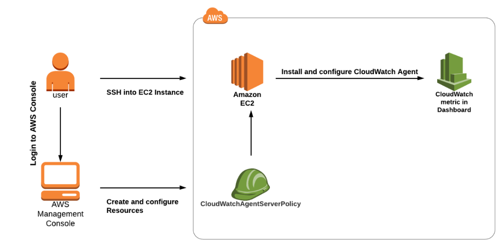
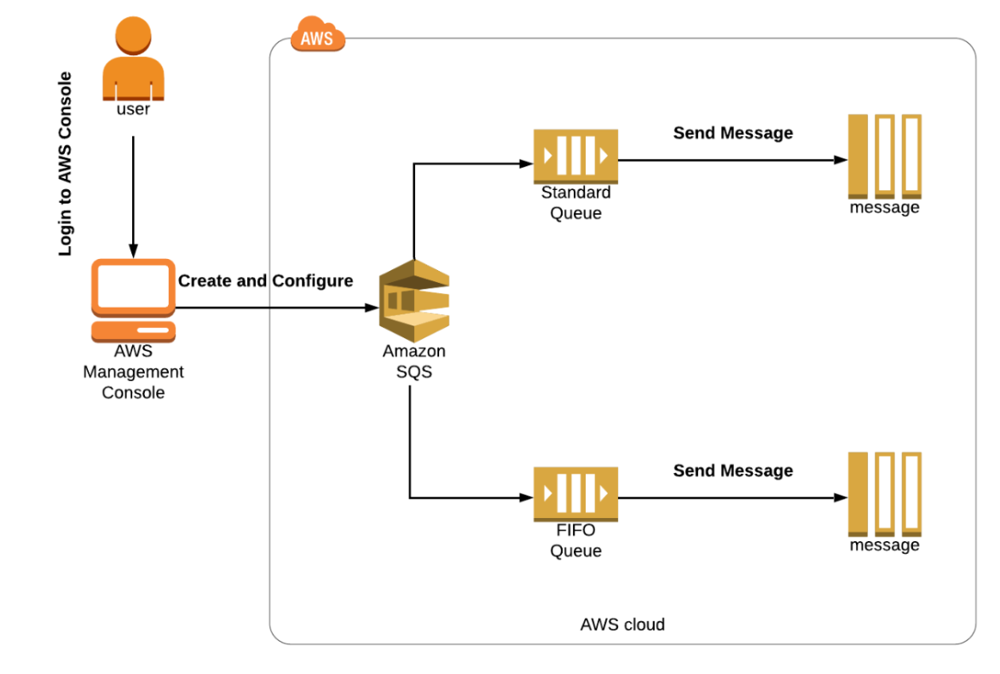
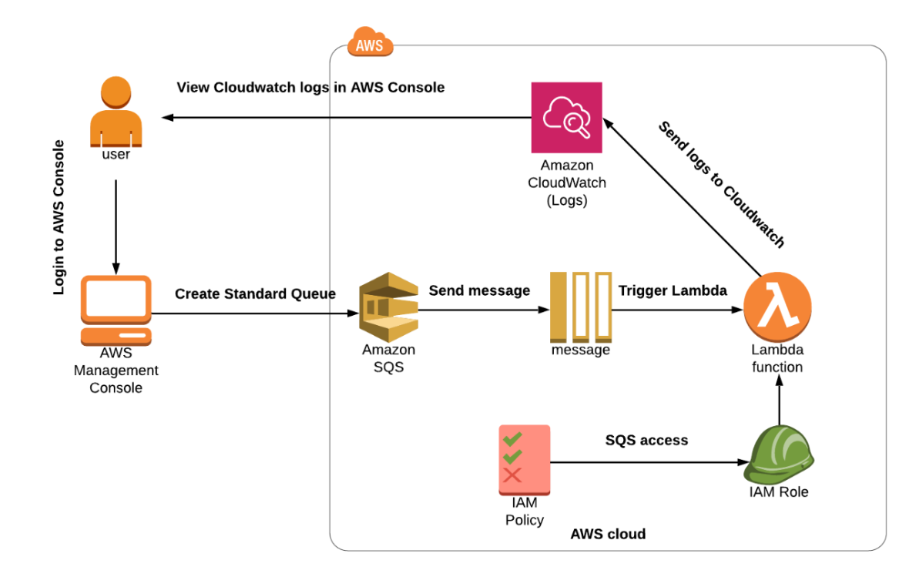

# Table of contents

1. [EC2](#ec2)
2. [CloudWatch, SNS, SQS](#cloudwatch-sns-sqs)
3. [Route53](#route53)
4. [VPC](#vpc)
5. [ECS](#esc)
6. [CI-CD](#ci-cd)
7. [SAM](#sam)
8. [RDS](#rds)
9. [ElasticCache](#elasticcache)
10. [DynamoDB API Gateway Lambda Secret Manager X-Ray](#lambda-dynamo-apigateway)
11. [CronJobs via aws: EventBridge + Lambda](#cron-job-event-bridge-lambda)
12. [S3 + CloudFront, AWS Shield, WAF](#s3-waf-shield)
13. [Beanstalk](#beanstalk)
14. [AWS Autoscaling](#autoscaling)
15. [AWS Cognito](#cognito)
16. [Security & encryption: KMS, Secret Manager](#security-kms)
17. [Monitoring tools](#monitoring-tools)
18. [AWS Config, System Manager, Amazon Inspector](#config-smm-inspector)
18. [Architectural section](#architectural-section)
19. [Final Section](#final-section)

<a name="ec2"></a>

## EC2

###### Included: EBS, EFS, Instance Store, ALB, Target Group, Auto Scaling Group, Launch template, Launch Configuration

#### Goal: Get hands-on experience with aws core service: EC2.

#### Launch internet accessible web server using ec2 with manual setup

Launch ec2 instance, setup web server using httpd and html page, test it via public ip address.

#### Setup EC2 using userdata

Automate step 1 using userdata. Do your steps to set up a web server via userdata, test it via a public ip address.

#### Setup EC2 using userdata and create a static public ip address.

Reproduce previous step, attach elastic ip, reboot instance, test it via elastic ip.

#### Create an ec2 server and test access for S3.

Create a test s3 bucket (just a simple s3 bucket with full default settings).
Create EC2 and try to get a list of S3 buckets in the account. You should get an error, google it and try to understand
why.
Fix the error using iam role with right iam permissions.

#### Launch template

Create a Launch template with basic settings and userdata.
Test it via public ip.

#### Setup highly available server stack using ALB + Target Group

Create a fleet of EC2 instances ( at least 2 servers) with your userdata. You can use the Launch template from the
previous step.
Create a target group. (use Instances for target type)
Create ALB. Choose at least two subnets, don`t forget to create a security group for alb.
Test your application via ALB DNS name.
Make sure your server does not accessible via server public ip (only from ALB)
(This should be done via properly configured security group)

#### Spot Fleet

Creating a launch template with default settings, with t2.micro linux image and httpd userdata.
Create an auto scaling group and test it via ALB.
Create Spot Fleet Request with existing launch template.
Test instance via public IP.
Interrupt a Spot Instance directly from Amazon EC2 Console.
What is the difference between allocation strategy?

#### Create AMI with httpd server

Create ec2 with httpd and html page. Launch instance using AMI and test that httpd works.

#### Launch Configuration and Autoscaling group

Create launch configuration using previous AMI and autoscaling group based on it.
Test it via ALB.

#### EBS & EFS

#### EBS and ec2

Create EC2. Create EBS. Attach it to newly created ec2.
Create a file on this new EBS.
Create a second Ec2 and reattach this ebs to the second ec2.
Ssh to the second instance and double check that you have a file from the first instance

#### EFS and ec2

Create EC2. Create EFS.
Attach EFS to EC2.
Try to upload a file on EFS from this EC2.

#### EBS and EC2

Create an EC2 instance with next ebs settings:
Create one more ebs volume
Do not delete after instance terminated
Type: gp3
Name: /dev/sdy/
Encrypted using default key
Delete ec2 instance, test that your ebs volume is still there.
Delete it.

#### Placement Group

Create all 3 types of placement groups.
Launch 2 instances in each.
Describe the difference.

### Theory

* Compare Saving plans and reserved instances
* Placement groups. What is the benefits
* EFS vs EBS
* What is an instance store?

<a name="cloudwatch-sns-sqs"></a>

# CloudWatch, SNS, SQS

#### Using CloudWatch for Resource Monitoring, Create CloudWatch Alarms and Dashboards

Create EC2 Instance.SSH into EC2 Instance.
Create SNS Topic.
Subscribe to an SNS Topic. (via email)
Check EC2 CPU Utilization Metrics in CloudWatch Metrics.
Create CloudWatch Alarm.
Testing CloudWatch Alarm by Stressing CPU Utilization. (stress --cpu 2 --timeout 60)
Checking For an Email from the SNS Topic.
Checking the CloudWatch Alarm Graph.
Create a CloudWatch Dashboard.

#### Install CloudWatch Logs Agent on EC2 Instance and View CloudWatch Metrics

Create an EC2 instance.
SSH into EC2 Instance.
Download and Install the Cloudwatch agent on EC2.
Configure and Start the Agent.
View the metric in the Cloudwatch Metrics.



#### Create an Alarm Using a Metric Filter

Create an SNS topic
Create an email subscription to the topic
Create a log group and configure the log group to retain logs for 1 year.
Create a metric filter using the previous log group and name it http-5xx-metric. Create a filter pattern that monitors
all of the HTTP 500-level errors and name it http-5xx-filter. Use these log events to test the pattern you created.
127.0.0.1 - - [24/Sep/2013:11:49:52 -0700] "GET /index.html HTTP/1.1" 500 287 2
127.0.0.1 - - [24/Sep/2013:11:49:52 -0700] "GET /index.html HTTP/1.1" 500 287 3
127.0.0.1 - - [24/Sep/2013:11:50:51 -0700] "GET /~test/ HTTP/1.1" 200 3 4
127.0.0.1 - - [24/Sep/2013:11:50:51 -0700] "GET /favicon.ico HTTP/1.1" 501 308 5
127.0.0.1 - - [24/Sep/2013:11:50:51 -0700] "GET /favicon.ico HTTP/1.1" 503 308 6
127.0.0.1 - - [24/Sep/2013:11:51:34 -0700] "GET /~test/index.html HTTP/1.1" 200 3

5. Create an alarm using the custom metric filter you just created. Set the metric name to http-5xx-sum.
6. Configure the alarm to evaluate every minute and set the total threshold to greater than 5. Then, set the alarm
   threshold to 3 units.
7. Publish a message to the topic when the ALARM state is triggered. Set the alarm name to 5xx-alarm.

#### SQS

#### Introduction to Simple Queuing Service

Create FIFO and Standard Queue using the Console.
What is Long Polling and configuring Long Polling for the queue.
What is Visibility Timeout and configuring Visibility Timeout.
What is Delay Queue and configuring Delay Queue.
Purge Queue and verify the same.
SQS points to remember.



#### Creating CloudWatch Logs for SQS by Triggering a Lambda function

Create a SQS Queue.
Create a Lambda Function.
Check the CloudWatch Logs.



#### Add SNS subscription filtering for SQS

https://aws.amazon.com/getting-started/hands-on/filter-messages-published-to-topics/

<a name="route53"></a>

# Route53

#### Assign A record for your EC2

Create ec2 with httpd web server in public subnet
Create A record in ec2 for IP address of ec2
Test it

#### Alias setup for EC2

Create ec2 with httpd web server in public subnet
Create ALB and target group
Create alias for alb.
Test it

#### Private hosted zone

Create a ec2 instance in private subnet
Create internal ALB + target group
Create private hosted zone and point alias to this ALB
Try to call this alias from your browser
Create a bastion in the public subnet and try to ping this ec2 using the hosted zone.

#### Questions:

* Alias vs Cname
* Routing policies: Failvoer, Geolocation, Geo Proximity. Weighted Latency When to use?


### DynamoDB

Structure: (Determine keyAttributes, PartitionKey, sortKey, NonKeyAttributes)!!

* Product Cart
* customerId
* Status&Date
* Price
* Count
* Status

* Create DynamoDB table
* Create lambda function on python that will insert data in dynamodb
* Create lambda function that will retrieve data from dynamodb (list)
* Create lambda to get by id

#### DynamoDB + DAX

* Add DAX caching for previous DB
* Three nodes in different availability zones (1 in each)

#### Cloudformation for DynamoDB

Goal: You need to create a cloudformation script for dynamodb with Dax cache

#### Questions:

* DynamoDB DAX vs Redis
* Aurora serverless v1 vs v2

<a name="elasticcache"></a>

# ElasticCache: Redis + Memcahed

#### Create web application using Java or Python or NodeJs

* RDS Postgresql as a database

ElasticCache Redis as a cache implementation

* NodeType: micro
* Replicas: 1
* Auto failover ON
* Vpc default
* Specify maintenance window as night
* Specify daily backups

Table:

* Users
* Id
* firstName
* lastName
* phoneNumber

Goal:

* When POST user, add to db then to cache
* When GET user firstly check in-memory cache than go to DB.
* When DELETE user firstly delete from cache than from db

Flow:

* Deploy your application on EC2
* Test it via load balancer


#### Create ElasticCache Memcached 

Goal: Create memcached cache and connect to it via our application. Test it with simple request

###	Questions:

* What is the difference between Redis and Memcached?
* Which cache strategies do you know?
* How encryption works for both?
* How does scaling work for both?

<a name="lambda-dynamo-apigateway"></a># ESC & ECR
# DynamoDB API Gateway Lambda Secret Manager X-Ray

#### Create serverless application

Goal: create an application to save products

* Create a dynamoDb table for products
* Create a lambda function based on Python to receive a POST request with Product data. Required: Id,productName,
  productCost.
* //Not-required: array of strings for description, not more than 6 elements
* Create a GET logic to return all products in the database.
* Create an API Gateway for two methods, GET and POST
* Test application via postman.
* Create rds and setup Lambda based on Python
* Create an RDS database (postgres)
* Connect to it via pgadmin and create 1 table users, fields: id, personal_number, first_name, last_name.
* Create a python application that will connect to the database and insert users from POST request and return users via
  GET request
* Create a lambda function based on this python app.
* Create an ALB and adjust your lambda response (https://docs.aws.amazon.com/lambda/latest/dg/services-alb.html)
* Database connection should be out of lambda code inside lambda
* Pass database url via environment variable.
* Create few versions of lambda by changing print line (should print v1 and v2 for appropriate version)
* Create an alias for v1 as dev and v2 as prod.
* Create a weighted rule for 50% and 50% for aliases.
* Enable AWS X-Ray and take a look on a service map.
* Make a few calls and view the results.
* Move DB credentials to Secret Manager at the final step and test your lambda.
* How to create layer (https://www.geeksforgeeks.org/how-to-install-python-packages-for-aws-lambda-layers/)
* How to get pg dep
* https://github.com/jkehler/awslambda-psycopg2

#### Create an architecture to store S3 objects metadata inside dynamodb using lambdas

* Create S3 bucket
* Create a lambda function to add a new record with file metadata to the table of dynamodb
* Create a Dynamodb table and setup invoke of lambda function on uploading in S3
* Create another lambda to retrieve image metadata (name, extension, url)
* Create API Gateway and point it on this lambda
* Test it and see if you will upload object to s3 you will have a record in dynamodb

* Create a web rest server with 1 get endpoint and deploy it to ec2 or ecs.
* Create a lambda function to be able to send HTTP requests with a payload based on Python
* Create event bridge cron jobs to call your application every 5 min.
* Run your application locally and make it available via Ngrok
* Optional: Run your application into Ec2 with ALB and update eventBridge payload
* Note: application here just a simple 1 endpoint app.
* Check logs via Cloudwatch

<a name="cron-job-event-bridge-lambda"></a>

# CronJobs via aws: EventBridge + Lambda

AWS Lambda & AWS EventBridge

* Create a web rest server with 1 get endpoint and deploy it to ec2 or ecs.

* Create a lambda function to be able to send HTTP requests with a payload Python + NodeJs (both!)

* Create event bridge cron jobs to call your application every 5 min.

* Run your application locally and make it available via Ngrok

* Run your application into Ec2 with (ALB or public dns) and update eventBridge payload

* Note: application here could be from step 2 but also it can be just a simple 1 endpoint app.

Code example Nodejs

```
'use strict'
var https = require('https');
var http = require('http');
const AWS = require('aws-sdk');
const kms = new AWS.KMS()
const parameterStore = new AWS.SSM()
AWS.config.update({
    region: process.env.AWS_REGION
})


function httprequest(options) {
    return new Promise((resolve, reject) => {
        const req = http.get(options, (res) => {
            if (res.statusCode < 200 || res.statusCode >= 300) {
                return reject(new Error('statusCode=' + res.statusCode));
            }
            var body = [];
            res.on('data', function (chunk) {
                body.push(chunk);
            });
            res.on('end', function () {
                try {
                    body = JSON.stringify(Buffer.concat(body).toString());
                } catch (e) {
                    reject(e);
                }
                resolve(body);
            });
        });
        req.on('error', (e) => {
            reject(e.message);
        });
        // send the request
        req.end();
    });
}
exports.handler = async (event, context) => {
    ///////////////////
    const value = "test value"
    ///////////////////
    // send request
    // req props
    const options = {
        host: event.host,
        path: event.path,
        port: 80,
        method: event.method
    };
    return httprequest(options).then((data) => {
        const response = {
            statusCode: 200,
            body: JSON.stringify(data),
        };
        return response;
    });
};

```

```
{
  "host": "ec2-3-124-4-154.eu-central-1.compute.amazonaws.com",
  "path": "/api/v1/users",
  "method": "GET"
}
```

### S3 + eventBridge + Event notification + SNS + Email message

Goal: You need to set up an architecture to provide an email for s3 events

* Create s3 bucket
* Create a standard SNS topic
* Create SES subscription for your email
* Setup event notification for s3 with EventBridge

<a name="s3-waf-shield"></a>

# S3 + CloudFront, AWS Shield, WAF

#### Versioning for s3 bucket

Create a bucket
Add file
Enable versioning
Add one more file
Add one more file with the same name
View how versioning works

#### Backup for s3 bucket

Create a backup for previous bucket to another bucket

#### Deploy a static website using S3

* Create 2 pages: simple html page + error page for your website
* Add route53 record for your bucket and test your website via record.
* Add js script of html snippet from another bucket and configure fetch from another s3 bucket. Setup right CORS.

#### Setup lifecycle policy for s3 bucket files

* Set up a lifecycle policies for different.
* One file from Standard to OneZone-IA
* Another one from Standard to Standard-IA

#### S3 Encryption: Setup s3 server side encryption

Set encryption for server side for your bucket

#### S3 Encryption: Setup s3 kms encryption

* Change encryption for kms using aws manage key
* Change for kms with a custom managed key.

#### Load testing & K6 & artillery

Test load testing using K6 and 2 ec2 instances

1. create an ec2 instance, put there 1 spin boot endpoint application that will return a string response, + write a log
   sout Instance for adjustment
   Endpoint must create a pathVariable in itself
   users/{slovo} and in the code you have to write that word this will allow you to see that k6 takes different paths
2. create an instance for Testing (great!!) run a simple k6 script on it
   Take the instructions that he threw and upload 2 files to the server with k6: the script itself + file with urls
   Run the script (you can also copy k6 logs which it will write to a nearby file)

#### Cloudfront & s3

* Take s3 bucket with static website from previous step
* Add cloudfront distribution for bucket
* Describe why it is a good architecture
* Setup Route53 for cloudfront

#### WAF & ALB

* Create a simple 1 rest endpoint application and deploy it with EC2 using ALB and target group.

* Create WAF and try to add a Limit rule and manage rules: AWSManagedRulesAmazonIpReputationList
  AWSManagedRulesKnownBadInputsRuleSet

* Attach WAF to the ALB

* Test it via ec2 instance with k6 script from previous step. See if the requests will be blocked

* Show statistics via cloudwatch insight. (waf should stream data for analysis there).
* Find all blocked requests count
* Take an ip address of your ec2 with k6 and find count of request from this IP address
* Override limit rule to COUNT and reproduce test.
* Create a ipSet with ip address of your k6 instance
* Create an IP set rule to allow all calls from this IP address and put it first in a list of rules.
* Test it one more time and see if your requests would be blocked by Rating rule (rule must be in BLOCK mode)


All count request

```
fields @timestamp, @message, action, nonTerminatingMatchingRules.0.action, ruleGroupList.0.terminatingRule.ruleId, terminatingRuleId, httpRequest.clientIp, httpRequest.uri
| filter nonTerminatingMatchingRules.0.action = "COUNT"
```

All blocked requests with uri

```
fields @timestamp, @message, action, nonTerminatingMatchingRules.0.action, ruleGroupList.0.terminatingRule.ruleId, terminatingRuleId, httpRequest.clientIp, httpRequest.uri
| filter action = "BLOCK"
| filter httpRequest.uri = "/"
| stats count(*)
```

#### Create cloudformation template for waf ACL

* Create waf via cloudformation with 2 aws managed groups for your choice.
* Add 1 Custom Limit rule for 2000 reqs per 5 minute
* Add 1 Custom rule to block based on header or rule (on your choice)
* Deploy it and test via ALB + ec2 simple setup

#### Cloudfront & WAF

* Add Cloudfront distribution for your ec2 app from prev step
* Attach precious WAF to the cloudfront*
* Point Cloudfront to the ALB

* Test your setup with k6 and with hands
* Describe why it better than previous step

#### ECS + ECR + ALB + **WAF** + ROUTE53

* Take a cloudformation from the ECS step.
* Create deployment based on java single endpoint app with url with PATH variable.
* Create a WAF manually and attach it to ALB.
* (Add aws managed rules:
* AWSManagedRulesAmazonIpReputationList & AWSManagedRulesKnownBadInputsRuleSet)
* (Create custom rule to block all request that contains word block in url)
* (Create a custom rule to allow all request that contains word allow in url)
* Create Route53 alias for ALB.
* Test that it works and waf block/allow works properly

* Add waf to your cloudformation with these 4 rules.
* Delete your manually created waf.
* Redeploy your template and see if you have the same waf.
* Test it again.

##### Questions:

* What is the requesterPay feature?
* What is an event notification feature?
* What is aws s3 endpoint?
* How can we use pre signed urls?
* What is the difference between lifecycle rules?
* Read about CDN.

* Read theory about AWS Shield
* Shield vs Shield Advanced
* Theory about ddos attacks & protection (layers 4 & 7)
* Which services have basic protection offered by aws ?
* What is security on the edge?
* What is CLA?
* Which types of load testing do you know?


<a name="autoscaling"></a>

# AWS Autoscaling


#### Autoscaling group lifecycle 

* Create an autoscaling group
* Move one instance to stand by


#### Create a lifecycle hook for your EC2 Instance

##### Questions:

* Compare Simple, Target Step and Scheduling scaling policies.
* Which metrics we can use?
* What type of scaling exist in aws?
* RDS Storage Auto Scaling
* DynamoDB Auto Scaling


<a name="security-kms"></a>

# Security & encryption: KMS, Secret Manager


<a name="monitoring-tools"></a>
# Monitoring tools

#### AWS CloudWatch, X-Ray, ELK, NewRelic, Splunk
(not included)


<a name="config-smm-inspector"></a>
# AWS Config, System Manager, Amazon Inspector
(not included)


<a name="architectural-section"></a>
# Architectural section


<a name="final-section"></a>

# Final Section

### Complete lab

[Build real time board with awxzls](https://aws.amazon.com/getting-started/hands-on/real-time-leaderboard-amazon-aurora-serverless-elasticache/)

