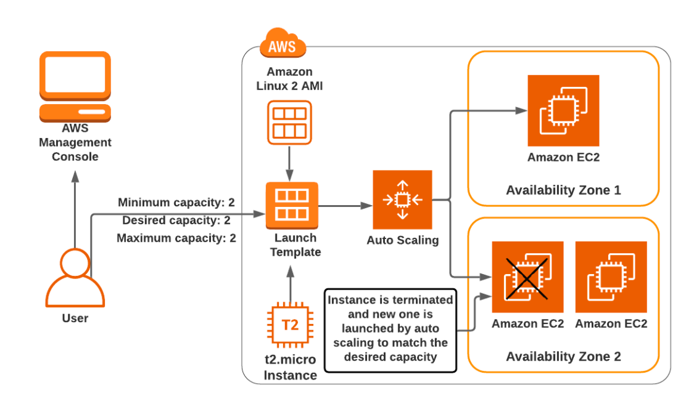

## Tasks for Getting Hands-on Experience with AWS Core Service: EC2

### 1. Launch Internet-Accessible Web Server using EC2 with Manual Setup

Launch an EC2 instance, set up a web server using httpd and HTML page, and test it via the public IP address.

### 2. Setup EC2 using Userdata

Automate step 1 using userdata. Set up a web server via userdata and test it via a public IP address.

### 3. Setup EC2 using Userdata and Create a Static Public IP Address

Reproduce the previous step, attach an Elastic IP, reboot the instance, and test it via the Elastic IP.

### 4. Create an EC2 Server and Test Access for S3

- Create a test S3 bucket (a simple S3 bucket with full default settings).
- Create an EC2 instance and try to get a list of S3 buckets in the account. (You should get an error; Google it and try
  to understand why.)
- Fix the error using IAM role with correct IAM permissions.

### 5. Create and Configure Amazon EC2 Auto Scaling with Launch Templates



#### Flow:

- Create a security group called `dev-LaunchTemplate-SG`.
  - Select the default VPC.
  - Open the HTTP port 80 from anywhere.
- Create a Key Pair for your launch template.
- Create a launch template called `dev-WebServer-LC`.
  - Add a description.
  - For AMI, select "Amazon Linux 2 AMI (HVM), SSD Volume Type."
  - Select `t3.micro` for the instance size.
  - Select your KeyPair.
  - For the network settings, select your default VPC and the newly created security group.
  - In Advance details, under User data, insert the following script:
    ```
    #!/bin/bash     
    sudo su
    yum update -y
    yum install -y httpd
    systemctl start httpd
    systemctl enable httpd              
    echo "<html> <h1> Response from webServer </h1> </ html>" > /var/www/html/index.html
    ```
- Create an Auto Scaling Group with the name `dev-WebSever-ASG`.
  - Select the launch template you created earlier.
  - Select a default VPC.
  - Select 2 for the capacity.
  - Scaling policies should be set to none for this task.
  - Add required tags.
- Test your auto scaling by terminating one instance.
- Delete your resources.

### 6. Setup Highly Available Server Stack using ALB + Target Group

- Create a fleet of EC2 instances (at least 2 servers) using your userdata. You can use the Launch template from the
  previous step.
- Create a target group (use Instances for target type).
- Create an Application Load Balancer (ALB). Choose at least two subnets, and don't forget to create a security group
  for ALB.
- Test your application via the ALB DNS name.
- Ensure your server is not accessible via server public IP (only from ALB). This should be done via properly configured
  security group.

### 7. Spot Fleet

- Create a launch template with default settings, with a `t2.micro` Linux image and httpd userdata.
- Create an auto-scaling group and test it via ALB.
- Create a Spot Fleet Request with the existing launch template.
- Test the instance via public IP.
- Interrupt a Spot Instance directly from the Amazon EC2 Console.
- Discuss the difference between allocation strategies.

### 8. Create AMI with httpd Server

- Create an EC2 instance with httpd and an HTML page.
- Launch an instance using AMI and test that httpd works.

### 9. Launch Configuration and Autoscaling Group

- Create a launch configuration using the previous AMI and an autoscaling group based on it.
- Test it via ALB.

### 10. Placement Group

- Create all 3 types of placement groups.
- Launch 2 instances in each.
- Describe the difference.
