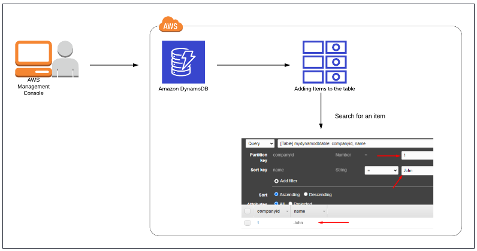
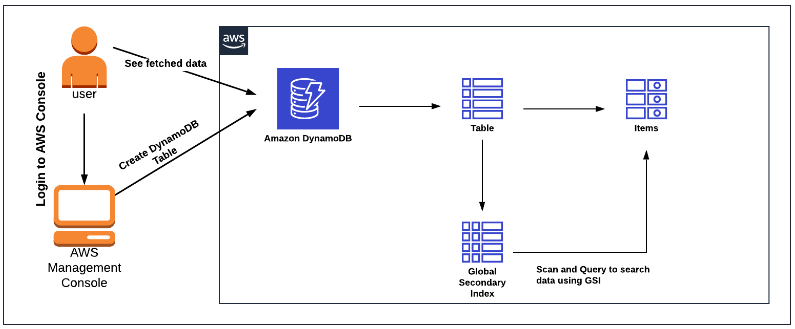

# DynamoDB Introduction

Architecture Diagram

* Create a DynamoDB table.
  - Table Name: Enter `mydynamodbtable`
  - Primary key: Enter `companyid` and select
  - Add sort key: Enter name in the respective field and select String.
* Insert data into that DynamoDB table.(Add 3-5 items)
  - companyid     : 1
  - name        : John
* Search for an item in the DynamoDB table.

## DynamoDB & Global Secondary Index

Architecture Diagram

**Note: If the Global secondary index is not showing in the Scan list, Please wait another 5 to 10 minutes and reload the entire page. This is an AWS side delay.**

* Create DynamoDB Table
  - Table name : `WhizOrderTable`
  - Partition Key : `UserName` (String)
  - sort key : `OrderID` (String)
* Create Item
  - Once you select the create item, you’ll see `UserName` and `OrderID`, but we need 2 more attributes in our table. Click on Add new attribute and then select String from the drop down menu.
  - Give the attribute name as `ReturnDate`
  - Click on Add new attribute again and select String from the drop down menu.
  - Now Give the attribute name as `UserAmount`
  - Now enter the values as shown below:
------------------------------------------------------------------------------
    UserName : HarryPotter
    OrderID : 20160630-12928
    ReturnDate : 20190705
    UserAmount : 142.23
------------------------------------------------------------------------------
  - Navigate to the `Tables` and click on `Index` tab next to Overview section.
  - Click on `Create Index`.
  - Enter the Paritition key as `ReturnDate` and Sort key as `UserAmount`.
  - Leave everything as default and Click on Create index and wait until the index state changes to Active.
  - Move to the Items tab and click on Create item. Insert the following additional data into the table and click on Create item:
------------------------------------------------------------------------------
    UserName :  HarryPotter
    OrderID :  20160630-28176
    ReturnDate :  20190513
    UserAmount :  88.30

    UserName :  Ron
    OrderID :  20170609-25875
    ReturnDate :  20190628
    UserAmount :  116.86

    UserName :  Ron
    OrderID :  20170609-4177
    ReturnDate :  20190731
    UserAmount :  27.89

    UserName :  Voldemort
    OrderID :  20170609-17146
    ReturnDate :  20190511
    UserAmount :  114.00

    UserName :  Voldemort
    OrderID :  20170609-18618
    ReturnDate :  20190615
    UserAmount :  122.45
------------------------------------------------------------------------------
 
* Use Global Secondary Index to Fetch Data
  - Now go to Explore Table items and click on the Scan or Query option for WhizOrderTable.
  - Let`s try with the Scan option to search for data.
  - Select the “Scan” option -> Table or index : Select `ReturnDate-UserAmount-index` -> Expand Filters -> click on Run button.
------------------------------------------------------------------------------
    Attribute name : Enter ReturnDate
    Type : Select String
    Condition : Select Between
    Value : Enter 20190501 and 20190531
------------------------------------------------------------------------------
  - Let`s try with the Query option to search for some data. Click on Query next to Scan.
------------------------------------------------------------------------------
    Table or index : Select ReturnDate-UserAmount-index
    ReturnDate : Enter 20190628
    UserAmount (Sort key) : Select Greater than or equal to
    Enter sort key : Enter 100
------------------------------------------------------------------------------
## DynamoDB PITR & On-Demand Backup and Restore

--------

# Lambda

## Configuring DynamoDB Streams Using Lambda

--------

# API Gateway

## Implementing Amazon DynamoDB operations through Amazon Private REST API Gateway

--------

#### Create an architecture to store S3 objects metadata inside dynamodb using lambdas

* Create S3 bucket
* Create a lambda function to add a new record with file metadata to the table of dynamodb
* Create a Dynamodb table and setup invoke of lambda function on uploading in S3
* Create another lambda to retrieve image metadata (name, extension, url)
* Create API Gateway and point it on this lambda
* Test it and see if you will upload object to s3 you will have a record in dynamodb

* Create a web rest server with 1 get endpoint and deploy it to ec2 or ecs.
* Create a lambda function to be able to send HTTP requests with a payload based on Python
* Create event bridge cron jobs to call your application every 5 min.
* Run your application locally and make it available via Ngrok
* Optional: Run your application into Ec2 with ALB and update eventBridge payload
* Note: application here just a simple 1 endpoint app.
* Check logs via Cloudwatch

----------

## DynamoDB API Gateway Lambda Secret Manager X-Ray

#### Create serverless application

Goal: create an application to save products

* Create a dynamoDb table for products
* Create a lambda function based on Python to receive a POST request with Product data. Required: Id,productName,
  productCost.
* //Not-required: array of strings for description, not more than 6 elements
* Create a GET logic to return all products in the database.
* Create an API Gateway for two methods, GET and POST
* Test application via postman.
* Create rds and setup Lambda based on Python
* Create an RDS database (postgres)
* Connect to it via pgadmin and create 1 table users, fields: id, personal_number, first_name, last_name.
* Create a python application that will connect to the database and insert users from POST request and return users via
  GET request
* Create a lambda function based on this python app.
* Create an ALB and adjust your lambda response (https://docs.aws.amazon.com/lambda/latest/dg/services-alb.html)
* Database connection should be out of lambda code inside lambda
* Pass database url via environment variable.
* Create few versions of lambda by changing print line (should print v1 and v2 for appropriate version)
* Create an alias for v1 as dev and v2 as prod.
* Create a weighted rule for 50% and 50% for aliases.
* Enable AWS X-Ray and take a look on a service map.
* Make a few calls and view the results.
* Move DB credentials to Secret Manager at the final step and test your lambda.
* How to create layer (https://www.geeksforgeeks.org/how-to-install-python-packages-for-aws-lambda-layers/)
* How to get pg dep
* https://github.com/jkehler/awslambda-psycopg2

