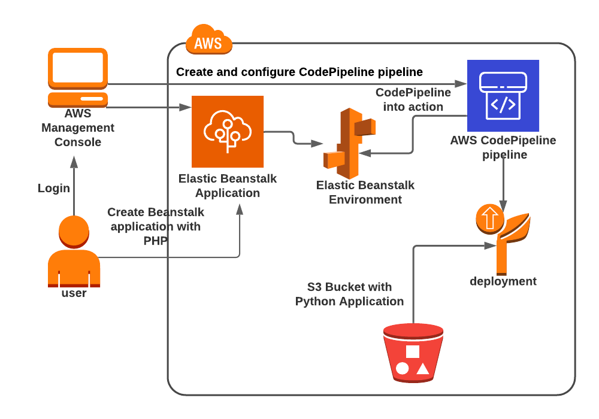

# CI\CD: CodeCommit, CodeBuild, CodeDeploy, CodePipeline

## AWS Ci\Cd

## Create and configure Codepipeline with Elastic Beanstalk

#### Create Elastic Beanstalk Environment

* Platform: Node.js
* VPC: Default
* Public IP Address
*

-----------------------------

## Create and Deploy applications using CodeDeploy and CodePipeline and Ec2

-----------------------------

## Advanced

#### Gitlab Ci\Cd

* Create ci cd via Gitlab for the application from step 2 based on single runner on EC2 using shell executor

* Create cicd via Gitlab for app from step 2 based on Custom executor with custom config based on ECS (note, this step
  can be done via cloudformation from the scratch)

* Create cloudformation for step 2.

Pipeline for git lab:

1. Build project
2. Run tests (if exists)
3. Create image and push to ECR via docker

##### Advanced: Create a deployment process to the existing cluster (from step 5) using aws cli commands inside of stage in gitlab yaml file