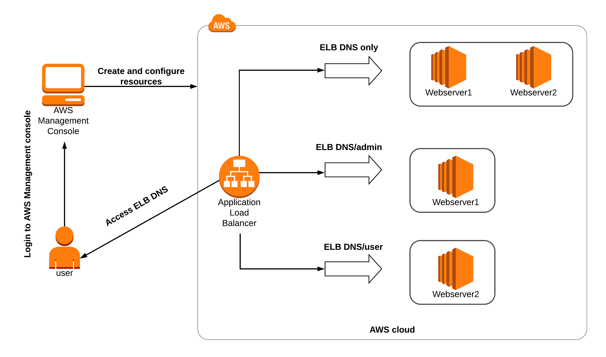
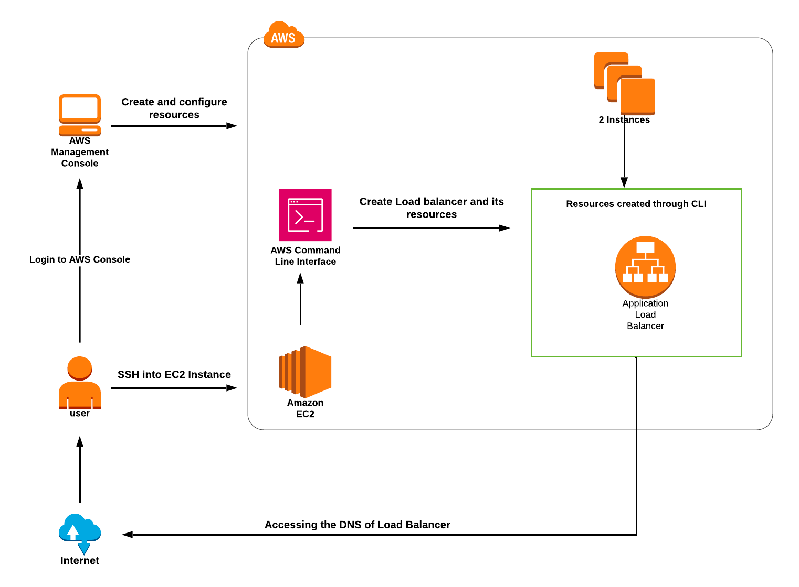

# Understanding AWS ALB Path Based Routing

## Create webServers

* Create 4 webservers with httpd server and html page
    * 1 and 2 server content: default page
    * 3 server: admin page
    * 4 server: user page

```
#!/bin/bash
yum update -y
yum install -y httpd.x86_64
systemctl start httpd.service
systemctl enable httpd.service
echo “[your text here] $(hostname -f)” > /var/www/html/index.html
```

* Create 3 target groups: default, admin, user and assign required servers
* Create ALB and configure Path based routing
* Test your setup



# Creating and configuring a network load balancer in AWS

## Launch Ec2 instance

```
#!/bin/bash
#Switch to root user
sudo su
#Update the system packages
yum update -y
#Install Apache HTTP Server
yum install httpd -y
#Start the Apache service
systemctl start httpd
#Enable Apache to start on system boot
systemctl enable httpd
#Create an index.html file with a custom response
echo "<html> <h1> Response coming from server </h1> </html>" > /var/www/html/index.html
#Restart the Apache service for changes to take effect
systemctl restart httpd
```

## Create NLB

* Target group name: Enter Apache-TG
    * Protocol: Choose TCP
    * Port: 80
* Create TG called webserver-TG and assign your instance to it
* Create second TG called nginx-tg
    * Port: 8080
    * Protocol: TCP
* Create a new listener for nginx-tg for port 8080
* Connect to your Ec2 and install nginx on it

```
sudo su
httpd -v
lsof -i tcp:80
sudo yum install nginx -y
cd  /etc/nginx
vi  nginx.conf
[change port number 80 to 8080] 
service nginx start
lsof -i tcp:8080
```

## Test using DNS and default port and port 8080

# Creating an Application Load Balancer from AWS CLI

## Create a Bastion Host with port 22 opened with public IP

## Creating 2 EC2 Instance

* Create 2 web servers in private subnet

* In **User data** section, enter the following script to make the server a web server:

* Instance 1

```
#!/bin/bash 
sudo su
yum update -y
yum install httpd -y
touch /var/www/html/index.html      
echo “REQUEST SERVED FROM INSTANCE1” >> /var/www/html/index.html
chmod 777 /var/www/html/index.html
mkdir -p /var/www/html/work
touch /var/www/html/work/test.html
echo “REQUEST SERVED FROM WORK PATH OF INSTANCE1” >> /var/www/html/work/test.html
mkdir -p /var/www/html/images
touch /var/www/html/images/test.html
echo “REQUEST SERVED FROM IMAGES PATH OF INSTANCE1” >> /var/www/html/images/test.html
systemctl start httpd
systemctl enable httpd
```

* Instance 2

```
#!/bin/bash 
sudo su
yum update -y
yum install httpd -y
touch /var/www/html/index.html
echo “REQUEST SERVED FROM INSTANCE2” >> /var/www/html/index.html
chmod 777 /var/www/html/index.html
mkdir -p /var/www/html/work
touch /var/www/html/work/test.html
echo “REQUEST SERVED FROM WORK PATH OF INSTANCE2” >> /var/www/html/work/test.html
chmod 777 /var/www/html/work/test.html
mkdir -p /var/www/html/images
touch /var/www/html/images/test.html
echo “REQUEST SERVED FROM IMAGES PATH OF INSTANCE2” >> /var/www/html/images/test.html
chmod 777 /var/www/html/images/test.html
systemctl start httpd
systemctl enable httpd
```

## Create ALB

```
aws elbv2 create-load-balancer --name dev-LB --subnets <Subnet Id of Instance 1> <Subnet Id of Instance 2> --security-groups <Security Group of loadbalancer_SG>
```

## Create Target Group

```
aws elbv2 create-target-group --name dev-TG1 --protocol HTTP --port 80 --vpc-id <Load balancer VPC Id>

aws elbv2 create-target-group --name dev-TG2 --protocol HTTP --port 80 --vpc-id <Load balancer VPC Id>
```

## Register Targets

```
aws elbv2 register-targets --target-group-arn <TG1 ARN> --targets Id=<Instance1 Id>
aws elbv2 register-targets --target-group-arn <TG2 ARN> --targets Id=<Instance2 Id>
```

## Create Listener

```
aws elbv2 create-listener --load-balancer-arn <Load Balancer ARN> --protocol HTTP --port 80 --default-actions Type=forward,TargetGroupArn=<TG1 ARN>


aws elbv2 create-rule --listener-arn <LB Listeners ARN> --priority 10 --conditions Field=path-pattern,Values='/images/*' --actions Type=forward,TargetGroupArn=<TG1 ARN>

aws elbv2 create-rule --listener-arn <LB Listeners ARN> --priority 5 --conditions Field=path-pattern,Values='/work/*' --actions Type=forward,TargetGroupArn=<TG2 ARN>

```

## Target Group Health

```
aws elbv2 describe-target-health --target-group-arn <TG1 ARN>
aws elbv2 describe-target-health --target-group-arn <TG2 ARN>
```

## Test ALB using DNS path

