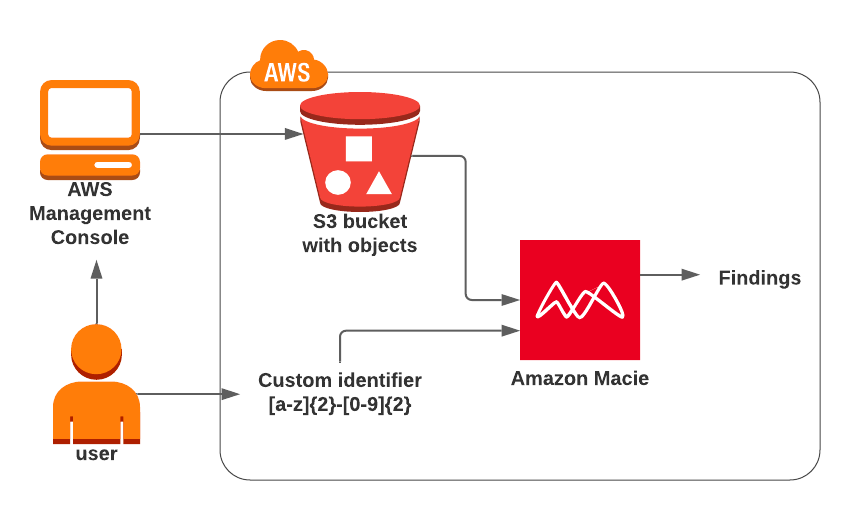

#### Versioning for s3 bucket

Create a bucket
Add file
Enable versioning
Add one more file
Add one more file with the same name
View how versioning works

#### Backup for s3 bucket

Create a backup for previous bucket to another bucket

#### Deploy a static website using S3

* Create 2 pages: simple html page + error page for your website
* Add route53 record for your bucket and test your website via record.
* Add js script of html snippet from another bucket and configure fetch from another s3 bucket. Setup right CORS.

#### Setup lifecycle policy for s3 bucket files

* Set up a lifecycle policies for different.
* One file from Standard to OneZone-IA
* Another one from Standard to Standard-IA

#### S3 Encryption: Setup s3 server side encryption

Set encryption for server side for your bucket

#### S3 Encryption: Setup s3 kms encryption

* Change encryption for kms using aws manage key
* Change for kms with a custom managed key.

#### Discover sensitive data present in S3 bucket using Amazon Macie

## Create your s3 bucket dev-lab-[hash] and put there file

* ab-12
* cd-45
* ef-78
* gh-90
* xy-56

## Task 2: Enable Macie for the account

* Navigate to Amazon Macie by clicking on the Services menu at the top, then click on Amazon Macie in the Security,
  Identity & Compliance section.
* On the home page, click on the `Get started` button to configure Amazon Macie.
* On the `Get started` page, click on the `Enable Macie` button.

## Task 3: Create a Macie job

Macie will try to find out all the details of the account, which may take some time. No need to wait, simply click on
the `Create job` button.

- For Step-1, Choose S3 Bucket,
    - To Select the bucket, click on the `Add filter criteria` field and click on the `Bucket name`.
    - Type `dev-lab` and select the bucket name starting with dev-lab, and click on the `Next` button.
    - **NOTE**: If bucket is not listed, wait for 2–5 minutes and refresh the page 2–3 times.
- For Step-2, Review S3 buckets
    - Keep everything as default and click on the `Next` button.
- For Step-3, Refine the scope,
    - In `Sensitive data discover options`: Select `One-time job`
    - Click on the arrow to expand the window of `Additional settings`
    - Let the `Object criteria` be default as `File name extensions`.
    - Write csv in the textbox and click on the `Include` button.
    - Once done, click on the `Next` button to proceed.
- For Step-4, Select managed data identifiers,
    - Selection type: Choose `All`
    - Click on the `Next` button.
- For Step-5, Custom data identifiers,
    - Click on the `Manage custom identifiers`, to create one.
    - *Note: This will open in the New tab, please enable a pop-up, if it doesn't open in one click.*
    - Click on the `Create` option present on the top right.
    - Fill in the details, as follows:
        - Name: Enter `[name]`
        - Description:
          Enter `This identifier finds the data present in the format of AB-01 i.e. two characters, dash and followed by two numbers.`
        - Regular expression: Enter `[a-z]{2}-[0-9]{2}`
    - Keep all other options as default.
    - Click on the `Submit` button to create the Custom identifier.
    - Go back to the previous tab and click on the refresh icon to see the newly created Custom identifier.
- Once refreshed, you will be able to see the `[name]` identifier listed here. Click on the `Next` button.
- For Step-6 : Select allow lists : Keep it default and click on `Next` button
- For Step-7, In General Setting : Enter a name and description,
    - Name: Enter `[name]Job`
    - Description:
      Enter `This job scans the bucket with a name starting as dev-lab and gathers its finding based on the regular expression pattern.`
    - Click on the `Next` button.
- For Step-8, Review and create,
    - Review everything, click on the `Submit` button present below.
    - Job is now created successfully.

## Task 4: Macie job run and findings

Once the job is created, it will start running immediately.

- The job runs for approximately 10 minutes and gathers the findings.
- After 10 minutes, the status is changed to `Complete`.
- To view the `Findings` for the job, perform the following:
    - Click on the `Job` present there.
    - Select `Show results`
    - And Choose `Show findings`
- To check the exact results, open the finding.
    - Perform the following task:
        - Select the present finding
        - Click on the `Actions` button
        - And, Choose `Export (JSON)`
- JSON present here is in Read-only format, you may choose to download the complete report.
