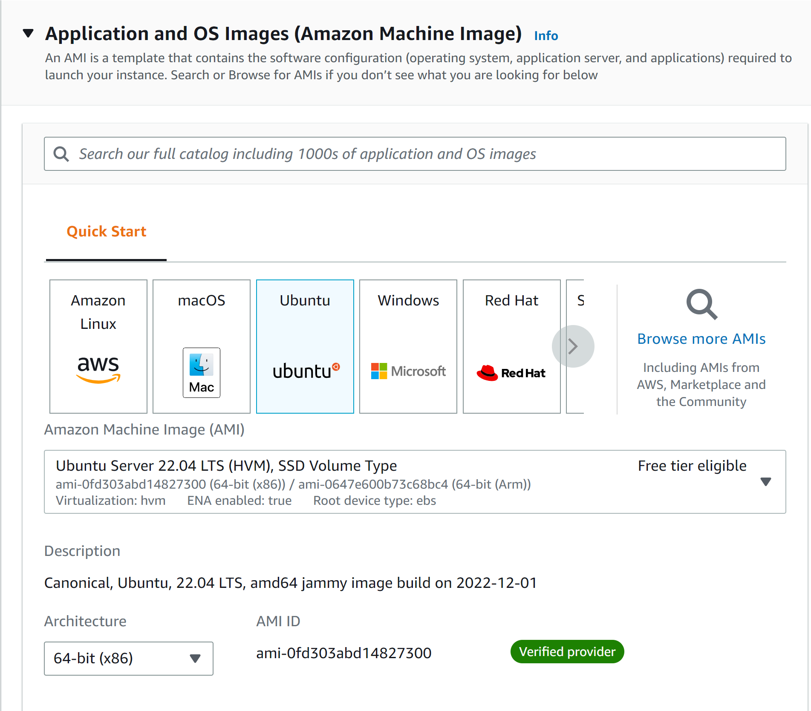
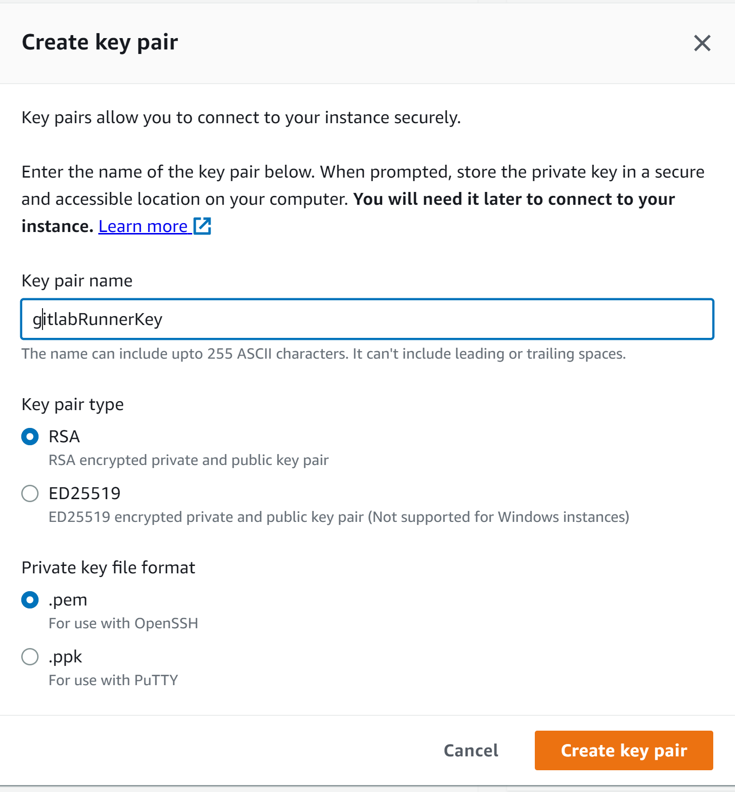
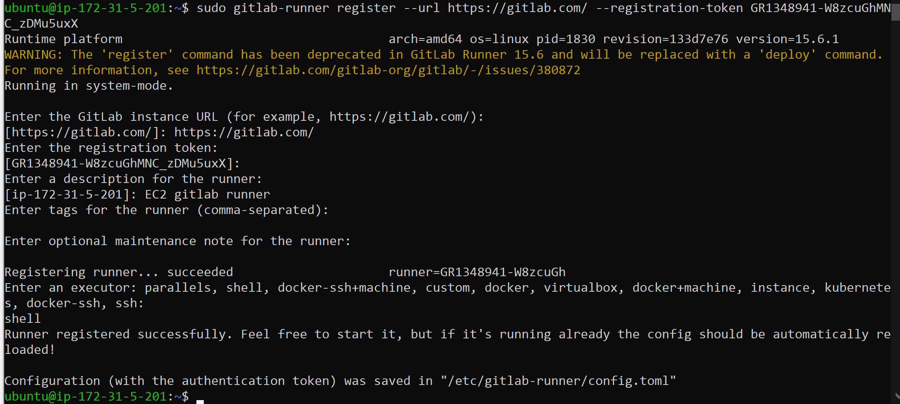

How to create EC2 runner:

First create instance itself:

add Some name, like GitlabRunner


I would recommend use Ubuntu as it's one of the most stable



Then any FREE type, as we dont need much

Then create new key-pair which is a pem-file we will later use for connection


After this we may add security group and launch our instance

Now we need to connect, for these lets just use simple SSH, 
open up any terminal ypu like in a directory with our .pem file 
and run ssh connect, which will look like this:


Now we are in our instance, to create runner we have to install its first

```
# Download the binary for your system
sudo curl -L --output /usr/local/bin/gitlab-runner https://gitlab-runner-downloads.s3.amazonaws.com/latest/binaries/gitlab-runner-linux-amd64

# Give it permission to execute
sudo chmod +x /usr/local/bin/gitlab-runner

# Create a GitLab Runner user
sudo useradd --comment 'GitLab Runner' --create-home gitlab-runner --shell /bin/bash

# Install and run as a service
sudo gitlab-runner install --user=gitlab-runner --working-directory=/home/gitlab-runner
```

We may literally just pass this to our terminal one after another

Now, as we installed it, we have to register it as well, for this we have to ue this command,
where REGISTRATION_TOKEN is a token provided by Gitlab in Settings -> CICD-> Runners 

```
sudo gitlab-runner register --url https://gitlab.com/ --registration-token $REGISTRATION_TOKEN
```
After this all we need is to enter data that will be added to
a newly created config.toml file

For now lets choose executor as shell


And after this just verify if its alive

```
sudo gitlab-runner verify

sudo gitlab-runner run
```


Now we can see our runner in the gitlab console
