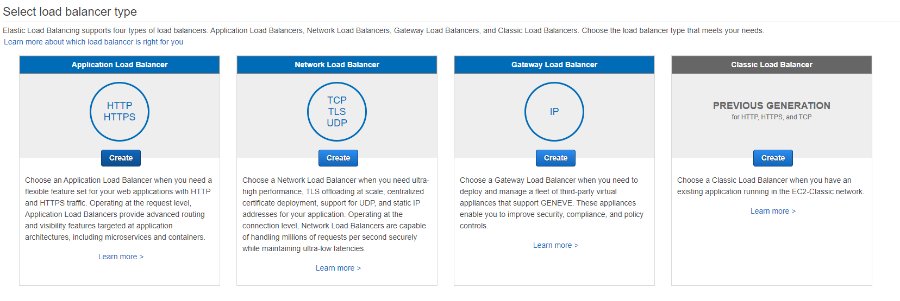
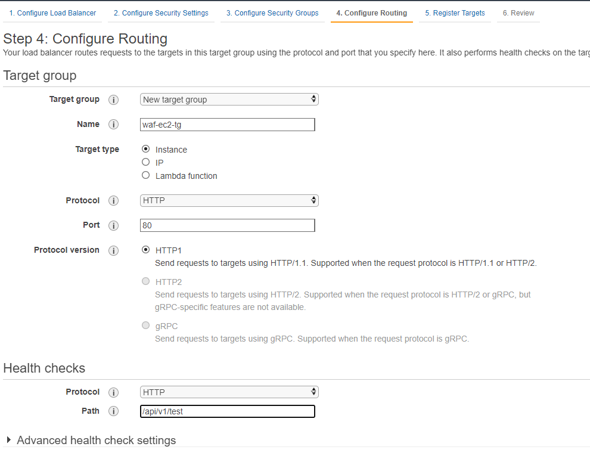
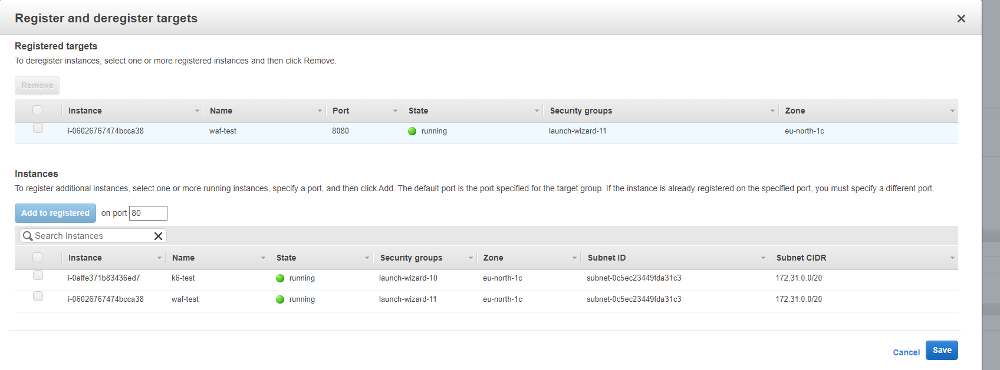
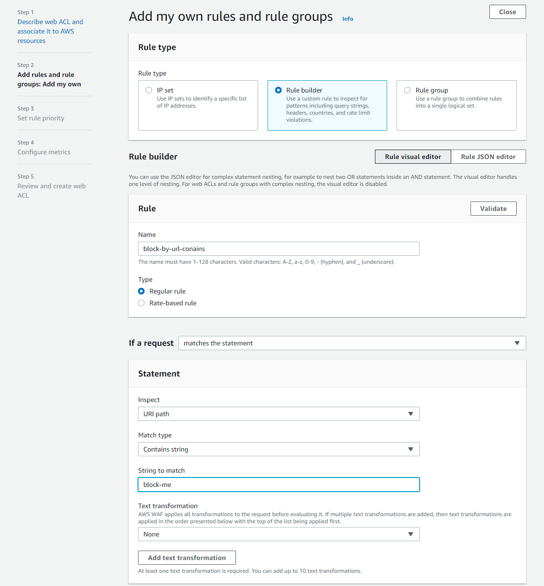
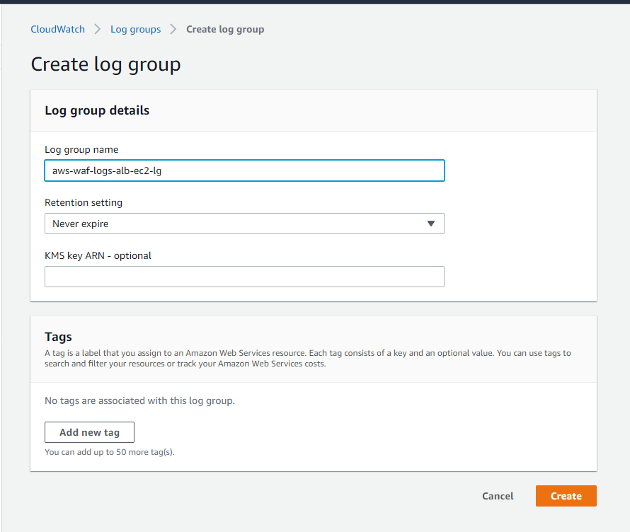
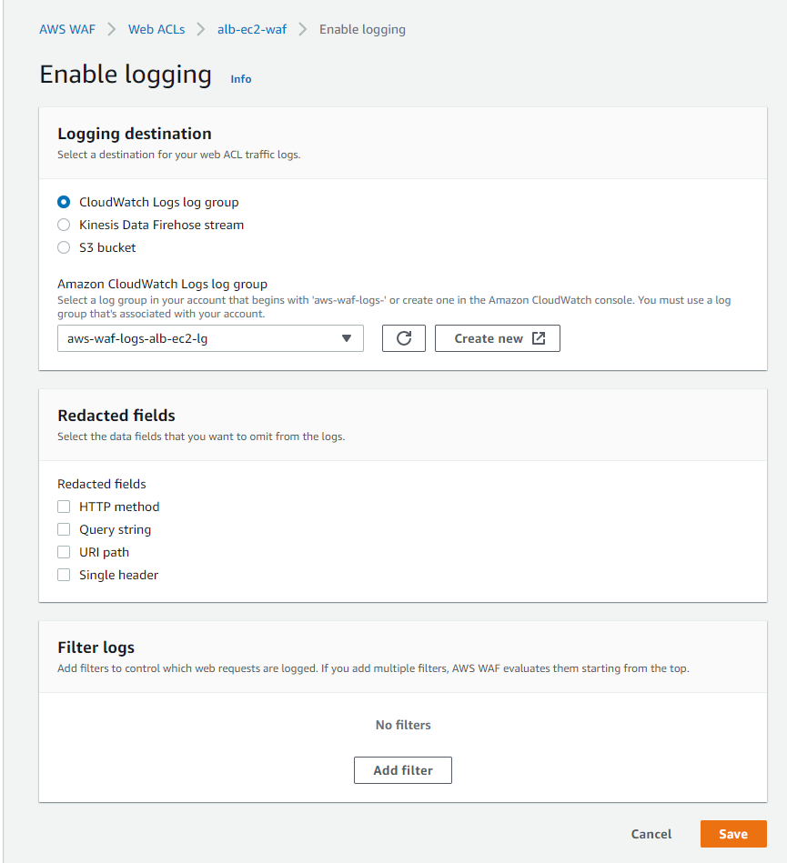
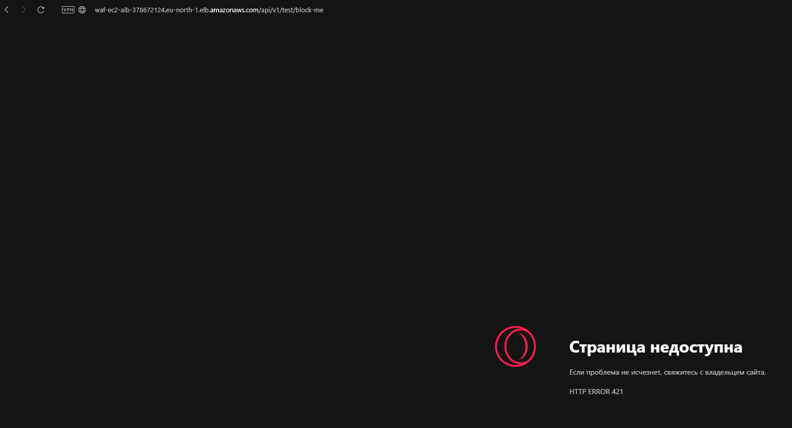
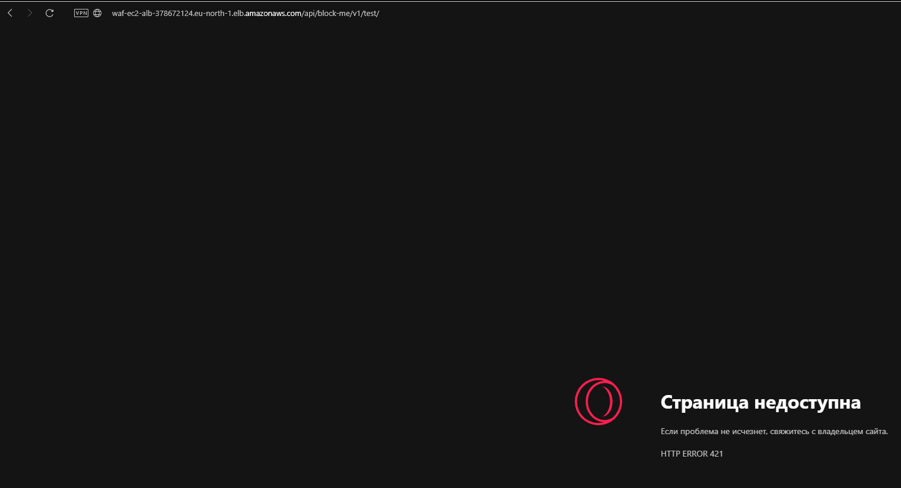
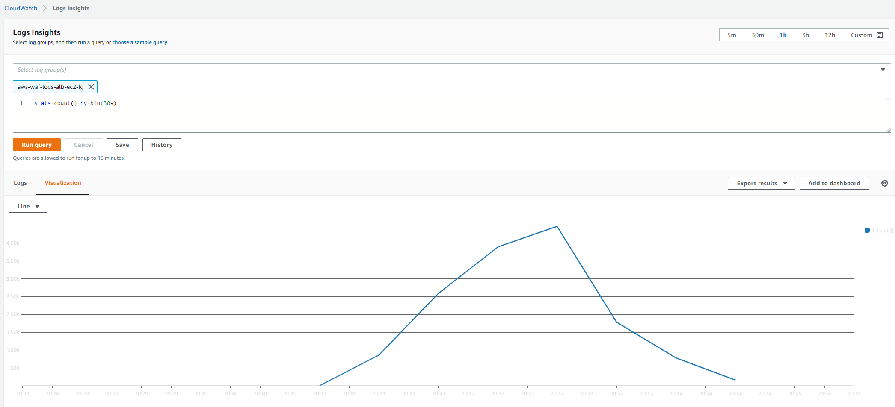

First we need to create instance itself and rub a simple lets say java application on it:

For this first, build our jar file and then just copy it to our instance:
```
scp -i ./DemoKeyPair.pem . <username>@<public-ip or DNS>:/pathwhere/you/needto/copy
```


Next we need Java on our instance, for that we can run

```
java -version
```

And see all the variatons of commands to run to install it


I chose this one:
```
sudo apt install openjdk-11-jre-headless
```

And we will see this after installation and checking version again:


Now lets run our app:
```
java -jar test-cicd.app
```


And now we may connect t it and check if it works:


!NOTE:
Enable port 8080 in our security group:


Now lets create application load balancer:




When creating target group put in a health check path to our endpoint


And register our target:



Now we can access to our endpoint through DNS of our loadbalancer:


Now lets create our WAF and connect it to our ALB.

##WAF creation


And add our own rue that will block anything with "block-me" in url



And just to be sure we will add custom responce 421:


Other configurations may be left as they are

To check logs we need to enable logging in waf and create log group with 'aws-waf-logs' prefix




And now when we add our string to our url we will get this:





##Add K6 to our app


How to install k6 on our instance and run it you can find [here](../../k6/K6.md)

To check it on our app just paste our URL to that req1.js file


Now we may check our insights in previously created log group on insights tab:
