#How to set up ECS + ECR + ALB + WAF and test via k6

!NOTE: for this you need docker to be installed on your machine!

First we can create ECR repository


Then we can see push commands to build and push our image:


Once its done, we may see our image in ECR:


Now lets navigate to ECS and create cluster

!NOTE: here we will use default vpc!


Next we should create a task definition:

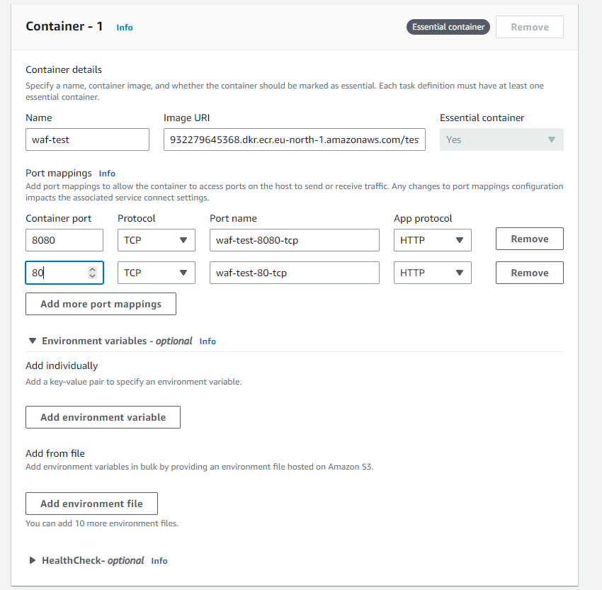
As image URI use tha URI from ECR with tag (latest is for the latest version)

Next configure env for fargate:


Rest of configurations may be left as they are
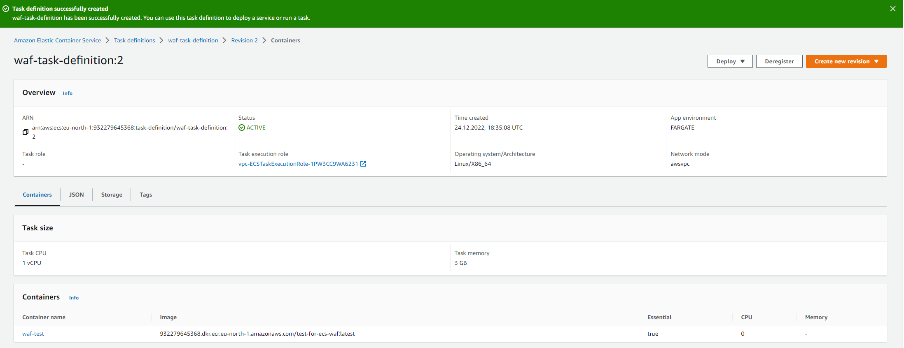
!NOTE: here we have a second revision, but you will have the first one!


Now lets work with our security groups
This one represents security group for our loadbalancer

And this one accepts traffic from alb and passes to ECS on 8080


Next navigate to cluster and create service to run our fargate:


In network choose our security group:


And create Load balancer right here:

And after a few minutes we can see our service and our task in Running status in cluster console:


In alb console add our security group:


Than pass our loadbalancer dns in url with our request uri and thats it:


Now lets create WAF as before and name it ecs-alb-waf:


But this time lets block everything that not ends with "test"
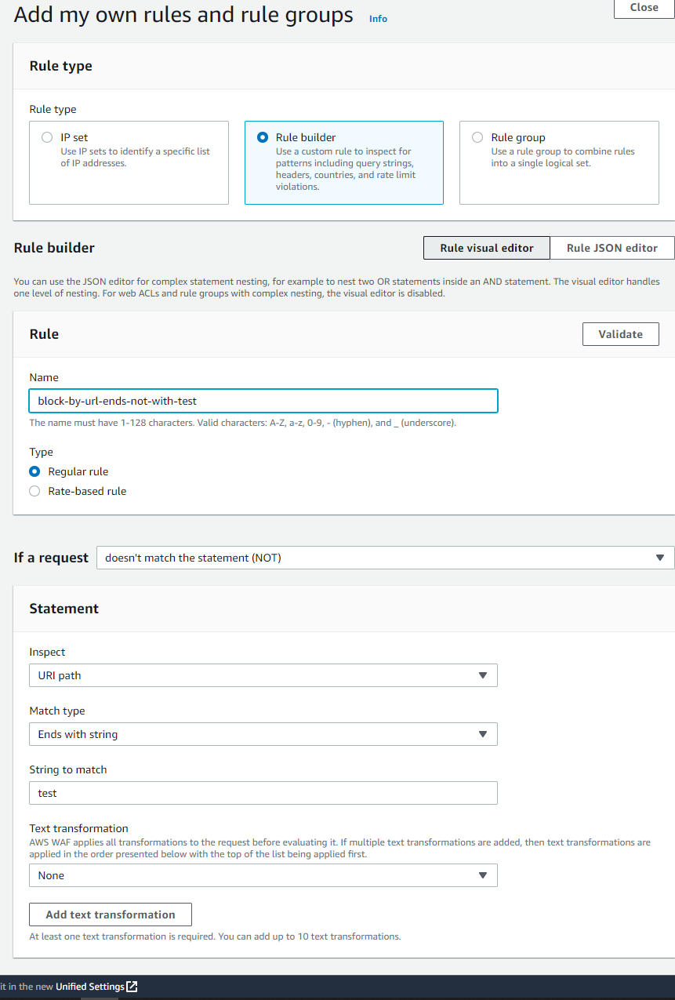

And now we have HTTP 403 which is default WAF code:


Even in case that we dont have such endpoint:


As well we can add ip set

First, lets get our ip [here](https://ip4.me)

Then lets create set itself, using mask 32, because its our just our single ip:
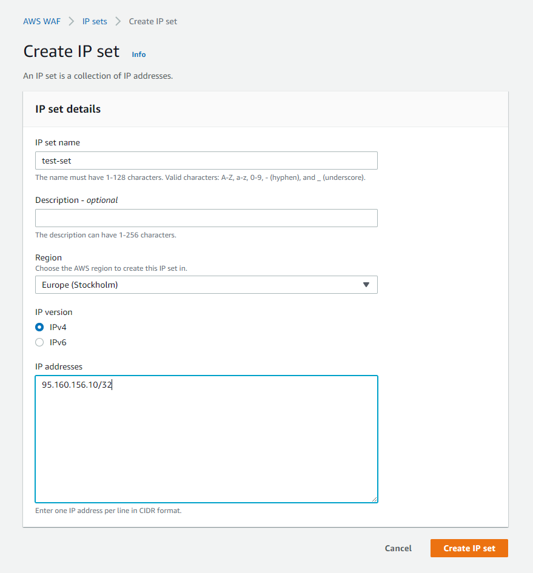
Next go to our waf and add new rule:
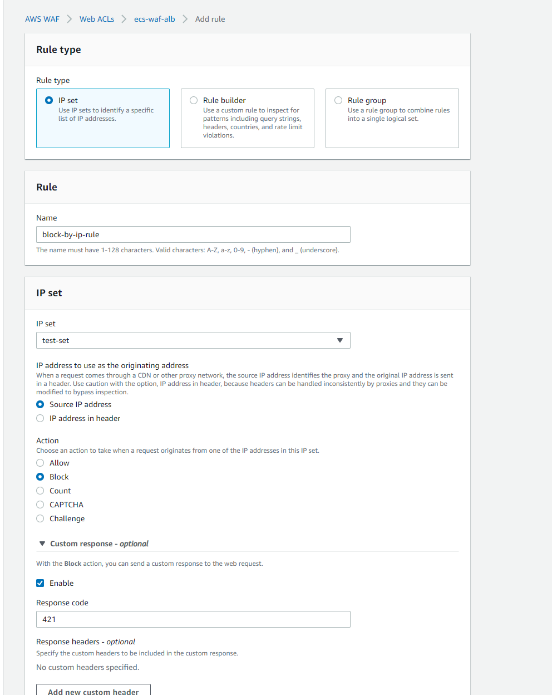
Lets enable custom response as a text as well to be sure that it works:
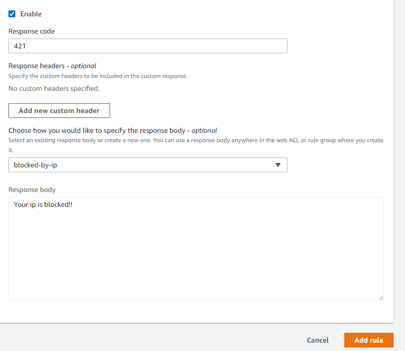

And now try ro connect again and we will see this:


Now lets test it via [k6](../../k6/K6.md):

This is with the correct url that not blocked with WAF:
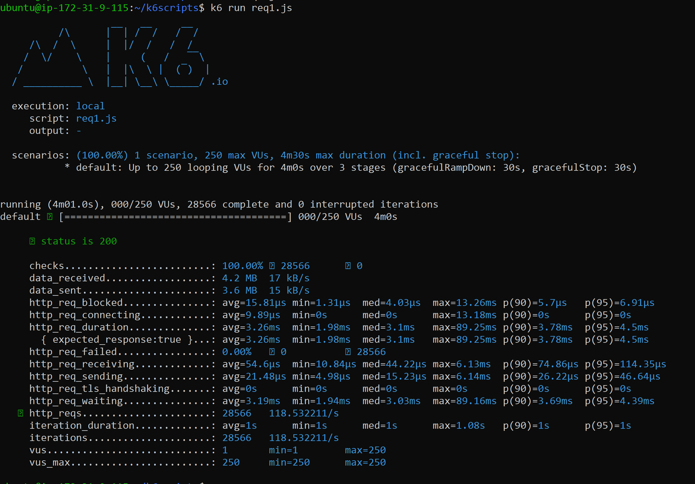

Now lets create wrong URL:


And thats will be our output:
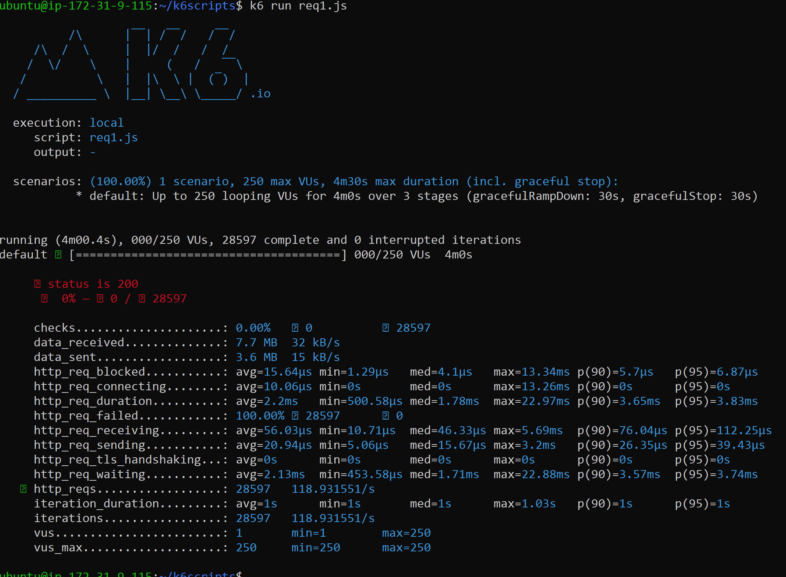

As well as our log insights:


But! To protect us from some DOS/DDOS we also can add rate-based rules:
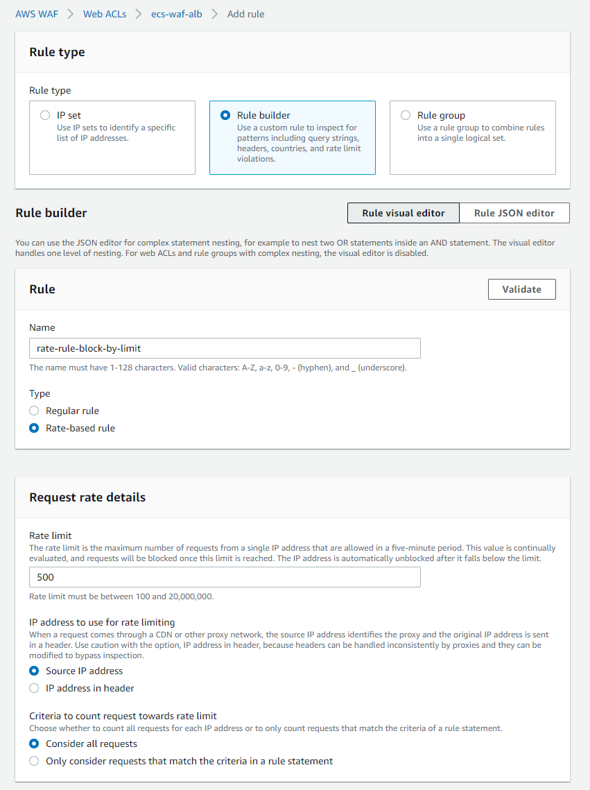
Now lets run our k6 again

While its running we may check our log insights(clientIp here is the ip of our instance with k6):
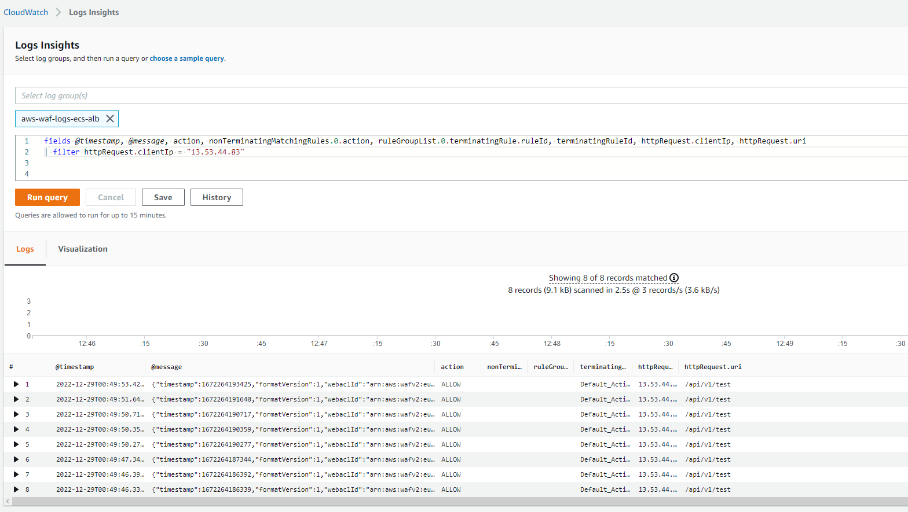
As we can see everything is ok, but lets wait a bit more and add filter for blocked requests:
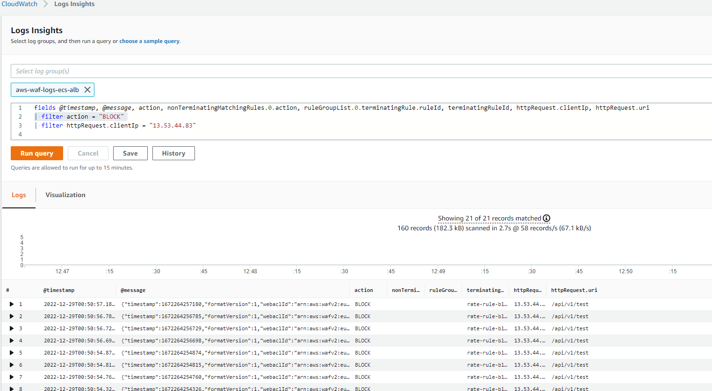
```
fields @timestamp, @message, action, nonTerminatingMatchingRules.0.action, ruleGroupList.0.terminatingRule.ruleId, terminatingRuleId, httpRequest.clientIp, httpRequest.uri
| filter action = "BLOCK"
| filter httpRequest.clientIp = "K6_IP"
```

So now our k6 finished and we may check the results:
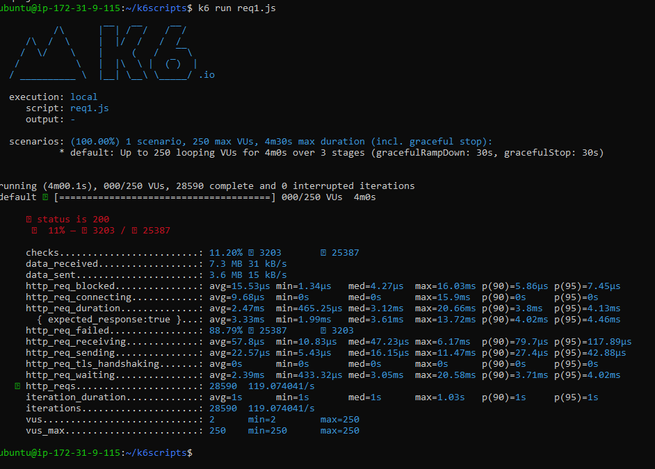
As we can see only 11% of our requests was 200, the rest of them were blocked by our rate rule

But! now lets add ip-set with our k6 instance ip as allowed rule and put it as first for our waf:
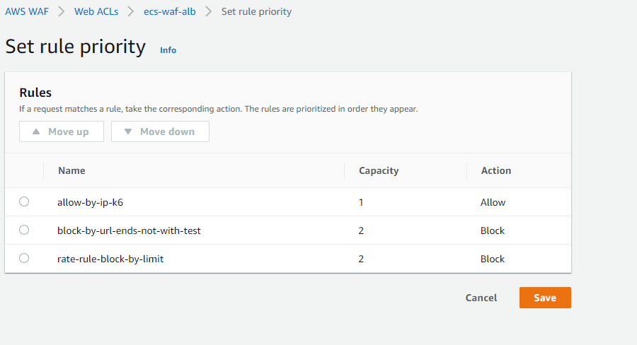
And run our k6:

Now its allowed because our rule is in higher priority and its allows our traffic from k6

But if you will put our ip rule lower than the rate one, then... try it yourself!