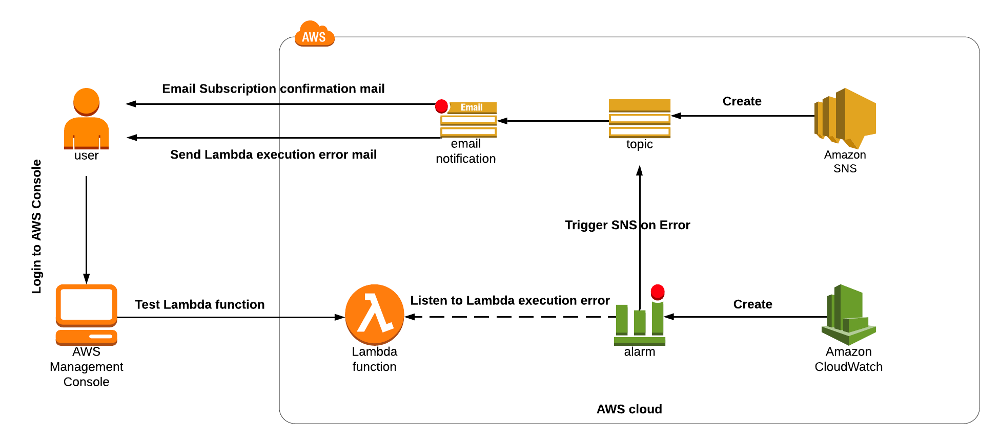
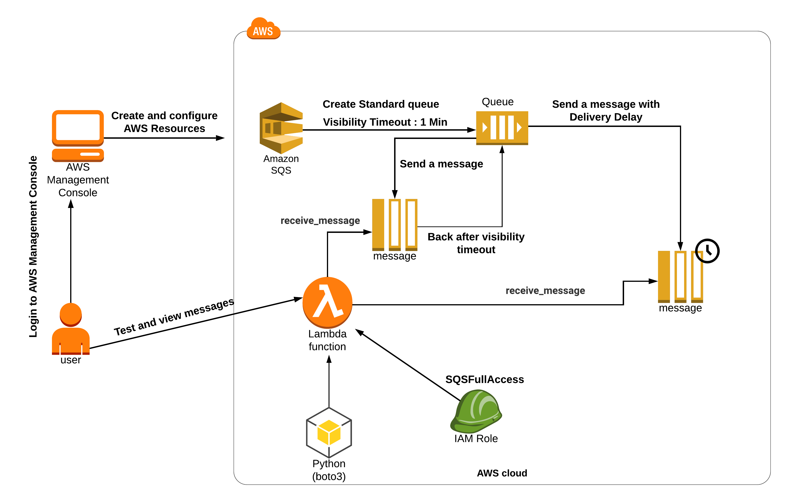

# SNS

## Configuring a CloudWatch Alarm for Lambda Invocation Errors with SNS Notifications



### Create Lambda function

* Settings
  * Choose Author from scratch
  * Function name        :  Enter [name]
  * Runtime        : Select Python 3.8
  * Role            : In the permissions section, click on Change default execution role to choose to use an existing
    role.
  * Existing role        : Select sns_role_for_lambda
* Insert code
* Configure test event

```
import json
def lambda_handler(event, context):         
# TODO implement            
return {            
'statusCode': 200,          
'body': json.dumps('HELLO FROM LAMBDA!')            
}
```

### Configuring an Alert/Alarm in CloudWatch

* Click on services and navigate to the CloudWatch dashboard.
* Click on All alarms under Alarms in the left panel and then click on Create alarm
* Click on Select metric to choose the metric that will trigger our alarm.
* Choose “Lambda” from the All metrics section.
* Choose By Function Name.
  * [name] -> Errors
* Select Metric
* Metric Conditions
  * Metric name          : Errors
  * FunctionName      : [name]
  * Statistic                : Average
  * Period                  :Select 1 minute
  * Conditions: Give the below details:
  * Threshold type            :  Select Static
  * Whenever Errors is     : Greater/Equal
  * than... (Threshold value)          : Enter 0
* Configure Alarm
  * Whenever this alarm state  : Select in Alarm
  * Select an SNS topic            : Select Create new topic
  * Topic name                          : Enter lambda-execution-error-alert
  * Email endpoint name           : Email address to which you want the alert to be sent (ex:test@example.com)
* Alarm:
  * Alarm name :  Enter Alert_for_lambda_invocation_error
  * Alarm description    : Enter Alert for failure of lambda function execution

### Testing the Metric

* Add some error to your lambda code
* Deploy function and click Test
* Check your email and cloudwatch alarm

# SQS

## Introduction to SQS

Create FIFO and Standard Queue using the Console.
What is Long Polling and configuring Long Polling for the queue.
What is Visibility Timeout and configuring Visibility Timeout.
What is Delay Queue and configuring Delay Queue.
Purge Queue and verify the same.
SQS points to remember.

## Difference between SQS Visibility Timeout and Delay Queue



### Create SQS

* Select Standard type
* Visibility timeout : Enter 1 Minute

### Create a lambda function

* Lambda settings:
  * Choose Author From Scratch.
  * Function name : Enter my_sqs_Lambda
  * Runtime: Select Python 3.8
  * Permissions: Click on the Change default execution role and choose Use an existing role
  * Existing role: Select task_role_<RANDOM_NUMBER> from the dropdown list.
  * Click on Create function button.
* Insert code below

```
import json         
import boto3            
def lambda_handler(event, context):         
    try:
        sqsClient = boto3.client("sqs", region_name="us-east-1")        
        try:        
            response = sqsClient.receive_message(       
            QueueUrl="<your Queue URL>",
            AttributeNames=['All'],
            )
            print(response)
            return response
        except Exception as e:
            print("Get queue message failed because ", e)
    except Exception as e:
        print("Client connection to SQS failed because ", e)
```

### Test your setup

* Send a message with Visibility Timeout
  * go to SQS, Send and receive message and test message
* Go to lambda and run it via Test button
  * You will immediately see message in response
* Click Test button one more time
  * You will not able to see message because of visibility timeout
* Try to retest after 1 min
  * You wll able to receive the message again

### Purge the Queue

* Go to your sqs and click Purge button

### Send a message with Delivery Delay

* Click Send and receive messages
  * Message body : Enter Test delivery delay
  * Delivery Delay : Enter 30 Seconds
* Go to your lambda and run it
  * The message will not available
* Wait for 30 seconds and run lambda again
  * Now you will be able to see this message


