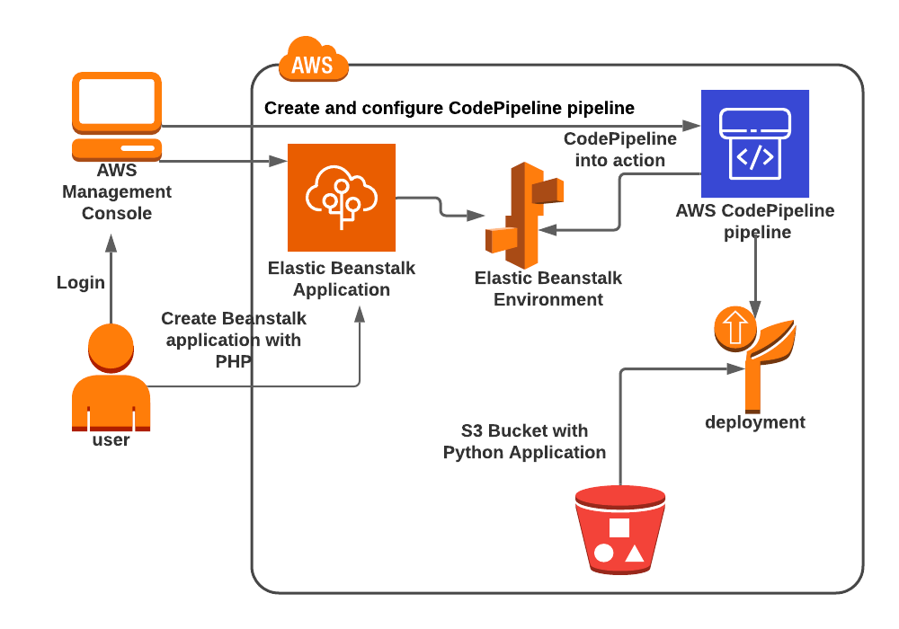
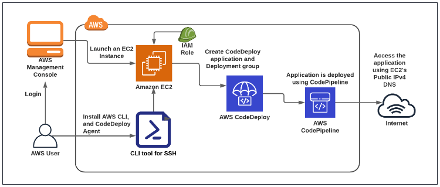

# CI\CD: CodeCommit, CodeBuild, CodeDeploy, CodePipeline

## AWS Ci\Cd

## Create and configure Codepipeline with Elastic Beanstalk

#### Create Elastic Beanstalk Environment

Once Elastic Beanstalk is opened, you’ll be presented with a getting started screen. Click on the `Create application` button.

* Application Name: MyDemo
* Platform: Node.js
* Service role : Choose Create and use new service role
* VPC: Default
* Check the `Activated` checkbox under `Public IP address`
* Scroll-down and Under Capacity: 
* * Environment Type: Select `Load balanced`
* * Under Instance type : Select `t2.micro` and remove the existing instance types.
* * Under `Listeners`: Select the Listener that is already present.
* Under Configure updates, monitoring, and logging - optional
* * Select `Basic` under System in the Monitoring section.
*  Under Managed platform updates:
* * `Uncheck the Activated checkbox` under Managed updates.
* Leave everything as default and click on Next button.
* Click on Submit button. The app and environment will start to create.  Note: This process usually takes about 10 to 
15 minutes to complete.
* Once the above is completed, you will be able to see SampleApplication in the dashboard.
* To test your application, click on the domain.  You will see your application is running successfully.

#### Enable versioning for the S3 bucket and copy the object key

* Navigate to the Services menu at the top. Click on S3 in the Storage section. (Create bucket and open it)
* Click on the `Properties` tab and next `Edit` button
* Select `Enable` option for versioning and click on the `Save changes` button present below.
* Upload zip file in your bucket
* Click on the object present to see its properties.
* Copy the object Key, and save it to notepad. We'll need this in further steps.

#### Create a CodePipeline pipeline

* On the homepage of CodePipeline, click on the Create pipeline button.
* For the Step-1, Choose pipeline settings
* * Pipeline name: Enter `yourname`
* * Service role: New service role
* * Leave other options as default, and click on the Next button.
* For the Step-2, Add source stage
* * Source provider: Select Amazon S3
* * Bucket: `yournamebucket`.
* * S3 object key: Enter `nodejs-v2-blue.zip`
* * Change detection options: `AWS CodePipeline`
* * Click on the Next button.
* For the Step-3, Add build stage
* * Click on the S`kip build stage` button.
* * Confirm to skip by clicking on the Skip button in the confirmation popup.
* For the Step-4, Add deploy stage
* * Deploy provider: Enter `AWS Elastic Beanstalk`
* * Region: yours
* * Application name: Enter yourown
* * Environment name: Enter yourown-env
* * Click on the Next button.
* For the Step-5, Review: Review everything and click on the Create pipeline button.
* Immediately after creation, the pipeline will start running, Once the source is verified, the first section Source 
will be shown as Succeeded.
* After a few minutes, the Deploy section will also be shown as succeeded.
* Deployment is now completed. Let's open the application page again to see the deployment result.

#### Test the application deployment changes

* Navigate to Elastic Beanstalk by clicking on the Services menu at the top, then click on Elastic Beanstalk in the
  Compute section.
* Navigate to Environments from the left navigation panel. Click on the environment present. i.e. yourown-env
* Copy the domain of the environment.
* Congratulations, deployment is successful. The background color has now changed to Blue.

-----------------------------

## Create and Deploy applications using CodeDeploy and CodePipeline and Ec2

Architecture Diagram

#### Launching an EC2 Instance

* Click on Instances from the left sidebar and then click on Launch Instances
* * Name : Enter MyEC2Instance
* * For Amazon Machine Image (AMI): In Quick Start menu, Select Amazon Linux
* * For Instance Type: select t2.micro
* For Key pair: Select Create a new key pair Button (name - `MyEC2Key`, type - `RSA`, file format - `.pem`)
* In Network Settings, Click on Edit:

________________________________________________________________________________________
    Auto-assign public IP: Enable
    Select Create new Security group
    Security group name: CodePipeline-SG
    Description: Security group for CodePipeline
    
    To add SSH
    Choose Type: SSH
    Source: Anywhere
    
    For HTTP,
    Click on Add security group rule
    Choose Type: HTTP
    Source: Anywhere
________________________________________________________________________________________

Your instance is now launching, Click on the instance ID and wait for complete initialization of instance state till 
status change to Running

Note down the sample IPv4 Public IP Address of the EC2 instance.

#### SSH into EC2 Instance

#### Install AWS CLI, and CodeDeploy Agent

* Switch to root user (`sudo su`)
* Run the updates (`yum -y update`)
* Install the CodeDeploy agent: (`yum install ruby wget -y`)
* * Install the prerequisite i.e., ruby and wget :  This command installs the Ruby programming language and the wget 
utility. Ruby is a prerequisite for installing the CodeDeploy agent, and wget is used to download the agent's installer.
* Download the CodeDeploy agent's installer (`wget https://aws-codedeploy-us-east-1.s3.us-east-1.amazonaws.com/latest/install`)
* * This command uses wget to download the CodeDeploy agent's installer from the specified URL. The installer is a 
script that sets up the CodeDeploy agent on the EC2 instance.
* Change the permission of the installer (`chmod +x ./install`)
* Install the latest version of the CodeDeploy agent (`sudo ./install auto`)
* Check that the service is running (`service codedeploy-agent status`)
* `Note`: If the output is “The AWS CodeDeploy agent is running as PID 785” or any other PID. It means codedeploy 
agent is running fine.
* If the output says, “error: No AWS CodeDeploy agent running”, then start the agent by running the below command and 
check the status again. (`service codedeploy-agent start` ,  `service codedeploy-agent status` )

#### Copy the S3 Bucket's key

* Create and open your bucket and upload file `SampleApp_Linux.zip`
* Copy the object Key, and save it to notepad. We'll need this in further steps.

#### Create a CodeDeploy application and Deployment group

* To create a CodeDeploy application, click on the `Create application` button.
* In Application configuration, Enter the application name.
* Select the EC2/On-Premises as Compute platform.
* And, click on the Create application button.
* To create a deployment group, click on the Create deployment group button.
* Deployment group name: Enter your name
* * Enter a service role : Select the service role from the dropdown.
* * Deployment type: Select `In-place` deployment
* * Environment configuration: Select Amazon EC2 Instances

* In Tag Group 1, use the following tags to select the EC2 Instance for deployment:
* * Note: The value should be the same as the tag defined while creation of EC2 Instance.
* `Key: Name`, `Value: MyEC2Instance` , Matching instances will show the record as 1 unique matched instance.
* Agent configuration with AWS Systems Manager: `Never`
* Deployment settings: Select `CodeDeployDefault.AllAtOnce`
* Enable load balancing: `Uncheck`
* Click on the Create deployment group button.

#### Create a CodePipeline pipeline and deploy the application on the instance

Click on Pipelines from the left sidebar and then click on the Create pipeline

* For the Step-1, Choose pipeline settings :
* * Pipeline name: yourname_Pipeline
* * Service role: New service role
* * Check the option of creating a new service role (Default)
* * Expand the option of Advanced settings
* * Artifact store: Select Custom location
* * Bucket: Select the Bucket name starting before
* * Click on the Next button.
* For the Step-2, Add source stage :
* * Source provider: Select Amazon S3 from dropdown
* * Bucket: Select yours
* * S3 object key: Enter `SampleApp_Linux.zip`
* * Change detection options: Select `AWS CodePipeline`
* For the Step-3, Add build stage :
* * Click on the Skip build stage.
* For the Step-4, Add deploy stage :
* * Deploy provider: Select AWS CodeDeploy from dropdown
* * Region: yours
* * Application name: Select yours
* * Deployment group: Select yours
* For the Step-5, Review :
* * Review everything and click on the Create pipeline button.

#### Test the application using EC2 Instance Public IPv4 DNS

* Navigate to EC2 by clicking on the Services menu in the top, then click on EC2 in the Compute section.
* On the dashboard, click on the Instances (running).
* To view the metadata of an EC2 Instance, click on the Instance ID for the instance named MyEC2Instance.
* Copy the `Public IPv4 DNS` of the Instance.
* Open the new tab in the browser and paste the public IP.

-----------------------------

## Deploy sample containerized application on ECS using CodeDeploy

#### Create a Security Group for the Load balancer
* We are going to create a Security group for the ECS cluster.
* * Security group name: Enter `ALB-SG`
* * Description: Enter `Security group for the load balancer`
* * VPC: Select Default VPC
* Click on the Add rule under Inbound rules.
* * Type : Select `All TCP`
* * Source : Select `Custom`
* * In the textbox add `0.0.0.0/0`
* * Leave everything as default and click on the Create security group button.

#### Creating the Target Group and Load Balancer :
* For Step 1, Specify group details
* * Choose a target group: Choose `IP addresses`
* * Target group name: Enter `ecs-TG`
* * Keep all the settings as default.
* For Step 2, Register targets
* * Keep all the settings as default.

* Click on Create load balancer button at the top-left to create a new load balancer for our web servers.
* For the Basic configuration section:
* * Load balancer name: Enter `httpd-LB`
* * Scheme: Select `Internet-facing`
* * IP address type: Choose `IPv4`
* For the Network mapping section:
* * VPC: Leave it as default
* * Mappings: Select 3 zones in your Region.
* For the Security groups section:
* * Select the `ALB-SG` from the dropdown and `remove the default security group`.
* For the Listeners and routing section, The listener is already present with Protocol HTTP and Port 80. Select the 
target group ECS-TG for the Default action forwards to option.
* Keep the tags as default and click on the Create load balancer button.

#### Create the second Target Group, required during deployment in CodeDeploy

* One Target Group is already present, click on the Create target group button.
* For Step 1, Specify group details
* * Under Basic configurations, сhoose a target group : Choose `IP addresses`. Target group name :  Enter `ECS-TG-2`
* * Keep all the settings as default.
* For Step 2, Register targets
* Keep all the options as default and click on the Create target group button.

#### Create an Environment in CloudShell

* Click on `CloudShell` icon on the top right AWS menu bar.
* You will see a creating the `environment message` on the screen.
* Wait for a few minutes to complete the environment creation. Once the environment is created, you are ready to use 
the terminal.

#### Create an ECS Cluster, Register task definition, and Create an ECS service

* Once the CloudShell environment is ready, you will use the create-cluster command to create an ECS Cluster named 
demo-ecs-cluster.

____________________________________________________________________
    aws ecs create-cluster --cluster-name tutorial-bluegreen-cluster --region us-east-1
____________________________________________________________________
Cluster will be created successfully. By running the above command, you will create an ECS cluster named 
`tutorial-bluegreen-cluster` in the `specified` AWS region, which can then be used to manage and run containerized applications.

* To register a task definition using CLI, you need a `JSON file`.
* The JSON files you need to put it in your s3 bucket, you just need to replace the ARN of the IAM role present in it.
* Copy the ARN of the IAM role called `ecsTaskExecutionRole`
* To download the fargate-task.json file, open the S3 Console in the new tab.
* Navigate to the `Services` menu at the top. Click on S3 in the Storage section.
* Open your bucket
* Select the file fargate-task.json download and open this file with notepad or any text editor present in your system.
* On line 30, replace the ARN of IAM role called `ecsTaskExecutionRole` with ARN copied in previous steps.
* Save the new changes in the file by pressing Ctrl + S, and upload it back to the S3 using the console.
* To upload the file, perform the following tasks:
* * Click on the Upload button
* * Click on Add files option and choose the fargate-task.json file from your local machine's download folder
* * Finally, click on the Upload button
* Once uploaded, click on the file name and copy the S3 URI of the file
* To copy the file from the bucket into your CloudShell directory, replace the copied S3 URI name.
____________________________________________________________________
    aws s3 cp s3://yourbucket.1379.93003433/fargate-task.json .
____________________________________________________________________

`Note:` Replace the S3 URI in the above command with a copied one and don't forget to put a dot (.) at the end of the command.)

* The file is now present, register the task definition by pasting the below command on CloudShell CLI.
____________________________________________________________________
    aws ecs register-task-definition --cli-input-json file://fargate-task.json --region us-east-1
____________________________________________________________________

Enter wq to come out. Task definition is now registered. It's time to create an ECS service.

*  Before creating the ECS service, let's collect the load balancer's data required.
*  Navigate to EC2 by clicking on the Services menu available under the Compute section.
*  Scroll below and click on the `Target groups` present under the `Load Balancing` option.
*  `Copy the ARN of ECS-TG, by clicking on the copy button.`

* Switch to the Load Balancers option from the left panel, `Select the load balancer present and copy the Subnet IDs`
* `Switch to the Security tab, copy the Security group ID.`
* To create an ECS service, switch back to the S3 console and download a file called `service-bluegreen.json`.
* After downloading, open the file in your local system with the help of a notepad or your favorite editor.
* In service-bluegreen.json you will make the following changes:
* * On line number 7, replace the Load balancer's TargetGroupArn with `ARN of ECS-TG` copied in previous step.
* * On line number 21, replace the SecurityGroups ID's with `Security groups` copied in previous step.
* * On line number 22, replace the Subnets ID's with `subnet id` copied in previous step.
* After making changes to the file, save the new changes by pressing Ctrl + S.
* Upload the file back to S3 Bucket using Console
* Once uploaded, click on the file name and `copy S3 URI` of the file `(^ save it to copy for appspec.yml)`
* To copy the file from the S3 bucket into your CloudShell directory, replace the copied S3 URI name.
____________________________________________________________________
    aws s3 cp s3://yourbucket.1379.93003433/service-bluegreen.json .
____________________________________________________________________
* The file is now present, register the task definition by pasting the below command on CloudShell CLI.
____________________________________________________________________
    aws ecs create-service --cli-input-json file://service-bluegreen.json --region us-east-1
____________________________________________________________________
Enter wq to come out. ECS service is now created.

* Copy the ARN of the taskdefinition and save it to notepad, needed for the next steps.
* You can now optionally, checkout the ECS Cluster, Task definition, and ECS service using console.
* Navigate to Elastic Container Service by clicking on the Services menu in the top, then click on Elastic Container 
Service in the Containers section.
* On the left sidebar, click on the Clusters option present under the Amazon ECS section.
* Cluster is present with the name, tutorial-bluegreen-cluster.

#### Create a new revision of the task definition and add a tag

* Navigate to Elastic Container Service by clicking on the Services menu in the top, then click on Elastic Container 
Service in the Containers section.
* Open the task definitions page, by choosing `Task Definitions` from the left panel.
* Select the task definition `tutorial-task-def` and choose to create a new revision by clicking on the Create new 
revision option.
* Scroll to the bottom of the page, Tags section.
* Enter Key as `Name` and Value as `CodeDeploy`, click on the Create button.
* Task definition is now updated to the new version. In the notepad where you have copied the ARN of task definition, 
replace the previous version with the new one at the end of the ARN.

#### Update the appspec.yml file and upload it back to the S3 bucket

In this task, we will download the appspec.yml file from the S3 bucket and then reupload it to the S3 bucket. 
The appspec.yml file is a crucial component in the AWS CodeDeploy service. It is used to define the deployment 
specifications for your application when using AWS CodeDeploy during the deployment process.

* Navigate to the Services menu at the top. Click on S3 in the Storage section.
* Select the appspec.yml file and click on the Download button, present in the menu bar.
* Now open this file with notepad or any editor present in your system.
* On line 6, replace the ARN of the task definition which was copied in the previous task.(in the previous task marked ^ )
* Save the new changes in the file by pressing Ctrl + S, and upload it back to the S3 using the console.
* Once uploaded, click on the file name and copy the URI of the file

#### Create a CodeDeploy application and deployment group

* Navigate to CodeDeploy by clicking on the Services menu at the top, then click on CodeDeploy in the Developer Tools section.
* Click on the Application, present on the left sidebar below Deployments under the CodeDeploy option.
* Choose to create a new application, by clicking on the Create application button.
* * Application name :  Enter ECS-App
* * Compute platform :  Select Amazon ECS
* * Now click on the Create application button.
* Once the application is created, choose to create the deployment group by clicking on the Create deployment group button.
* Fill in the details for the deployment group creation:
* * For Deployment group name : Enter a deployment group name: `ecs-dg`
* * For Service role : Select the present role called, `custom-codedeploy-ecs-role`
* * For Environment configuration:
____________________________________________________________________
    Choose an ECS Cluster name: Select the present ECS Cluster, tutorial-bluegreen-cluster
    Choose an ECS service name: Select the present ECS service, service-bluegreen
____________________________________________________________________

* For Load balancers:
____________________________________________________________________
    Choose a load balancer: Select the present load balancer ECS-LB
    
    Production listener port: Select HTTP:80
    
    Leave Test listener port - optional as empty.
    
    Target group 1 name: Enter ECS-TG
    
    Target group 2 name: Enter ECS-TG-2
____________________________________________________________________

* For Deployment settings:
____________________________________________________________________
    Traffic rerouting:  Choose Reroute traffic immediately
    
    Deployment configuration:  Select CodeDeployDefault.ECSAllAtOnce
    
    Original revision termination:  Select 0 Days, 0 Hours, 5 Minutes
    
    Now click on the Create deployment group button.
____________________________________________________________________

* Once the deployment group is created, create the deployment by clicking on the Create deployment button.
* Enter the details for the Deployment settings:
____________________________________________________________________
    Keep all the options as default.
    
    Revision location:  Paste the S3 URI of the appspec.yml file
    
    Revision file type:  Select .yaml
    
    Keep all the options as default.
    
    Click on the Create deployment button.
____________________________________________________________________

* Once the deployment is created, it will start to deploy on ECS.
* It may take up to 10 minutes for the deployment to complete as it is shifting the traffic.
* Wait until all steps are completed.

#### Update the ECS task definition by adding another tag

* Navigate to `Elastic Container Service` by clicking on the Services menu in the top, then click on Elastic Container 
Service in the Containers section.
* Open the task definitions page, by choosing `Task Definitions` from the left panel.
* Select the task definition `tutorial-task-def` and choose to create a new revision by clicking on the Create new revision option.
* Scroll to the bottom of the page, Tags section.
* Add another tag, enter Key as `Team` and Value as `Tech`, click on the Create button.
* Task definition is now updated to the new version. In the notepad where you have copied the ARN of task definition, 
`replace the old version with the new version at the end`.

#### Create a listener for the new port

* First we will complete the prerequisites for the listener creation, by collecting Load balancers ARN and Primary 
target group ARN.
* Navigate to EC2 by clicking on the Services menu available under the Compute section.
* Scroll below and click on the Target groups present under the Load Balancing option.
* Copy the ARN of `ECS-TG`, by clicking on the copy button and save it in notepad
* Switch to the Load Balancers option from the left panel, select the load balancer present and Copy the Load balancers 
ARN and save it to notepad.
* You will use the [create-listener](https://docs.aws.amazon.com/cli/latest/reference/elbv2/create-listener.html) AWS 
CLI command to create the listener for the 8080 port.
* Add the Load balancer's ARN and Target Groups ARN in the below CLI command. And, paste it to the CloudShell CLI.
____________________________________________________________________
    aws elbv2 create-listener --load-balancer-arn {Load-balancer-ARN} --protocol HTTP --port 8080 --default-actions 
    Type=forward,TargetGroupArn={Target-group-ARN} --region us-east-1

    Example: aws elbv2 create-listener --load-balancer-arn arn:aws:elasticloadbalancing:us-east-1:679770537133:loadbalancer/app/ECS-LB/16ac5bc3b3d512c5 
    --protocol HTTP --port 8080 --default-actions Type=forward,TargetGroupArn=arn:aws:elasticloadbalancing:us-east-1:679770537133:targetgroup/ECS-TG/34ccefe32c2273fb --region us-east-1
____________________________________________________________________

#### Create a Lambda function for the AfterAllowTestTraffic event

* We will create and copy the ARN of the IAM role, `lambda-cli-hook-role`, and save it to notepad
* Switch to the S3 bucket and copy the S3 URI of the Lambda function code.
* Open your S3 Bucket
* Click on the file `AfterAllowTestTraffic.js` and copy S3 URI.
* Now copy the file from the bucket into your CloudShell directory, and replace the copied S3 URI name.
___________________________________________________________________
    aws s3 cp s3://yours.1379.93003433/AfterAllowTestTraffic.js .
___________________________________________________________________

* The file is now present, zip the file using the below command.
___________________________________________________________________
    zip AfterAllowTestTraffic.zip AfterAllowTestTraffic.js
___________________________________________________________________

Replace the ARN of lambda-cli-hook-role in the following code and then Create the Lambda function with the help of below command:

___________________________________________________________________
    aws lambda create-function --function-name AfterAllowTestTraffic \
              --zip-file fileb://AfterAllowTestTraffic.zip \
              --handler AfterAllowTestTraffic.handler \
              --runtime nodejs14.x \
              --role  arn:aws:iam::679770537133:role/lambda-cli-hook-role
___________________________________________________________________

* Lambda function is now created, copy the ARN of it and save it in notepad.

#### Update the appspec.yml file

* Open your local editor from the downloads folder and replace the contents of the appspec.yml file with the below code.

___________________________________________________________________
    version: 0.0
    Resources:
      - TargetService:
          Type: AWS::ECS::Service
          Properties:
            TaskDefinition: "ARN-of-task-definition-new-revision"
            LoadBalancerInfo:
              ContainerName: "sample-app"
              ContainerPort: 80
    Hooks:
      - AfterAllowTestTraffic: "ARN-of-Lambda-function"
___________________________________________________________________

* On line 6, add the ARN of task definition new revision from the notepad.
* On line 11, add the ARN of the Lambda function of the previous task (Create a Lambda function for the AfterAllowTestTraffic event)
* Once updated, upload the file back to the S3 bucket.

Once uploaded, click on the file name and copy the URI of the file

`You will need the ARN of the appspec.yml file in the next task!!!`

#### Modify the deployment group and add Test listeners port

* Navigate to CodeDeploy by clicking on the Services menu at the top, then click on CodeDeploy in the Developer Tools section.
* Navigate on the `Application`, present on the left sidebar below Deployments under the CodeDeploy option.
* Click on the application present with the name `ECS-App`
* Select the `deployment group` and click on the Edit button.
* Go to the Load balancers section and under Test listener port - optional, select HTTP:8080
* Keep all the settings as default and click on the Save changes button.
* The deployment group is now updated, click on the Create deployment button to make the changes to the ECS service.
* Under the Deployment settings section:
* * For revision location, paste the S3 URI of `appspec.yml` and select `.yaml` as the revision file type.
* * Note: The revision location is the same as used earlier.
* Once these changes are done, click on the Create deployment button.
* The deployment will be created and within few seconds it will start.
* Shifting the traffic will take about 10-15 minutes.
* Wait until all steps are completed. It may take up to 10-15 minutes.

#### Check your final output in the CloudWatch log

* Navigate to CloudWatch by clicking on the Services menu at the top, then click on CloudWatch in the Management & Governance section.
* From the left panel, click on the Log groups present under Logs.
* Click on the log group with the name `/aws/lambda/AfterAllowTestTraffic`.
* Open the log stream present.
* Enable the option of `View as text` and there you go with the output as `AfterAllowTestTraffic` validation tests succeeded.

-----------------------------

## Advanced

#### Gitlab Ci\Cd

* Create ci cd via Gitlab for the application from step 2 based on single runner on EC2 using shell executor

* Create cicd via Gitlab for app from step 2 based on Custom executor with custom config based on ECS (note, this step
  can be done via cloudformation from the scratch)

* Create cloudformation for step 2.

Pipeline for git lab:

1. Build project
2. Run tests (if exists)
3. Create image and push to ECR via docker

##### Advanced: Create a deployment process to the existing cluster (from step 5) using aws cli commands inside of stage in gitlab yaml file