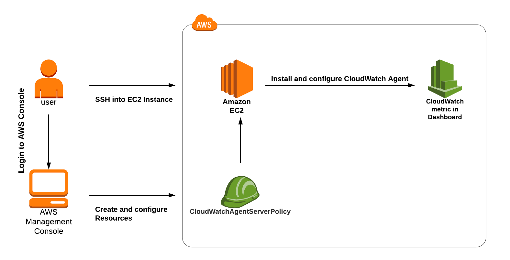
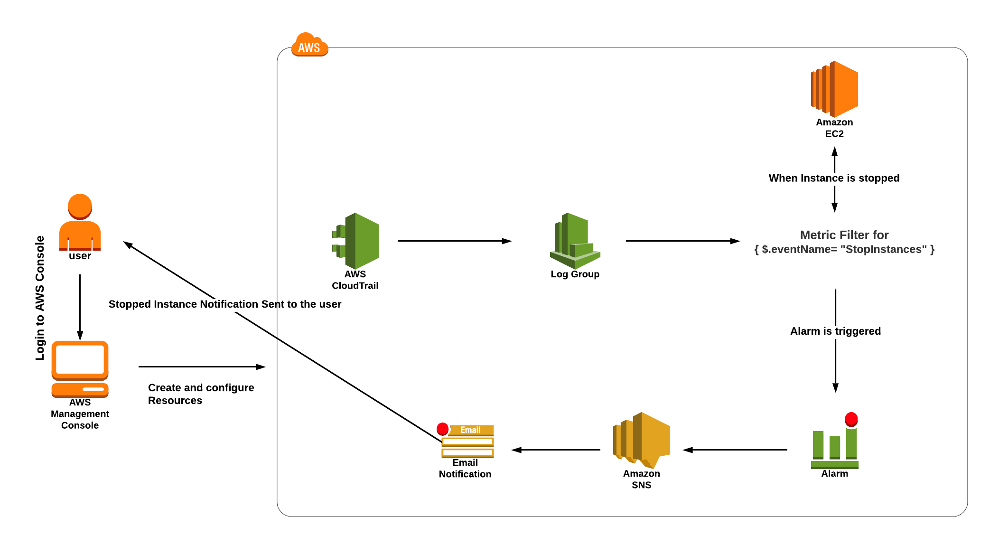

# CloudWatch and Cloudtrail

## Install CloudWatch Logs Agent on EC2 Instance and View CloudWatch Metrics



### Launch Ec2 Instance

* AmazonLinux 2
* t3 micro
* Select keyPair and open SSH Access
* Connect to your instance
* Download the Cloudwatch Unified Agent
* Install the Cloudwatch Agent
* Open the setup wizard
* Enter these values asked during setup:
  * On which OS are you planning to use the agent? : Enter 1
  * Are you using EC2 or On-Premises? : Enter 1
  * Which user are you planning to run the agent? : Enter 1
  * Do you want to turn on the StatsD daemon? : Enter 2
  * Do you want to monitor metrics from CollectD? : Enter 2
  * Do you want to monitor any host metrics? Enter 1
  * Do you want to monitor CPU metrics per core? Enter 1
  * Do you want to add ec2 dimensions into all of your metrics if the info is available? : Enter 1
  * Would you like to collect your metrics at high resolution? : Enter 1 (1s)
  * Which default metrics config do you want?: Enter 2
  * Are you satisfied with the above config? Enter 1
  * Do you have any existing CloudWatch log Agent configuration file to import for migration? : Enter 2
  * Do you want to monitor any log files? : Enter 2
  * Do you want to store the config in the SSM parameter store? : Enter 2
* View CloudWatch Metrics
  * under Metrics you need to find CWAgent

```
wget https://s3.amazonaws.com/amazoncloudwatch-agent/amazon_linux/amd64/latest/amazon-cloudwatch-agent.rpm

sudo rpm -U ./amazon-cloudwatch-agent.rpm

sudo /opt/aws/amazon-cloudwatch-agent/bin/amazon-cloudwatch-agent-config-wizard

sudo /opt/aws/amazon-cloudwatch-agent/bin/amazon-cloudwatch-agent-ctl -a fetch-config -m ec2 -c file:/opt/aws/amazon-cloudwatch-agent/bin/config.json -s

systemctl status amazon-cloudwatch-agent

```

------------------

## AWS Access control alerts with CloudWatch and CloudTrail



## Create a Cloudtrail

* Create a new Trail with name `dev-trail`
* Add CloudWatch Logs to this trail
  * For the role select `New` and called it `dev-alert-tool-role`

## Creating Metric Filters for Log Groups in Cloudwatch

* Open CloudWatch Tab
* Select log group for cloudTrail from above and click Create Metric Filter
  * Filter pattern                 : Enter the pattern { $.eventName= "StopInstances" }
  * Select log data to test  : Select the cloudtrail log in drop-down.
* Filter name: Enter stoppedInstancecount
* Metric details:
  * Metric namespace  : Enter CloudTrailMetrics
  * Metric name            : Enter EC2stoppedInstanceEventCount
  * Metric value            : Enter 1
  * Default value           : Leave default

## Creating an Alarm

* Go to CloudWatch and select Create Alarm for your Metric Filter
* Metric Conditions:
  * Namespace : CloudTrailMetrics (default)
  * Metric name : EC2stoppedInstanceEventCount (default)
  * Statistic        : sum (default)
  * Period          : 5 minute (default)
  * Conditions:
    * Threshold type: Select Static
    * Whenever EC2stoppedInstanceEventCount is : greater or equal than 1.
* Configure Action:
  * Alarm state trigger   : Select in alarm
  * Select an SNS topic   : select Create new topic
  * Create a new topic    : Enter the topic name
  * Email endpoints that will receive the notification :  Enter your Email address to receive the alert
  * Once you provide these details, click on create topic.
  * Confirm subscription using letter which will come on your email

## Test the solution

* Create new ec2 instance and then stop it. your alarm should be triggered

------------------

## CronJobs via aws: EventBridge + Lambda

AWS Lambda & AWS EventBridge

* Create a web rest server with 1 get endpoint and deploy it to ec2 or ecs.

* Create a lambda function to be able to send HTTP requests with a payload Python + NodeJs (both!)

* Create event bridge cron jobs to call your application every 5 min.

* Run your application locally and make it available via Ngrok

* Run your application into Ec2 with (ALB or public dns) and update eventBridge payload

* Note: application here could be from step 2 but also it can be just a simple 1 endpoint app.

Code example Nodejs

```
'use strict'
var https = require('https');
var http = require('http');
const AWS = require('aws-sdk');
const kms = new AWS.KMS()
const parameterStore = new AWS.SSM()
AWS.config.update({
    region: process.env.AWS_REGION
})


function httprequest(options) {
    return new Promise((resolve, reject) => {
        const req = http.get(options, (res) => {
            if (res.statusCode < 200 || res.statusCode >= 300) {
                return reject(new Error('statusCode=' + res.statusCode));
            }
            var body = [];
            res.on('data', function (chunk) {
                body.push(chunk);
            });
            res.on('end', function () {
                try {
                    body = JSON.stringify(Buffer.concat(body).toString());
                } catch (e) {
                    reject(e);
                }
                resolve(body);
            });
        });
        req.on('error', (e) => {
            reject(e.message);
        });
        // send the request
        req.end();
    });
}
exports.handler = async (event, context) => {
    ///////////////////
    const value = "test value"
    ///////////////////
    // send request
    // req props
    const options = {
        host: event.host,
        path: event.path,
        port: 80,
        method: event.method
    };
    return httprequest(options).then((data) => {
        const response = {
            statusCode: 200,
            body: JSON.stringify(data),
        };
        return response;
    });
};

```

```
{
  "host": "ec2-3-124-4-154.eu-central-1.compute.amazonaws.com",
  "path": "/api/v1/users",
  "method": "GET"
}
```

