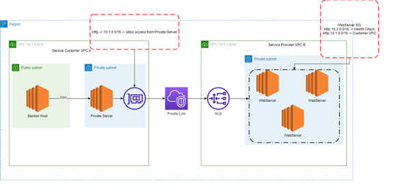
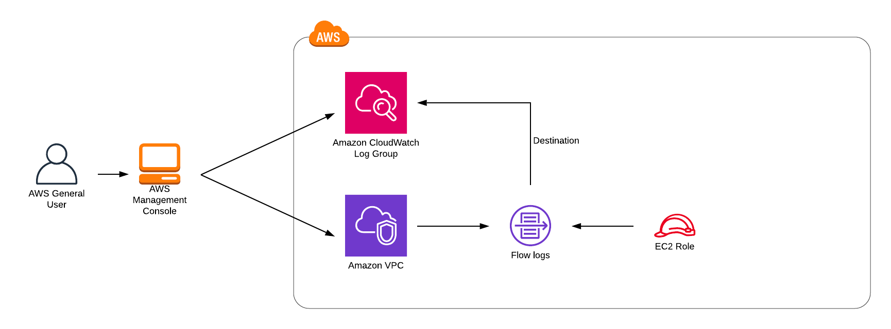
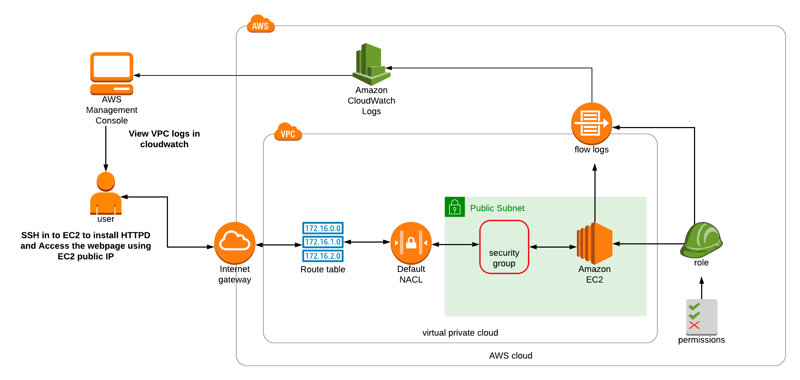
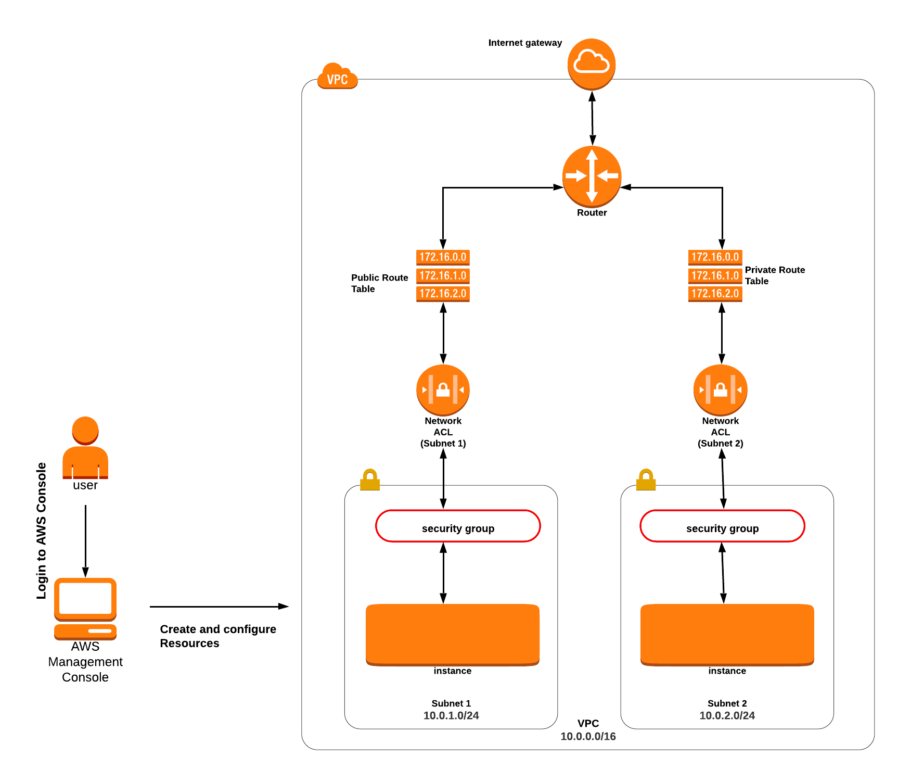
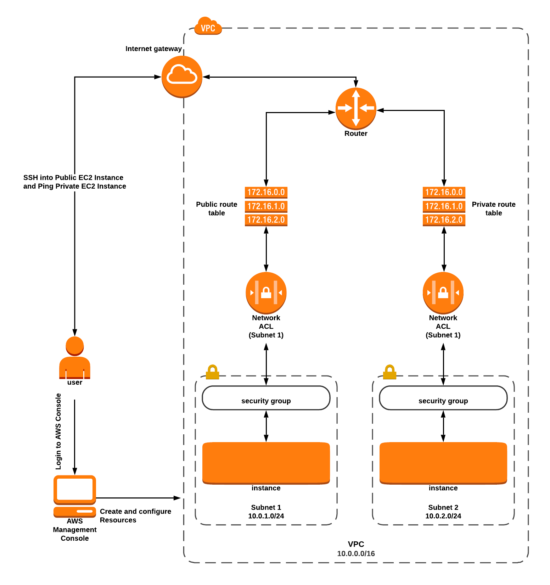
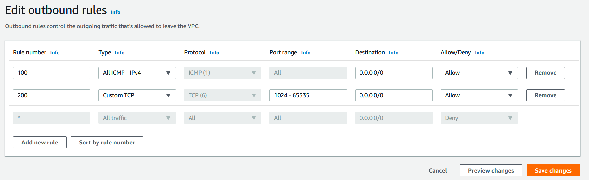
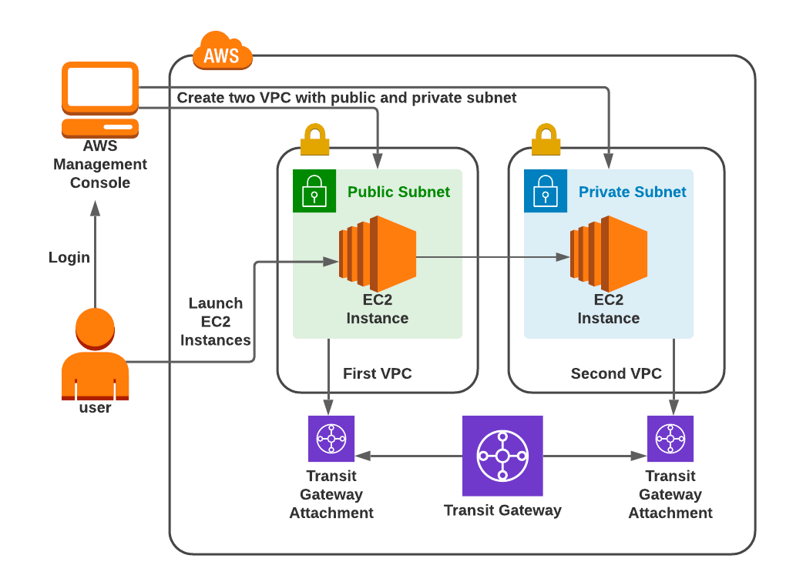
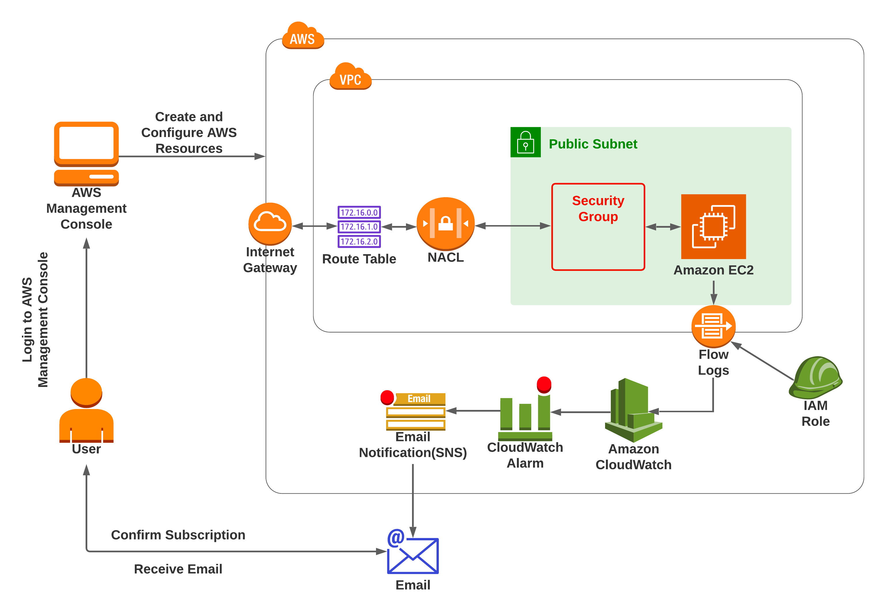
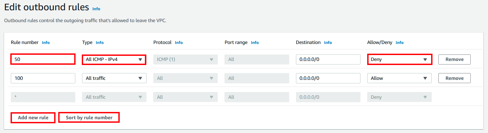

# VPC

#### Create manual VPC setup

VPC setup:

* 2 availability zones
* 2 public & 2 private & 2 database subnets
* 2 nat gateway for high availability (explain why)

Test setup:

* Create bastion instance and test ssh connection to it
* Create ec2 in private and database subnets.
* SSH to instance in private and database subnet
* Test instances with ping command (What should be added to the security group ? )

#### VPC peering

Goal: We want to have 2 private ec2 instances that will talk via a private network. Make them behave as if they were in
the same vpc.

* Create VPC A and VPC B in different regions.
* Create 2 subnets for VPC A: 1 public subnet and 1 private subnet.
* For vpc B just one private subnet.
* Create a bastion host inside of VPC A in a public subnet.
* Create an ec2 instance in each VPC in a private subnet.
* Create VPC Peering Connection from A to B
* Accept connection in vpc B
* Modify Route tables for both VPC.
* Connect to vpc A bastion host, then to private instance in private subnet then ping private instance in vpc B, then
  ssh to private instance in vpc B.
*

Notes:

* ! Remember CIDRs must be non-overlapping
* 10.10.0.0/16
* 10.20.0.0/16
* Open 22 for ssh in security groups
* Add ICMP for VPC cidr range for instance vpc b security group (for ping)

#### VPC Gateway endpoint

Goal: upload file in s3 bucket using vpc gateway endpoint without using public internet

* Create a default S3 bucket
* Create a VPC with 2 subnets: 1 public and 1 private. 10.10.0.0/16
* Launch bastion host and instance in private subnet.
* Create a proper iam role for private instance, give s3 full access permissions.
* Create a Gateway Endpoint. Open in vpc Endpoints
* Search for S3 and choose Gateway endpoint.
* Choose your vpc and choose a private subnet.
* Create a text file in a private instance.
* Upload it on your s3 bucket: aws s3 cp file.name s3://bucket-name -- region name

#### VPC Interface endpoint and SQS

Goal: access aws services with private network using vpc interface endpoint

* Create a VPC with 2 subnets: 1 public 1 private
* Launch bastion host and server in private subnet.
* Create an IAM role with full access for SQS for private instance.
* Open endpoints for VPC
* Search for SQS with Interface type
* Choose vpc, az and your private subnet
* Enable DNS name should be enabled!
* Create a security group for HTTPS from your vpc CIDR.
* Select this group for the endpoint.
* If you get an error, don't forget to enable DNS Resolution and DNS Hostname for your vpc :)
* Copy a queue url from SQS service for the next command.
* Verify that you got a message in sqs service interface.

Example of sending message command: https://docs.aws.amazon.com/cli/latest/reference/sqs/send-message.html

#### VPC Private Link: Create private connection between two vpcs using ELB

* Create VPC A with 2 public subnet and 2 private subnet
* Create VPC B with 2 private Subnets
* Deploy 1 ec2 instance in private subnet in vpc A
* Deploy bastion host in vpc A
* Deploy 2 ec2 instances with httpd server behind and ELB using VPC B
* Create PrivateLink for VPC B NLB
* Connect to VPC A private instance using bastion host and test using CURL that you can access NLB dns name



#### VPC via Cloudformation

* Create a vpc with template.
* Compare vpc from CloudFormation with manually vpc from task 1.
* Create a vpc setup from step 1 via cloudformation.
* Test it in the same way with ec2 instances.

#### VPC Flow Logs

#### Lab: Creating VPC Flow Logs with CloudWatch

This lab will guide you through the process of creating a VPC, setting up a CloudWatch Log Group, and creating VPC Flow
Logs using AWS Management Console.

##### Step 1: Create a CloudWatch Log

1. Navigate to the Services menu at the top and choose CloudWatch under Management and Governance.
2. Click on `Log Groups` under Logs in the left-side panel, then click on `Create Log Group`.
3. Enter the Log Group Name: `dev-vpclogs` and click on the **Create** button.

##### Step 2: Create a VPC

1. Navigate to the Services menu on the top and choose VPC under Networking and Content Delivery.
2. Click on `Your VPCs` in the left side panel then click on `Create VPC`.
3. Select `VPC only`.
4. Enter the Name tag: `dev-vpc` and enter IPv4 CIDR block: `10.1.0.0/16`. Leave other options as default and click on
   the **Create** button.

##### Step 3: Create VPC Flow Logs

1. Inside `dev-vpc`, scroll down and click on the **Flow logs** tab and click on the **Create Flow Log** button.
2. Under Flow log settings: Name: `dev-flow`
3. Select `Filter` as `Accept` and select `Destination` as `Send to CloudWatch Logs`. Choose the previously created
   CloudWatch Logs `dev-vpclogs`.
4. Choose the IAM role `EC2Role_<RANDOM_NUMBER>` and leave the others as default. Click on **Create flow log**.
5. Once the flow logs are created, scroll down and click on **Flow Logs**.



#### VPC Flow Logs: Creating AWS VPC Flow Logs and Generating Traffic

#### Lab: VPC Flow Logs, EC2, and CloudWatch

#### Lab Steps:

#### Create CloudWatch Logs

1. Navigate to the Services menu at the top and choose CloudWatch under Management and Governance.
2. Click on `Log Groups` on the left side panel and Click on the **Create log group** button.
3. Enter the Log Group Name: `dev-vpclogs` and click on **Create**.

#### Create a VPC

1. Navigate to the Services menu at the top and select VPC under Networking and Content Delivery.
2. Click on `Your VPCs` on the left side panel, then click on `Create VPC` and select `VPC only`.
3. For VPC settings, enter the Name tag as `MyVPC` and IPv4 CIDR block as `10.1.0.0/16`.
4. Leave the other fields as default and click on **Create VPC**.
5. Create 1 subnet  `10.1.1.0/24`
6. Create IGW

#### Create VPC Flow Logs

1. Click on `Your VPCs` on the left side panel and select `MyVPC`, click on `Actions`, then select **Create Flow Log**.
2. For **Create flow log**, enter the Name as `MyVPCFlowLog`, select `Accept` for Filter, select `1 minute` for Maximum
   Aggregation Interval, select `Send to Cloudwatch Logs` for Destination, select `dev-vpclogs` for Destination Log
   Group, and select `VPCFlowLog_Role_<RANDOM_NUMBER>` for IAM role.
3. Leave the other options as default, then click on **Create flow log**.
4. Once the flow logs are created, in the `My VPCs` dashboard, select `MyVPC`, and click on **Flow Logs** tab below.

#### Creating an EC2 Instance

1. Navigate to Services at the top and click on EC2 under Compute.
2. Make sure you are in the US-East (N. Virginia) `us-east-1` region.
3. Select `Instances` on the left side panel and click on **Launch instances**.
4. Enter Name: `dev-labsec2instance`. Choose an Amazon Machine Image (AMI): Select `Amazon Linux 2023 AMI` in the
   drop-down. Choose an Instance Type: Select `t2.micro`.
5. For Key pair, select **Create a new key pair** Button, enter Key pair name as `dev-Key`, select RSA for Key pair
   type, and .pem for Private key file format. Then, click **Create key pair** Button.
6. In Network Settings, Click on **Edit** Button, select `MyVPC` for VPC, and it automatically selects the Subnet we
   created (`dev-sub`) for Subnet. Enable **Auto-assign public IP**.
7. Select **Create new Security group**, enter `MyEC2Server_SG` for Security group name,
   enter `Security Group to allow traffic to EC2` for Description, and check **Allow SSH from** and Select **Anywhere**
   from the dropdown.
8. To add SSH, Choose Type: SSH, Source: Select Anywhere. For HTTP, Select **Add Security rule** Button, Choose...

#### Generate Traffic

```
sudo su

yum -y update

yum install httpd -y

cd /var/www/html

echo "Response coming from server" > /var/www/html/index.html

systemctl start httpd

systemctl enable httpd

systemctl status httpd
```

#### View your flow logs



### AWS VPC NACL Lab



#### Create vpc

* Create vpc 10.0.0.0/16 `dev-vpc`
* Create subnets: public subnet `10.0.1.0/24` and private subnet `10.0.2.0/24`
* Enable auto-assign public ip

#### Launching an EC2 Instance in the Public Subnet

1. Navigate to the EC2 Dashboard on the AWS Management Console.
2. Click on the "Launch Instance" button.
3. For the Amazon Machine Image (AMI), select Amazon Linux 2 AMI.
4. Choose an instance type: t3.micro.
5. Set up the instance details:
    - Network: MyVPC
    - Subnet: MyPublicSubnet
    - Auto-assign Public IP: Enable
6. In the "Add Storage" step, leave the default settings.
7. In the "Add Tags" step, add a tag to name your instance: Key = Name, Value = MyPublicEC2Server.
8. In the "Configure Security Group" step, create a new security group named "MyWebserverSG". Add two rules: SSH (
   Source: Anywhere) and HTTP (Source: Anywhere).
9. In the "Review" step, under "Advanced Details", add the following script to the User data section to install and
   start Apache HTTP server:

    ```
    #!/bin/bash
    sudo su
    yum update -y
    yum install httpd -y
    echo "<html><h1>Welcome to webserver Server</h1></html>" >> /var/www/html/index.html
    systemctl start httpd
    systemctl enable httpd
    ```

#### Launching an EC2 Instance in the Private Subnet

1. Click on the "Launch Instance" button.
2. For the Amazon Machine Image (AMI), select Amazon Linux 2 AMI.
3. Choose an instance type: t2.micro.
4. Set up the instance details:
    - Network: MyVPC
    - Subnet: MyPrivateSubnet
    - Auto-assign Public IP: Disable
5. In the "Add Storage" step, leave the default settings.
6. In the "Add Tags" step, add a tag to name your instance: Key = Name, Value = MyPrivateEC2Server.
7. In the "Configure Security Group" step, create a new security group named "MyServerSG". Add two rules: SSH (Source:
   Anywhere) and All ICMP - IPv4 (Source: Anywhere).
8. Review the instance settings, then click on "Launch".
9. In the key pair window, select "Choose an existing key pair", then choose the key pair that you created
   earlier.
10. Click on "Launch Instances".
11. Click on "View Instances". Your new instance will be initializing. Wait for it to become "Running".

#### Testing Both EC2 instances

1. Navigate to the "Instances" tab in the EC2 dashboard.
2. Copy the Public IPv4 address of the "MyPublicEC2Server" instance and open it in a new browser tab. You should see
   your webpage served by Apache.
3. SSH into your "MyPublicEC2Server" instance and use the "ping" command to check connectivity to the "
   MyPrivateEC2Server" instance using its private IP.

#### Creating Custom NACL and Associate it to the Subnet

1. Navigate to the "VPC" service from the AWS Management Console.
2. On the left pane, under Security, click on "Network ACLs".
3. Click on the "Create network ACL" button.
4. Name it "MyPublicNACL", select "MyVPC" from the VPC drop-down list, and click on "Create".
5. Select the newly created NACL, go to the "Subnet associations" tab, click on "Edit subnet associations".
6. Select both the "MyPublicSubnet" and "MyPrivateSubnet", and click "Save".
7. Rename the default NACL to "MyPrivateNACL".

#### Testing the Public and Private Server (step 10)

1. Repeat the steps in Task 10. Due to the NACL changes, you might encounter connectivity issues.

#### Adding Rules to Custom NACL (MyPublicNACL)

1. Select "MyPublicNACL" from the "Network ACLs" list.
2. In the "Inbound rules" tab, click on "Edit inbound rules" and add the following rules:
    - Rule #100: HTTP (80) from 0.0.0.0/0
    - Rule #150: All ICMP - IPv4 from 0.0.0.0/0
    - Rule #200: SSH (22) from 0.0.0.0/0
3. In the "Outbound rules" tab, click on "Edit outbound rules" and add the following rules:
    - Rule #100: Custom TCP Rule, Port Range 1024-65535, to 0.0.0.0/0
    - Rule #150: All ICMP - IPv4 to 0.0.0.0/0
    - Rule #200: SSH (22) to 0.0.0.0/0

#### Testing Both EC2 instances

1. Repeat the steps in Step 10. Now, with the new NACL rules, you should be able to see the Apache web page and ping the
   private instance from the public one.

------------------

# Advanced

### Understanding and Configuring Layered Security in an AWS VPC



#### Create VPC

* CIDR 10.0.0.0/16
* IGW
* Two Subnets
    * public 10.0.1.0/24
    * private 10.0.2.0/24

#### Create SG

* SSH rule from anywhere
* ALL ICMP IPv4 from anywhere

#### Creating and configuring Network ACL

* Inbound rules
    * SSH rule
        * Rule number : Enter 100
        * Type: Choose SSH (22)
        * Source: Enter 0.0.0.0/0
        * Allow / Deny: Select Allow
    * For ALL ICMP- IPv4
        * Rule number : Enter 200
        * Type: Choose ALL ICMP - IPv4
        * Source: Enter 0.0.0.0/0
        * Allow / Deny: Select Allow
* Outbound rules
    * For ALL ICMP- IPv4, click on Add new rule,
        * Rule# : Enter 200
        * Type: Choose ALL ICMP - IPv4
        * Destination: Enter 0.0.0.0/0
        * Allow / Deny: Select Allow

    * For Custom TCP Rule, click on Add new rule,
    * Rule# : Enter 300
    * Type: Choose Custom TCP Rule
    * Port Range: Enter 1024 - 65535
    * Destination: Enter 0.0.0.0/0
    * Allow / Deny: Select Allow
* Assosiate with both public and private subnet
* 

#### Launch 2 ec2 instances

* One instance in public subnet, second one in private subnet

#### Testing

* SSH into public instance and ping your private instance.

### VPC Transit Gateway

#### Create first VPC

* CIDR 10.0.0.0/24
* Enable DNS resolution and Enable DNS hostnames
* Create public subnet 10.0.0.0/25
* Launch Ec2 instance in VPC with SG for ssh, http, https rules from anywhere
* add user data

```
#!/bin/bash         
sudo su         
yum update -y           
yum install httpd -y            
systemctl start httpd           
systemctl enable httpd          
echo "<html><h1> Welcome to WebServer Public Server</h1><html>" > /var/www/html/index.html
```

#### Create Second VPC

* CIDr 10.1.0.0/24
* Enable DNS resolution and Enable DNS hostnames
* Create private subnet 10.1.0.0/25
* Launch ec2 instance with SSH rule

#### Create Transit Gateway

* Create TG
* Create Transit Gateway attachment for the first VPC
    * Name tag : First_VPC_TGA
    * Transit Gateway ID: Select transit gateway present with Name tag DemoTG.
    * Attachment type: Select VPC
    * DNS support: Checked (default)
    * IPv6 support: Unchecked
    * VPC ID: Select VPC with the Name First_VPC
    * Subnet IDs: Default
* Create TGA for the second VPC
    * Name tag: Second_VPCs_TGA
    * Transit Gateway ID: Select transit gateway present with Name tag DemoTG.
    * Attachment type: Select VPC
    * DNS support: Checked (default)
    * IPv6 support: Unchecked
    * VPC ID: Select VPC with the Name Second_VPC
    * Subnet IDs: Default

#### Update VPCs Route Tables

* First VPC: add CIDR of second VPC -> 10.1.0.0/24 : Destination Transit Gateway
* Second VPC: add CIDR of the first VPC -> CIDR 10.0.0.0/24 : Destination Transit Gateway

#### Test Connection between two VPCs

* ssh to public instance
* Copy your key pair on this instance
* Connect to instance in second vpc using SSH



# Create a Network Monitoring System Using AWS VPC Flow Logs and CloudWatch Level



#### Create VPC

* CIDR 10.0.0.0/24
* Create Subnet: CIDR 10.0.0.0/26

#### Create VPC Flow logs and integrate it with CLoudWatch

* create log group
* go to VPC and create Flow logs
    * filter: Choose All
    * Maximum aggregation interval: Choose 1 minute
    * Destination: Choose Send to CloudWatch Logs

#### Create EC2 Instance

* For the SG allow SSH
* Connect to instance and generate some activities by Curl google.com
* Then check logs in cloudWatch

#### Configure CloudWatch Metric Filter and CloudWatch Alarm to monitor traffic

* Go to Network ACLs
* Add New Rule
    * Rule number: Enter 50
    * Type: Select All ICMP - IPv4
    * Allow/Deny: Select Deny
    * Click on Sort by rule number Button.
    * Now click on Save Changes
    * 
* Go to cloudWatch
* Select your log group and create Metric Filter
    * use the following patter: Filter pattern:
      Enter [version, account, eni, source, destination, srcport, destport, protocol="1", packets, bytes, starttime, endtime, action="REJECT", flowlogstatus]
    * Data to test pattern
    * Name will be Ping-Deny-Metrics
    * Metric name: Enter Ping-Deny
    * Metric value: Enter 1

```
2 898009780581 eni-02900ac2fc00ea81d 10.0.0.11 45.76.22.189 56711 123 1 1 76 1632806231 1632806281 ACCEPT OK
2 898009780581 eni-02900ac2fc00ea81d 162.142.125.74 10.0.0.11 59544 9129 1 1 44 1632806231 1632806281 REJECT OK
2 898009780581 eni-02900ac2fc00ea81d 193.242.145.15 10.0.0.11 50598 22333 1 1 40 1632806231 1632806281 REJECT OK
2 898009780581 eni-02900ac2fc00ea81d 162.159.200.1 10.0.0.11 123 41433 1 1 76 1632806231 1632806281 ACCEPT OK
```

* Then create CloudWatch Alarm
    * Metric-name: Enter Ping-Deny
    * Statistic: Select Sum
    * Period: Select 1 minute
    * Under Condition section:
        * Threshold type: Choose Static
        * Whenever Ping-Deny is…: Choose Greater/Equal
        * than…: Enter 1

* Enter values for the alarm action:
* Alarm state trigger: Choose In alarm
* SNS topic: Choose Create new topic
* Create a new topic: Enter CloudWatch-Alarms-Ping-Deny
* Email endpoints that will receive the notification…: Enter <your email address>
* Click on Create Topic button.
* Leave other options as default.
* Before you proceed to trigger the alarm, you should access your email inbox and Confirm subscription for the SNS topic
  subscription.

#### Test your system

* connect to Ec2 instance
* Do ping google.com
* This will lead you to get alarm triggered and you will receive an email

# Vpc Endpoint

* Goal: Create a s3 bucket A. Create a VPC , create interface endopoint for s3 and using policy allow to send request
  only for specific s3 bucket A.
* Update S3 bucket A bucket policies to allow request only from this specific Interface endpoint ( aws:sourseVpce)
* Create ec2 in private subnet and test it

# Pair two VPCs with the same cidr block (CIDR block conflict)

* VPC A with 10.0.0.0/16 with ec2 in private subnet and ELB region A
* VPC B with 10,0,0,0/16 with ec2 in private subnet in region B need to send request to vpc A ELB
* How to solve it? (Create additional VPC C in region A with cidr 192.168.0.0/16 and create VpC endpoint Service for
  this ELB, Create VPC inter region peering between C and B)


# Site to Site VPN hands on

TODO