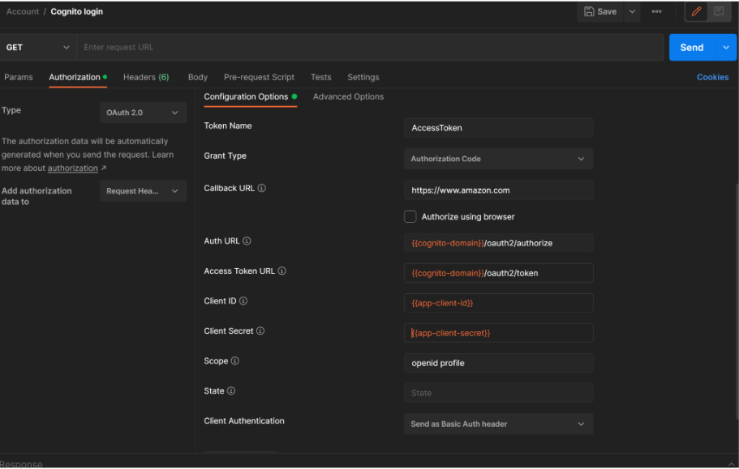

# AWS Cognito

#### Create a userPool with signUp and signIn options

Login based on email address

At least fields:

* Username
* Email
* Password

* Send verification code on email, email only
* Configure email sender address, configure reply to address
* Edit message template to add some custom stuff.

* Remember user device

* Add a post authentication with lambda what would be adding all available info about user into dynamodb table

* Add a pre token generation lambda to be able to add one more custom claim

* Add one more trigger based on lambda on your choice. Explain why do we need it?

* Add custom identity providers: Google.

* Attach WAF to your user pool.

* Add required tags.


* Create at least one custom user.

* Create a user group

* Create custom domain name Cognito

* Create app client:

* for the callback url select an ec2 instance with httpd service to simulate redirect on your frontend site

* Customise your page: Create a custom UI (just image)

* Customise sing up experience: add at least one custom attribute

Test sign up & sign in process

* Additional task: Build a Serverless Web Application with AWS Lambda, Amazon API Gateway, AWS Amplify, Amazon DynamoDB,
  and Amazon Cognito

[https://aws.amazon.com/getting-started/hands-on/build-serverless-web-app-lambda-apigateway-s3-dynamodb-cognito/]

#### Create Identity pool based on UserPool

##### Step 1: Create user pool

* Sign-in experience:
    * Provider types: Cognito user pool
    * Sign-in options: User name
    * User name req-ts: case sensitive
* Security requirements:
    * Password policy: Cognito defaults
    * Multi-factor authentication: No MFA
    * User account recovery: Enable self-service account recovery (Email only)
* Sign-up experience:
    * Leave default settings
* Message delivery:
    * Send email with Cognito
* App:
    * Use the Cognito hosted UI
    * Use a Cognito domain
    * Public client
    * Generate a client secret
    * Callback & Sign-out URLs:
        * https://www.amazon.com
    * OpenID Connect scopes:
        * All of them
* Launch hosted UI (App client -> Hosted UI -> View Hosted UI)
    * sign up
    * sign in

##### Step 2: Create Identity pool

* Create Identity pool:
    * Enable access to unauthenticated identities
    * Providers:
        * cognito userpool from prev step
    * create new IAM roles
* Edit IAMs policies:
    * Cognito_POOLNAMEAuth_Role:
        * S3
            * list
            * All resources
* Create Identity
* Check Identity in console
* Get temporary credentials for our identity
* Check that temp creds

_Notes_:

1. How to get id_token to create identity?
    * Proceed this configuration to get id_token.
    * In the login pop up just log in with your user



2. How to create identity?
    * Endpoint:
      POST  [https://cognito-identity.us-east-1.amazonaws.com/](https://cognito-identity.us-east-1.amazonaws.com/)
    * Additional headers:
    * CONTENT-TYPE : ```application/x-amz-json-1.1```
        * X-AMZ-TARGET : ```com.amazonaws.cognito.identity.model.AWSCognitoIdentityService.GetId```
    * Json body:
      ```
      {
      "IdentityPoolId": "YOUR_IDENTITY_POOL_ID",
      "Logins": {
      "cognito-idp.eu-north-1.amazonaws.com/YOUR_USERPOOL_ID”: "ID_TOKEN"
      }
      }
      ```
3. How to get temp credentials ?
    * Endpoint:
      POST  [https://cognito-identity.us-east-1.amazonaws.com/](https://cognito-identity.us-east-1.amazonaws.com/)
    * Additional headers:
        * CONTENT-TYPE : ```application/x-amz-json-1.1```
        * X-AMZ-TARGET : ```com.amazonaws.cognito.identity.model.AWSCognitoIdentityService.GetCredentialsForIdentity```

    * Json body:
    ```
   {
   "IdentityId": "YOUR_IDENTITY_ID",
   "Logins": {
   "cognito-idp.eu-north-1.amazonaws.com/YOUR_USERPOOL_ID”: "ID_TOKEN"
   }
   }
    ```

#### Questions:

* User pool vs identity pool
* What is App clients
* What is sign in certificate?
* What is import job?
* What is resource server?
