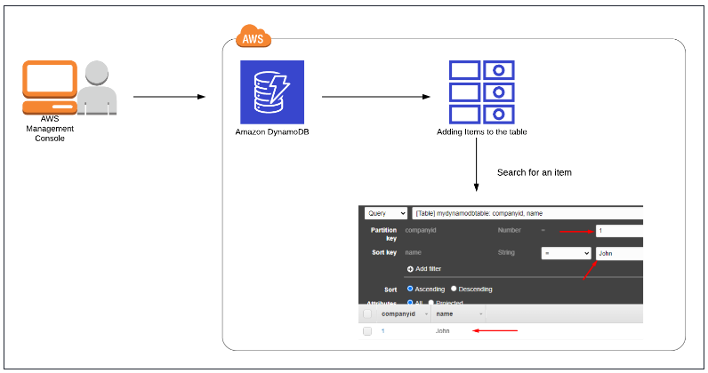
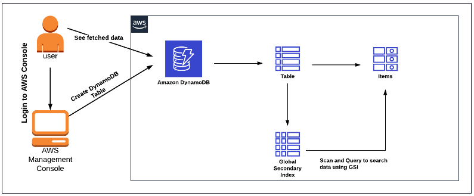
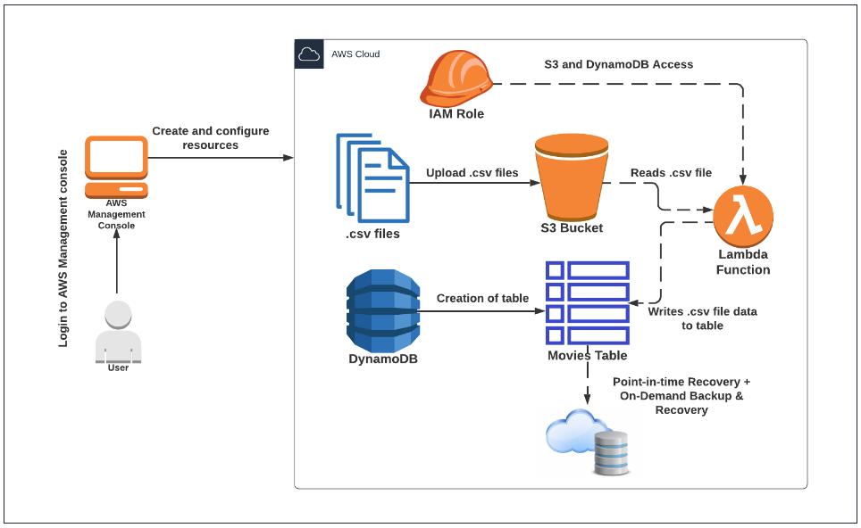
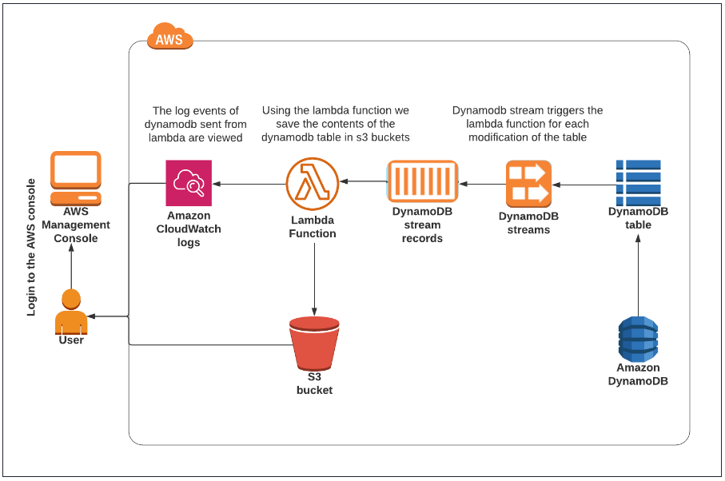
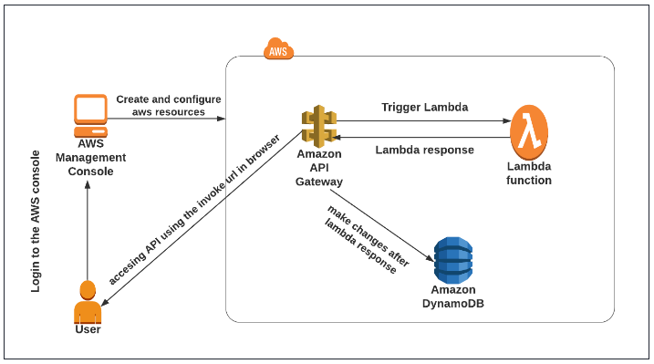

# DynamoDB Introduction

Architecture Diagram

* Create a DynamoDB table.
  - Table Name: Enter `mydynamodbtable`
  - Primary key: Enter `companyid` and select
  - Add sort key: Enter name in the respective field and select String.
* Insert data into that DynamoDB table.(Add 3-5 items)
  - companyid     : 1
  - name        : John
* Search for an item in the DynamoDB table.

## DynamoDB & Global Secondary Index

Architecture Diagram

**Note: If the Global secondary index is not showing in the Scan list, Please wait another 5 to 10 minutes and reload the entire page. This is an AWS side delay.**

* Create DynamoDB Table
  - Table name : `WhizOrderTable`
  - Partition Key : `UserName` (String)
  - sort key : `OrderID` (String)
* Create Item
  - Once you select the create item, you’ll see `UserName` and `OrderID`, but we need 2 more attributes in our table. Click on Add new attribute and then select String from the drop down menu.
  - Give the attribute name as `ReturnDate`
  - Click on Add new attribute again and select String from the drop down menu.
  - Now Give the attribute name as `UserAmount`
  - Now enter the values as shown below:
------------------------------------------------------------------------------
    UserName : HarryPotter
    OrderID : 20160630-12928
    ReturnDate : 20190705
    UserAmount : 142.23
------------------------------------------------------------------------------
  - Navigate to the `Tables` and click on `Index` tab next to Overview section.
  - Click on `Create Index`.
  - Enter the Paritition key as `ReturnDate` and Sort key as `UserAmount`.
  - Leave everything as default and Click on Create index and wait until the index state changes to Active.
  - Move to the Items tab and click on Create item. Insert the following additional data into the table and click on Create item:
------------------------------------------------------------------------------
    UserName :  HarryPotter
    OrderID :  20160630-28176
    ReturnDate :  20190513
    UserAmount :  88.30

    UserName :  Ron
    OrderID :  20170609-25875
    ReturnDate :  20190628
    UserAmount :  116.86

    UserName :  Ron
    OrderID :  20170609-4177
    ReturnDate :  20190731
    UserAmount :  27.89

    UserName :  Voldemort
    OrderID :  20170609-17146
    ReturnDate :  20190511
    UserAmount :  114.00

    UserName :  Voldemort
    OrderID :  20170609-18618
    ReturnDate :  20190615
    UserAmount :  122.45
------------------------------------------------------------------------------
 
* Use Global Secondary Index to Fetch Data
  - Now go to Explore Table items and click on the Scan or Query option for WhizOrderTable.
  - Let`s try with the Scan option to search for data.
  - Select the “Scan” option -> Table or index : Select `ReturnDate-UserAmount-index` -> Expand Filters -> click on Run button.
------------------------------------------------------------------------------
    Attribute name : Enter ReturnDate
    Type : Select String
    Condition : Select Between
    Value : Enter 20190501 and 20190531
------------------------------------------------------------------------------
  - Let`s try with the Query option to search for some data. Click on Query next to Scan.
------------------------------------------------------------------------------
    Table or index : Select ReturnDate-UserAmount-index
    ReturnDate : Enter 20190628
    UserAmount (Sort key) : Select Greater than or equal to
    Enter sort key : Enter 100
------------------------------------------------------------------------------
## DynamoDB PITR & On-Demand Backup and Restore

Architectural Diagram

**Create S3 bucket and upload CSV files.**

------------------------------------------------------------------------------
    Bucket Name     : whizlabs.backup.restore.0504
    Region : Select your Region
    Leave other settings as default.
    Click on the Create Bucket button.
------------------------------------------------------------------------------
    
  Here we will be uploading two CSV files called Movies-1.csv and Movies-2.csv.  
  To upload the files, download them by clicking on the link – Download Me and unzip the zip file and then upload the files.
  - To upload the files to S3 bucket

**Create table in DynamoDB**

------------------------------------------------------------------------------
    Table Name :  Top_125_Movies
    Partition Key : Enter Rating
    Data Type : Select String
    Leave all the remaining options as it is and click on Create table.
    It does take a few seconds for the table to get created.
    Once the table is created, click on the table name and you are navigated to the main page which shows the Status as Active.
------------------------------------------------------------------------------

* Enabling Point-in-Time Recovery
  * Click on the table name
  You are navigated to the page where we find all the options related to the table.
  We will be clicking on the Backups tab.

  * Here we have the feature to work with 2 tasks.
  Enabling and Restoring of Point-in-time Recovery
  Creating On-Demand Backup and Restore
  * At this point we will work on `Point-in-time Recovery` and to do that we have to click on the Edit button present 
  next to the left of the heading (Point-in-time recovery).  New page is displayed, allowing you to Enable the option.
  Check the checkbox next to Enable `Point-in-time-recovery` and click on the Save Changes button.

**Create a Lambda function**

------------------------------------------------------------------------------
    Choose Author From Scratch .
    Function name: Enter Lambda_DB_Backup
    Runtime: Select Python 3.9
    Permissions: Click on the Change defacult execution role and choose Use an Existing role
    Existing role: Select  lambda_Role_<RANDOM-NUMBER> from the dropdown list.
------------------------------------------------------------------------------

Under Code tab, go to Code source and double click on lambda_function.py, Replace the existing code with the code below.

------------------------------------------------------------------------------
    import boto3
    
    s3_client = boto3.client("s3", region_name="us-east-1")
    
    dynamodb = boto3.resource("dynamodb", region_name="us-east-1")
    
    table = dynamodb.Table("Top_125_Movies")
    
    def lambda_handler(event, context):
    
        bucket_name = event['Records'][0]['s3']['bucket']['name']
    
        s3_file_name = event['Records'][0]['s3']['object']['key']
    
        resp = s3_client.get_object(Bucket=bucket_name,Key=s3_file_name)
    
        data = resp['Body'].read().decode("utf-8")
    
        TopMovies = data.split("\n")
    
        for movies in TopMovies:
    
            print(movies)
    
            movie_data = movies.split(",")
    
            # add to dynamodb
    
            try:
    
                table.put_item(
    
                    Item = {
    
                        "Rating" : movie_data[0],
    
                        "MovieName" : movie_data[1],
    
                        "YearReleased" : movie_data[2]
    
                    }
    
                )
    
            except Exception as e:
    
                print("End of file")

------------------------------------------------------------------------------

Click on Configuration tab, to edit General Configuration.  Click on the Edit button, to configure Basic settings.

Displayed page, allows us to edit the basic settings info and in the displayed screen under Timeout, provide “1” min “0” sec.  By default, the time provided is “0” min “3” sec.

Leave all other options as it is and click on Save.

**Executing Lambda function.**

- We will execute the lambda function, which will pick `Movies-1.csv` file data and inserts into DynamoDB table – `Top_125_Movies`.
- Navigate back to the Code tab.
- Click on Test, and you are displayed with a pop-up window Configure test event when clicked will allow us to 
configure the values required for the lambda function.  Provide the following values.

------------------------------------------------------------------------------
    Event Template    : Select S3-put from drop-down box.
    Event Name        : Enter insert
    In the displayed code, do the following corrections.
    Line 23 - Provide S3 bucket name - Enter whizlabs.backup.restore.0504[Make sure to enter your bucket name]
    Line 30 - Provide .csv file name – Enter Movies-1.csv
    Click on Save button to save the code.
------------------------------------------------------------------------------

- To execute the function click on Test.  The output of the function will list all the movie names.
- Now navigate to DynamoDB, click on Explore Items on the left panel and click on the table name Top_125_Movies and 
you are navigated to the page where the tabs are displayed.

Note :
- Make a note of the time when you have executed the lambda function.  This is required for us to perform Point-in-time Recovery.
- Wait for 10 minutes, and then perform the next i.e., adding another 25 records from Movies-2.csv file.

Now, let us execute the Lambda function a second time by referring to the Movies-2.csv file stored in S3 bucket.

- To edit the new .csv file in the code, get back to Lambda function and click on Test drop-down arrow, and then click 
on the  displayed Configure test event text.  It takes us back to the Configure test event screen.

- In the displayed screen, edit the previous .csv file name we have provided to Movies-2.csv at line number 30.

- Click on Save to update the above editing. You are navigated back to lambda function screen, and here click on Test 
present to execute the code.  The output of the function will list all the movie names.

- You are navigated back to lambda function screen, and here click on Test present to execute the code.  
The output of the function will list all the movie names.

Get back to DynamoDB screen and check the count of records in Top_125_Movies.  You would be seeing the count as - 125

To view the total number of records in the table perform the following steps.

- Click on tables on the left panel, then click on the table `Top_125_Movies` and scroll down and click on 
Get Live Item Count present in Items summary tab.
- In the displayed screen, click on the Start Scan button, and it displays the count of records in the table and 
in our case it will be 125.

**Performing Point-in-time Recovery**

- To perform this task, in DynamoDB click on the table and in the displayed grid to the right-hand side click on 
Backups tab.  As you are aware, we have enabled Point-in-time Recovery when the table is created.
- Since we must restore to the old point, click on Restore button.  As mentioned in the previous step to take a note 
of the time when the first Lambda function was executed.
- You are required to provide the following values to work with this task.
  - Name of restored table : Enter PITR_100_Movies-1
  - In our scenario, we will pick the second option i.e., provide the date and time we need to have.  (Here we will be 
  using the time that we have marked when we executed the Lambda function for the first time i.e., to have 100 records back).
  - Specify date and time - provide the details that we have recorded in the above steps.
  - Rest leave the available settings and click on Restore and the process of recovery starts.
- Once the restore is completed, we are displayed with a message, and a new table gets created holding the restored data.
- To confirm the record count, let us click on Get Live Item Count button, and in the displayed screen click Start Scan.

**Performing On-Demand Backup.**

- Click on the table name `Top_125_Movies`
- In the displayed grid, click on `Backups` tab.
- Under `On-demand Backups` click on `Create Backup`, and in the displayed screen provide the below details.

Note : Provide name for the table which holds the backup.
Click on Create Backup and the backup gets created.

Once the job is successful, you are updated about the same. Click on the Backups on the left side panel.

**Performing Restore of On-Demand Backup.**

- To restore the database, select the Backup name and click on Restore.
- Restore backup screen is displayed and you are asked to provide a new table name where the backup is restored.
  - Name of restored table : Enter Top_125_Movies_Copy-1
  - Leave all other options in the page as default and click on the Restore.
- As the restore happens, you can see the process working (Incase if you don't see the table, please refresh the page).
- Once the restore gets completed, you will find 125 records in the new table.  This task can be done, by clicking on 
the Get Live Item Count and click on Start Scan.
- On completion of the above task, we will be having 3 tables in DynamoDB.
  - Main table : Top_125_Movies
  - Point-in-time Recovery table : PITR_100_Movies-1
  - Backup of the table: Top_125_Movies_Copy-1

**Delete aws resources**

--------

# Lambda

## Configuring DynamoDB Streams Using Lambda

Architecture Diagram

**Create Amazon DynamoDB table.**

- In the DynamoDB dashboard, click on Create Table and then provide following values:
  - Table Name: Enter `whizlabs_dynamodb_table`
  - Primary Key :  Enter `id` and click on the drop-down to select `String` and click on Create Table.
  - Your table will be created within 2-3 minutes.

**Insert items into the DynamoDB table.**

- Click on Table created and in Actions Select Create item
- We need to create three additional fields for firstname, lastname and age. Click on Add new attribute and then select
String from the drop down menu and enter the appropriate values and click on Create Item.
------------------------------------------------------------------------------
    NOTE: Do not give extra spaces in the fields while creating an item.

    id  :  Enter 12
    first name  : Enter Anand
    last name  : Enter Arjunan
    age  : Enter 32
    
    id  : Enter 13
    first name  : Enter Bala
    last name  : Enter Kumaran
    age  : Enter 34
    
    id  : Enter 14
    first name  : Enter Chandra
    last name  : Enter Prakash
    age  : Enter 32
------------------------------------------------------------------------------

**Create a Lambda function.**

- Click on Create function and choose  Author from Scratch

------------------------------------------------------------------------------
    Function Name :  whizlabs_dynamodb_function
    Runtime : Select Python 3.8 (Choose from the Dropdown)
    Architecture : Select x86_64
    Click on Change default execution Role and then select Use an existing Role
    Choose whizlabs_dynamodb_role_<RANDOM_NUMBER>  from the drop-down menu
    Click on Create function
------------------------------------------------------------------------------

- Once the function is created, select the function (`whizlabs_dynamodb_function`) which you created from the Lambda dashboard.
- To open the existing code, under Code Source, double click `lambda_function.py`
- Download Zip file and unzip it. Open the `whizlabs_dynamodb_function.py` file, copy the code and 
replace the existing code in the `lambda_function.py` under Code Source.
- If you have created the DynamoDB table with any other name, make the changes in code, on line number 6.
- Navigate to the S3 bucket console and check the name of the bucket created for you i.e whizlabs.<Random number>
- Make the changes in code by replacing the bucket name on line number 23 with the bucket name created for you.
  - `Note: If there is more than 1 bucket, you should use the name of the latest created bucket.`
- Click on Deploy button.
- After updating the code, click on Configuration, then click on Edit on the General Configuration to reach 
Basic Settings, and change the Timeout value to 1 min.  Click on Save on the bottom right corner.
- Now you have successfully created a Lambda function for capturing the items in the DynamoDB table whenever there is 
a change. We also configured a text file containing the DynamoDB table to be dropped in S3.

**Add Triggers to the DynamoDB table.**

- Select the table `whizlabs_dynamodb_table`.
- On the right side select `Exports and streams`.
- Now scroll down to `DynamoDB stream details` and click on Enable.
- Now, leave the settings as default and click on Enable stream.
- Now scroll down and you will be able to find Trigger section under DynamoDB stream details.
- Under Trigger section, click on Create trigger button.

------------------------------------------------------------------------------
    Function :  Choose the function which we have created i.e whizlabs_dynamodb_function
    BatchSize  : 1
    Enable Trigger : Check
------------------------------------------------------------------------------

The DynamoDB Stream trigger will be ready once the State of the trigger is Enabled

**Make changes to the contents of the DynamoDB table.** 

- We will make some changes in the DynamoDB table, which will kick off the lambda to deliver a database snapshot to S3.
- In the DynamoDB  select the table we have created `whizlabs_dynamodb_table`.
- Click on Create item button.
- Now in the table `whizlabs_dynamodb_table`, we will insert a new item with the following parameters:

------------------------------------------------------------------------------
    id  : Enter 15
    first name  : Enter Dhana
    last name  : Enter Sekaran
    age  : Enter 32
------------------------------------------------------------------------------

- Click on Explore Table Items and Select Item having id 12 from Actions select Edit item
- Change the `first name` to `Arun`
- Select the table `whizlabs_dynamodb_table`.
- On the right side select `Exports and streams` and go to the `Triggers tab` in the Exports and streams section and then 
press the refresh button. Now the DynamoDB Streams will trigger the Lambda function to dump the items of the table into 
a text file named `data.txt` (it will take a minute to do this) and it will upload the file to the S3 bucket
- To verify that, navigate to the S3 and click on the bucket named `whizlabs.<RANDOMNUMBER>`. Select `data.txt` file and 
click on Download.
- Wait for some time and refresh the page, if you do not see the data.txt file inside the S3 bucket.
- Open the `data.txt `file and verify that the contents of the text file are in the `JSON format`.
- Updated content will be available in the data.txt.
- Repeat the procedure of updating and adding new items to the table to see the change reports in S3.

**Streaming Cloudwatch Logs.** 

- Navigate to Cloudwatch by clicking on  Management & Governance under the Services.
- Click on the Log groups under Logs in the Left Panel.
- You should be able to see dynamodb logs under log groups. If it’s not visible, please wait for 5-10 minutes, 
CloudWatch usually takes around 5-10 minutes after the creation to fetch the details.
- Now click on  `/aws/lambda/whizlabs_dynamodb_function`.
- Under the log streams section, click on the stream that is present, where we can find the stream of events that were 
triggered.
- We can view the log events of the lambda function when some actions are taken place in dynamodb.

--------

# API Gateway

## Implementing Amazon DynamoDB operations through Amazon Private REST API Gateway

Architecture Diagram

- Create a security group.

Under security groups, click on Create Security Group button.

------------------------------------------------------------------------------
    Security group name:  Whizvpcendpoint-sg
    Description: Enter Security group for VPC endpoint
    VPC: Select default VPC
------------------------------------------------------------------------------

Now in the inbound rules edit the rules by clicking on Add Rule.

------------------------------------------------------------------------------
    Type: Select  HTTPS
    Source: Select Anywhere-IPv4
------------------------------------------------------------------------------

Leave all other options as default and click on Create Security Group button.

- Create a VPC Endpoint. 

Go to the endpoint screen and click on Create Endpoint button

------------------------------------------------------------------------------
    Service Category: Select AWS services
    Service Name: select com.amazonaws.us-east-1.execute-api
    VPC: Select Default VPC
    Subnets: Select all the subnets inside the available zones
    Ip address type: IPv4
------------------------------------------------------------------------------

Under security group remove the default group and choose the security group we have created which is
`Whizvpcendpoint-sg` (Policy: Choose Full Access ) and click on Create Endpoint button.

`Note: Copy the endpoint of the VPC and paste in your notepad`

- Create an Amazon DynamoDB table

Click on Create table button.

------------------------------------------------------------------------------
    Table Name: Enter whizdbtable
    Partition key: Enter id and select String
------------------------------------------------------------------------------
Leave all the other settings as default and then click on Create table.

Click on the items tab, then select whizdbtable and Under Actions, click on Explore table items button

Click on Create item and to add new attributes click on the Add New Attribute and select string each time you add an attribute.

------------------------------------------------------------------------------

    id:  13 (String)
    firstname:  Arun (String)
    lastname:  Nanda (String)
    age:  23 (String)
    
    id:  14
    firstname:  Bala
    lastname:  Kumaran
    age:  34
    
    id:  15
    firstname:  Chandra
    lastname:  Prakash
    age:  32

------------------------------------------------------------------------------
- Create a List Lambda Function

Click on the Create Function button

------------------------------------------------------------------------------
    Choose Author from scratch
    Function name: Enter ListLambda
    Runtime: Select Python 3.9
------------------------------------------------------------------------------
Expand change default execution role and click on Use an existing role and select task_288_<RANDOM_NUMBER> role

Leave everything as default and click on Create Function button.

Under the Code tab, go to Code source and double click on GetLambda, you can see a file lambda_function.py inside. 
Now replace the existing code with the below code.

------------------------------------------------------------------------------
    import json
    import boto3
    
    client = boto3.resource('dynamodb')
    
    def lambda_handler(event, context):
        table_name = "whizdbtable"
        table = client.Table(table_name)
        response = table.scan()
        return response['Items']
------------------------------------------------------------------------------

Deploy the code by clicking on the Deploy button.

- Create a Get Lambda Function

Click on the Create function button again.

------------------------------------------------------------------------------
    Choose Author from scratch
    Function name:  Enter GetLambda
    Runtime: Select  Python 3.9
------------------------------------------------------------------------------

Expand change default execution role and click on Use an existing role and select task_288_<RANDOM_NUMBER> role

Click on Create function button.

Now navigate to the Lambda source code and edit the `lambda_function.py` file, copy and paste the code.

------------------------------------------------------------------------------
    import os
    import json
    import boto3
    
    client = boto3.resource('dynamodb')         
    def lambda_handler(event, context):
        table_name = "whizdbtable"
        table = client.Table(table_name)    
        try:
            student_id = event['student_id']
            response = table.get_item(Key={
                "id": student_id    
            })
            return (response['Item'])
        except Exception as e:
            return {
                "status": "400 - Get an Item by Id failed"  
            }
------------------------------------------------------------------------------

- Create a Update Lambda Function

Click on the Create function button.

------------------------------------------------------------------------------
    Choose Author from scratch
    Function name:  Enter UpdateLambda
    Runtime: Select  Python 3.9
------------------------------------------------------------------------------

Expand change default execution role and click on Use an existing role and select task_288_<RANDOM_NUMBER> role

Click on Create function button.

Now navigate to Lambda source code and edit the `lambda_function.py` file, copy and paste the code

------------------------------------------------------------------------------
    import json
    import boto3            
    client = boto3.resource('dynamodb')
    
    def lambda_handler(event, context):
        table_name = "whizdbtable"
        table = client.Table(table_name)    
        try:
            student_id = event['student_id']
            column_name = event['column_name']
            column_value = event['column_value']
            response = table.update_item(
                Key={'id': student_id},
                UpdateExpression="SET {} = :l".format(column_name),
                ConditionExpression="attribute_exists(id)",
                ExpressionAttributeValues={':l': column_value},
                ReturnValues="ALL_NEW"  
            )           
            return (response['Attributes'])
        except Exception as e:
            return {
                "status": "400 - Update item failed."   
            }

------------------------------------------------------------------------------

- Create a Delete Lambda Function

Click on the Create function button. (Choose Author from scratch, Python 3.9 and Function name:  Enter DeleteLambda)

Expand change default execution role and click on Use an existing role and select task_288_<RANDOM_NUMBER> role

Click on Create function button.

Now navigate to the Lambda source code and edit the `lambda_function.py` file, copy and paste the code.

------------------------------------------------------------------------------
    import boto3
    import json
    
    client = boto3.resource('dynamodb')
    
    def lambda_handler(event, context):
        table_name = "whizdbtable"          
        table = client.Table(table_name)
    
        try:
            student_id = event['student_id']            
            response = table.delete_item(
                Key={
                    "id": student_id
                })
            return {
                "status": "200 - Success"   
            }
        except Exception as e:
            return {
                "status": "400 - Delete item failed"
            }
------------------------------------------------------------------------------

- Create a REST API Gateway
  - Navigate to the Services menu at the top, then click on API Gateway in the Network and Content Delivery section.
  - Click on Build button under REST API Private.
  - Click on the OK button on the pop-up
  - Choose the protocol: Select REST
  - Choose Create new API as New API. Under settings,

------------------------------------------------------------------------------
    API name: Enter  WhizlabAPI
    Endpoint Type: Select Private
    VPC Endpoint IDs: Paste the endpoint id we noted previously

------------------------------------------------------------------------------

- Create 4 Resources

Once the API is created, click on the Whizlab API API, followed by Actions

Select Create Resource in actions. (esource Name: Enter list )

Once you enter the resource name, click on Create Resource button.

Similarly Create Get, Update, and Delete resource

`NOTE: Click on the Arrow icon and then click on Create Resource button`

- Retrieve all items from DynamoDB table

  - Once you created all the resources select list resource, click on Actions, and select `Create Method`.
  - Select Get in the drop-down list and click on `Check icon`
  - Select the Integration Type as `Lambda Function`
  - Lambda Region: Select yours
  - Lambda Function: Select  ListLambda
  - Click on the Save button.
  - A pop will be displayed, asking permission, click on OK
  - Click on the Test button.
  - On the method execution screen click again on Test. You will see Output

- Retrieve specific item from the DynamoDB table

  - Select Get resource click on Actions and select Create Method. Select Get in the drop-down list and click on the Check icon
  - Select the Integration Type as `Lambda Function`
  - Lambda Region: Select yours
  - Lambda Function: Select  GetLambda
  - Click on the Save button.
  - A pop will be displayed, asking permission, click on OK
  - Click on Method Request
  - Scroll down `URL Query String Parameters` section
    - Click on `Add Query String`
    - Enter `student_id` and click on `Check Icon`
  - Now scroll to top and click on the `Method Execution` link
  - Click on `Integration Request`
  - Scroll down `Mapping Templates` section
    - Click on `Add mapping template`
    - Enter `application/json` in Content type and click on the check icon. Click on `Yes, Secure this Integration` button on the pop-up
    - Copy this JSON template

------------------------------------------------------------------------------
    {
    "student_id": "$input.params('student_id')"
    }
------------------------------------------------------------------------------

Now scroll to the top and click on the Method Execution link.

Click on Test

Enter `student_id=13` in Query Strings and click on the `Test` button You will see output

- Update item from DynamoDB table

  - Select Update resource and click on Actions and select Create Method.
  - Select Post in the drop-down list and click on Check Icon
  - Select the Integration Type as Lambda Function
  - Lambda Region : Select yours
  - Lambda Function : Select UpdateLambda
  - Click on the Save button.
  - A pop will be displayed, asking permission, click on OK
  - Click on Method Request
  - Scroll down URL Query String Parameters section

------------------------------------------------------------------------------
    Click on Add Query String
    Enter student_id and click on Check Icon
    Again Click on Add Query String and Enter column_name and click on Check Icon
    Again Click on Add Query String and Enter column_value and click on Check Icon
------------------------------------------------------------------------------
You can see 3 Query String Parameters

Now scroll to the top and click on the `Method Execution` link.

Click on `Integration Request`

Scroll down `Mapping Templates` section

------------------------------------------------------------------------------

    Click on Add mapping template
    Enter application/json in Content type and click on Check Icon Click on Yes, Secure this Integration button on the pop-up
    Copy this JSON template

    {
    "student_id": "$input.params('student_id')",
    "column_name": "$input.params('column_name')",   
    "column_value": "$input.params('column_value')"
    }

------------------------------------------------------------------------------
Now scroll to the top and click on the `Method Execution` link.

Click on `Test`

Enter `student_id=13&column_name=age&column_value=54` in Query Strings and click on the Test button You will see output

- Delete item from DynamoDB table

  - Select Delete resource and click on Actions and select Create Action.
  - Select Delete in the drop-down list and click on Check Icon
  - Select the Integration Type as Lambda Function
  - Lambda Region: Select yours
  - Lambda Function: Select  DeleteLambda
  - Click on the Save button.
  - A pop will be displayed, asking permission, click on OK
  - Click on Method Request
  - Scroll down to the URL Query String Parameters section (Click on `Add Query String`, Enter `student_id` and click on Check Icon)

Now scroll to the top and click on the `Method Execution` link.

Click on `Integration Request`

Scroll down `Mapping Templates` section

------------------------------------------------------------------------------
    Click on Add mapping template
    Enter application/json in Content type and click on Check Icon Click on Yes, Secure this Integration button on the pop-up
    Copy this JSON template
    
    {
    "student_id": "$input.params('student_id')"
    }
------------------------------------------------------------------------------

Now scroll to top and click on the Method Execution link.

Click on Test

Enter `student_id=13` in Query Strings and click on the Test button. You will see output

You can also check Deletion on DynamoDB

Go to the DynamoDB console and click on `whizdbtable`

Click on `Explore table items` button Refresh it to Check the Deleted Item

--------

#### Create an architecture to store S3 objects metadata inside dynamodb using lambdas

* Create S3 bucket
* Create a lambda function to add a new record with file metadata to the table of dynamodb
* Create a Dynamodb table and setup invoke of lambda function on uploading in S3
* Create another lambda to retrieve image metadata (name, extension, url)
* Create API Gateway and point it on this lambda
* Test it and see if you will upload object to s3 you will have a record in dynamodb

* Create a web rest server with 1 get endpoint and deploy it to ec2 or ecs.
* Create a lambda function to be able to send HTTP requests with a payload based on Python
* Create event bridge cron jobs to call your application every 5 min.
* Run your application locally and make it available via Ngrok
* Optional: Run your application into Ec2 with ALB and update eventBridge payload
* Note: application here just a simple 1 endpoint app.
* Check logs via Cloudwatch

----------

## DynamoDB API Gateway Lambda Secret Manager X-Ray

#### Create serverless application

Goal: create an application to save products

* Create a dynamoDb table for products
* Create a lambda function based on Python to receive a POST request with Product data. Required: Id,productName,
  productCost.
* //Not-required: array of strings for description, not more than 6 elements
* Create a GET logic to return all products in the database.
* Create an API Gateway for two methods, GET and POST
* Test application via postman.
* Create rds and setup Lambda based on Python
* Create an RDS database (postgres)
* Connect to it via pgadmin and create 1 table users, fields: id, personal_number, first_name, last_name.
* Create a python application that will connect to the database and insert users from POST request and return users via
  GET request
* Create a lambda function based on this python app.
* Create an ALB and adjust your lambda response (https://docs.aws.amazon.com/lambda/latest/dg/services-alb.html)
* Database connection should be out of lambda code inside lambda
* Pass database url via environment variable.
* Create few versions of lambda by changing print line (should print v1 and v2 for appropriate version)
* Create an alias for v1 as dev and v2 as prod.
* Create a weighted rule for 50% and 50% for aliases.
* Enable AWS X-Ray and take a look on a service map.
* Make a few calls and view the results.
* Move DB credentials to Secret Manager at the final step and test your lambda.
* How to create layer (https://www.geeksforgeeks.org/how-to-install-python-packages-for-aws-lambda-layers/)
* How to get pg dep
* https://github.com/jkehler/awslambda-psycopg2

## SAM deployment of sample app

[instructions](../../../aws-developer/3-practice-helper/sam/SAM.md)