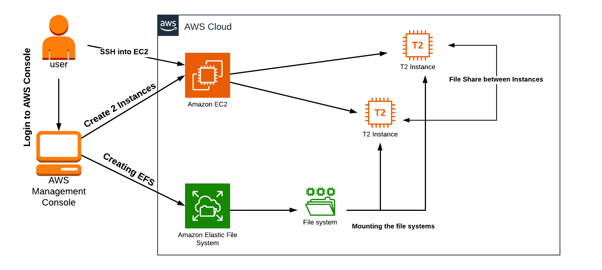

# Tasks for Getting Hands-on Experience with EBS, EFS

## EBS and EC2: Resizing Amazon EBS Volume

#### Task 1: Launching Amazon EC2 instance

1. Navigate to `Services` > `Compute` > `EC2`.
2. Click `Instances` > `Launch instances`.
3. Fill in the following settings:

- Name: `EC2 instance for Volume resize lab`
- Amazon Machine Image (AMI): `Amazon Linux AMI`
- Instance Type: `t2.micro`
- Key pair name: `{yourkey}`
- Key pair type: `RSA`
- Private key file format: `.pem`
- Auto-assign public IP: `Enable`
- Security group name: `{your-sg}`
- Type: `SSH`
- Source: `Anywhere`

#### Task 2: Resizing the EBS Volumes

1. Select `EC2 instance for Volume resize lab` > `Storage` > `Volume ID`.
2. Select the Volume and go to `Actions` > `Modify Volume`.
3. Modify the volume size from 8GiB to 20GiB and click `Modify`.
4. SSH into the server and enter these commands:

- `sudo su`
- `df -h`
- `lsblk` (list of all the block devices)
- `growpart /dev/xvda 1`
- `lsblk -f`  (ext2,ext3,ext4 or XFS)
- `resize2fs /dev/xvda1` (If the file system is XFS, use `xfs_growfs /dev/xvda1`)
- `df -h`

## EFS and EC2: Mount Elastic File System (EFS) on EC2

#### Task 1: Launching Two EC2 Instances

1. Navigate to EC2 under the `Compute` section, click on `Launch instances`.
2. Set `Number of Instances` to `2`, with the name as `dev-server`.
3. For `Amazon Machine Image (AMI)`, select `Amazon Linux 2 AMI`.
4. Set `Instance Type` to `t2.micro`.
5. Create a new key pair
6. Under `Network Settings`, enable `Auto-assign public IP`.
7. Create a new security group named `EFS Security Group`, add SSH and NFS with source from anywhere.

#### Task 2: Creating an Elastic File System

1. Go to EFS in the `Storage` section and click on `Create file system`.
2. Enter `EFS-Demo` as the name and ensure the default VPC and Regional options are selected.
3. Deselect the `Enable automated backups` option and select all Availability Zones.
4. In `Security Groups`, select `EFS Security Group` instead of the default.

#### Task 3: Mount the File System to dev-server-1 Instance

1. SSH into the dev-server-1 instance, switch to the root user and update the system.
2. Install the `amazon-efs-utils` NFS client.
3. Create a directory named `efs` and mount the file system in it.
4. Display the information of all currently-mounted file systems using `df -h` and create a directory named `aws`.

```
sudo -s

yum -y update

yum install -y amazon-efs-utils

mkdir efs

sudo mount -t efs -o tls [name]:/ efs 

df -h

mkdir aws
```

#### Task 4: Mount the File System to dev-server-2 Instance

1. Repeat the steps in Task 4 for the dev-server-2 instance.

```
sudo -s

yum -y update

yum install -y amazon-efs-utils

mkdir efs

sudo mount -t efs -o tls [name]:/ efs 

df -h
```

#### Task 5: Testing the File System

1. SSH into both instances and navigate to the `efs` directory.
2. In any one server, create a file named `hello.txt`.
3. Use the command `ls -ltr` to check the file.
4. On the other server, confirm the presence of the file `hello.txt` to verify that EFS is working. You may further test
   by creating files or directories on other servers.

```
sudo -s

cd efs

touch hello.txt

ls -ltr

cd efs
```



## EBS and EC2: Termination protection

- Create an EC2 instance with the next EBS settings:
- Create one more EBS volume
    - Do not delete after instance termination
    - Type: gp3
    - Name: /dev/sdy/
    - Encrypted using default key
- Delete the EC2 instance, then verify that your EBS volume is still there.
- Delete it.

## Instance store: Create EC2 with instance store

### Step 1: Choose an Instance Type that supports instance store

1. Login to the AWS Management Console.
2. From the EC2 dashboard, click on "Launch Instance".
3. In the "Choose an Amazon Machine Image (AMI)" page, choose a simple AMI like "Amazon Linux 2 AMI".
4. Click on "Select".
5. In the "Choose an Instance Type" page, choose an instance type that supports instance store volumes. For this lab,
   you can choose "**c5d.large**" which provides 1 x 50 NVMe SSD instance store.
6. Click on "Next: Configure Instance Details".

### Step 2: Configure Instance Details

1. Leave the configuration details as default and click "Next: Add Storage".

### Step 3: Add Storage

1. You will see that an instance store of 50 GiB is automatically added.
2. Click "Next: Add Tags".

### Step 4: Add Tags

1. Click on "Add Tag".
2. For the "Key" input, type in "Name". For the "Value" input, type in a name for your instance.
3. Click "Next: Configure Security Group".

### Step 5: Configure Security Group

1. You can create a new security group with SSH access.
2. Click "Review and Launch".

### Step 6: Review Instance and Launch

1. Review your instance configuration and then click "Launch".
2. A pop-up window will open for you to select your key pair or create a new one. Make sure you have access to the key
   pair you select because you will need it to connect to your instance.
3. Click on "Launch Instances".

### Step 7: Connect to your Instance

1. Once your instance is running, connect to it using SSH.

### Step 8: Identify the Instance Store Volume

1. After connecting, you can identify the instance store volumes by using the `lsblk` command.
2. Run the following command: `lsblk`
3. You should see an NVMe instance store volume.

### Step 9: Use the Instance Store Volume

1. You can create a file system on the volume, mount the volume, and then use it in a similar way that you use other
   block device storage.

### Step 10: Cleanup

1. Once you're done with your lab, remember to terminate the instance to avoid unnecessary costs.

> **Note**: Any data stored in instance store volumes will be lost when the instance is stopped, terminated, or if it
> fails.

